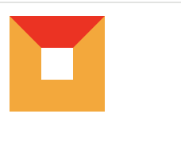

# 三角形

无宽高，粗 `border`

```css
.triangel{
            width: 0;
            height: 0;
            border:20px solid transparent;
            border-top:20px solid orangered;
        }
```

其他的border也需要设置，这样才会互相挤压变成一个正方形。每个边作为一个三角形。


不然只有border-top，宽高为0的情况下撑不起盒子。border-top就会变成一个点消失

直角三角形：两个相邻 `boder`组成

```css
.zhijiao{
            width:0;
            height: 0;
            border:20px solid transparent;
            border-top:20px solid orangered;
            border-left:20px solid orangered;
        }
```

# 梯形

有宽高，粗 `border`

```css
.tixing{
            width: 20px;
            height: 20px;
            border:20px solid transparent;
            border-top:20px solid orangered;
        }
```


