## flex 基本概念（常问居中布局和space-between和space-around的区别）

flex 的核心的概念就是 **容器** 和 **轴**。容器有 **父容器** 和内**子容器**，轴有**主轴** 和 **交叉轴**。flex 布局涉及到 12 个 `CSS` 属性（不含 `display: flex`），其中父容器、子容器各 6 个。不过常用的属性只有 4 个，父容器、子容器各 2 个，我们就先从常用的说起吧。

最常用的是水平垂直居中

```css
#dad {
    display: flex;
    justify-content: center;
    align-items: center
}
```

### 1. 容器

> 容器具有这样的特点：父容器可以统一设置子容器的排列方式，子容器也可以单独设置自身的排列方式，如果两者同时设置，以子容器的设置为准。

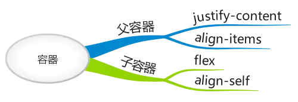

#### 1.1 父容器

##### 设置子容器沿主轴排列：**justify-content**

`justify-content` 属性用于定义如何沿着主轴方向排列子容器。

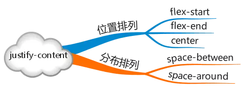


> **flex-start**：起始端对齐

> **flex-end**：末尾段对齐

> **center**：居中对齐

> **space-around**：子容器沿主轴均匀分布，位于首尾两端的子容器到父容器的距离是子容器间距的一半。


> **space-between**：子容器沿主轴均匀分布，位于首尾两端的子容器与父容器相切。


##### 设置子容器如何沿交叉轴排列：**align-items**

`align-items` 属性用于定义如何沿着交叉轴方向分配子容器的间距。


> **flex-start**：起始端对齐

> **flex-end**：末尾段对齐

> **center**：居中对齐

> **baseline**：基线对齐，这里的 `baseline` 默认是指首行文字，即 `first baseline`，所有子容器向基线对齐，交叉轴起点到元素基线距离最大的子容器将会与交叉轴起始端相切以确定基线。


> **stretch**：子容器沿交叉轴方向的尺寸拉伸至与父容器一致。

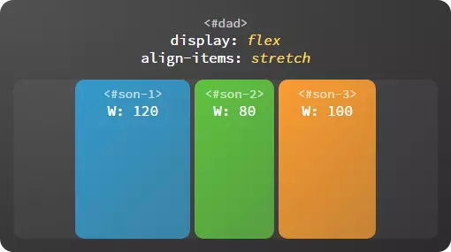


#### 1.2 子容器

##### 在主轴上如何伸缩：**flex**


flex的取值：

**单值**

- 无单位数：flex-grow的值
- 有效的宽度：当作flex-basis的值

- `initial(flex: 0 1 auto)`元素不会伸长会缩短
- `auto(flex: 1 1 auto)`元素会伸长缩短
- `none(flex: 0 0 auto)`元素不会伸长缩短

**双值**

第一个值必须为无单位数，当作`flex-grow`的值，第二个值必须为以下之一

- 一个无单位数：`flex-shrink`的值
- 一个有效的宽度值：它会被当作`flex-basis`的值

💛<font color='red'>当使用一个或两个无单位数时, flex-basis会从auto变为0</font>

**三值**

- 第一个值必须为一个无单位数，并且它会被当作 `<flex-grow>` 的值。
- 第二个值必须为一个无单位数，并且它会被当作  `<flex-shrink>` 的值。
- 第三个值必须为一个有效的宽度值， 并且它会被当作 `<flex-basis>` 的值。

🌟注意：

**flex-grow**默认值为 `0`，负值无效。
**flex-shrink**默认值为`1`，负值无效。
**flex-basis**默认值为 `auto`。`flex-basis` 表示在不伸缩的情况下子容器的原始尺寸。**主轴为横向时代表宽度，主轴为纵向时代表高度**。指定了 `flex-basis` 后，`width`/height 属性被忽略、不再起作用。但`flex-basis`会受到`min-width`和`max-width`的制约。

##### 单独设置子容器如何沿交叉轴排列：**align-self**


  每个子容器也可以单独定义沿交叉轴排列的方式，此属性的可选值与父容器 `align-items` 属性完全一致，如果两者同时设置则以子容器的 `align-self` 属性为准。

> **flex-start**：起始端对齐


> **flex-end**：末尾段对齐

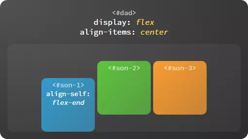

> **center**：居中对齐

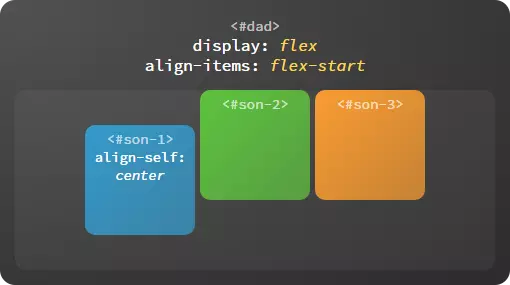

> **baseline**：基线对齐

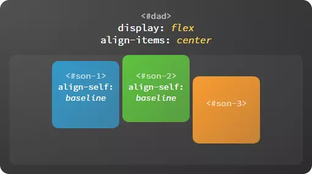

> **stretch**：拉伸对齐

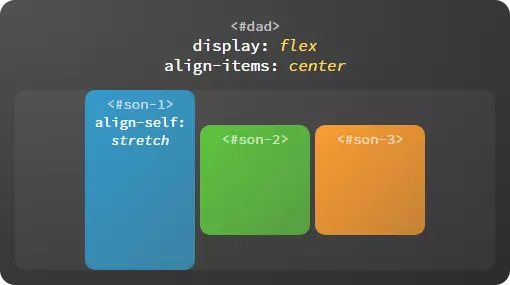

#### 比较一下`align-items`、`align-content`、`align-self`

共同点：它们都是设置子容器如何沿交叉轴排列

不同点：`align-item`和`align-items`都是父元素对子元素设置的，`align-item`设置的是单行，`align-content`设置的是多行，`align-self`是子元素对自身设置的，`align-self`的优先级高于`align-items`和`align-content`。因为`align-content`设置的是多行，所以它可以设置多行在交叉轴的分布，它拥有`justify-content`和`align-content`的所有属性。

### 2. 轴

如图所示，**轴** 包括 **主轴** 和 **交叉轴**，我们知道 `justify-content` 属性决定子容器沿主轴的排列方式，`align-items` 属性决定子容器沿着交叉轴的排列方式。那么轴本身又是怎样确定的呢？在 flex 布局中，`flex-direction` 属性决定主轴的方向，交叉轴的方向由主轴确定。

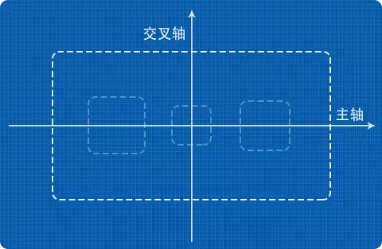

##### 主轴

主轴的起始端由 `flex-start` 表示，末尾段由 `flex-end` 表示。不同的主轴方向对应的起始端、末尾段的位置也不相同。

> 向右：`flex-direction: row`

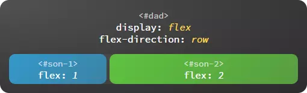

> 向下：`flex-direction: column`

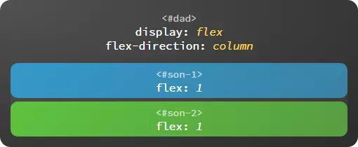

> 向左：`flex-direction: row-reverse`


> 向上：`flex-direction: column-reverse`


##### 交叉轴

主轴沿逆时针方向旋转 90° 就得到了交叉轴，交叉轴的起始端和末尾段也由 `flex-start` 和 `flex-end` 表示。

上面介绍的几项属性是 flex 布局中最常用到的部分，一般来说可以满足大多数需求，如果实现复杂的布局还需要深入了解更多的属性。

------

## flex 进阶概念

### 1. 父容器

- 设置换行方式：**flex-wrap**

  决定子容器是否换行排列，不但可以顺序换行而且支持逆序换行。


> **nowrap**：不换行


> **wrap**：换行


> **wrap-reverse**：逆序换行

逆序换行是指沿着交叉轴的反方向换行。


- 轴向与换行组合设置：**flex-flow**

  flow 即流向，也就是子容器沿着哪个方向流动，流动到终点是否允许换行，比如 `flex-flow: row wrap`，`flex-flow` 是一个复合属性，相当于 flex-direction 与 flex-wrap 的组合，可选的取值如下：

  - `row`、`column` 等，可单独设置主轴方向
  - `wrap`、`nowrap` 等，可单独设置换行方式
  - `row nowrap`、`column wrap` 等，也可两者同时设置

- 多行沿交叉轴对齐：**align-content**

  当子容器多行排列时，设置行与行之间的对齐方式。

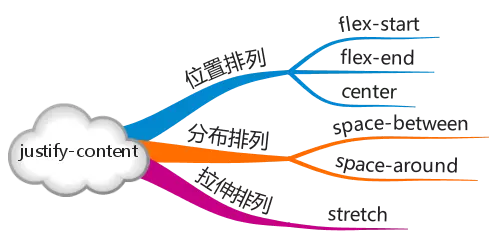

> **flex-start**：起始端对齐

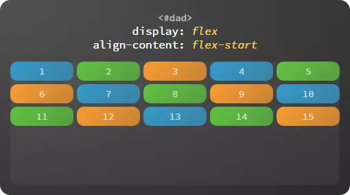

> **flex-end**：末尾段对齐

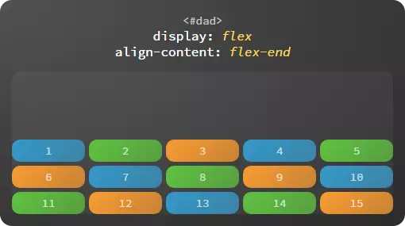

> **center**：居中对齐


> **space-around**：等边距均匀分布


> **space-between**：等间距均匀分布


> **stretch**：拉伸对齐


### 2. 子容器

- 设置基准大小：**flex-basis**

  `flex-basis` 表示在不伸缩的情况下子容器的原始尺寸。**主轴为横向时代表宽度，主轴为纵向时代表高度**。


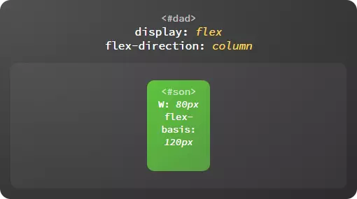

- 设置扩展比例：**flex-grow**

  子容器弹性伸展的比例。如图，剩余空间按 1:2 的比例分配给子容器。


- 设置收缩比例：**flex-shrink**

  子容器弹性收缩的比例。如图，超出的部分按 1:2 的比例从给子容器中减去。


- 设置排列顺序：**order**

  改变子容器的排列顺序，覆盖 HTML 代码中的顺序，默认值为 0，可以为负值，数值越小排列越靠前。


------

  以上就是 flex 布局的全部属性，一共 12 个，父容器、子容器各 6 个，可以随时通过下图进行回顾。


