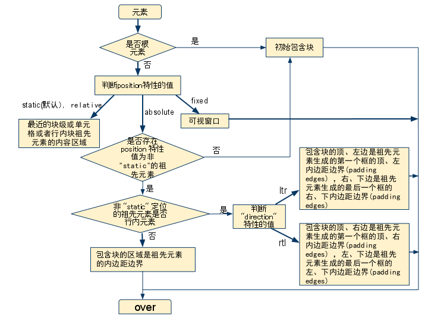

## 属性值都有哪些(6种)
- `inherit`

  规定应该从父元素继承 `position` 属性的值。

- `static`（静态定位）

对象遵循标准文档流中，没有定位，`top`， `right`， `bottom`，` left`，`z-index`等属性失效。

- `relative`(相对定位)

对象遵循标准文档流中，依赖top, right, bottom, left 等属性**相对于该对象在标准文档流中的位置进行偏移**，其占据的空间仍然保留。同时可通过z-index定义层叠关系。相对定位元素会创建一个包含块，用于作为内部子元素定位的基点。

💛 `static` 或 `relative` ，包含块就是由它的最近的祖先**块元素**或**格式化上下文**的内容边界

- `absolute`(绝对定位)

对象脱离标准文档流，相对于**包含块**进行定位。此时其原有空间为0，附近元素也会重新排列。同时，该元素内部产生`BFC`。上下外边距不会合并，不会因为内部浮动元素产生高度塌陷。

💛`absolute`的包含块就是由它的最近的 position 的值不是 `static`的祖先元素的内边距区的边缘。如果绝对定位的祖先元素position属性都是static，那么会相对于初始包含块`body`定位。如果存在`position`属性为其他值的祖先元素，则相对于其创建的包含块定位。

**在使用absolute定位时，必须指定left,top,right,bottom中的至少一个（否则left/right/top/bottom属性会使用默认值 auto ，导致对象遵从标准文档流，简单讲就是都变成relative，会占用文档空间）。**

- `fixed`(固定定位)

  对象脱离标准文档流，相对于屏幕视口定位，元素位置不随屏幕滚动改变。同时，该元素也会产生`BFC`。不兼容`IE`。

💛如果`position`属性是`fixed`和`absolute`，**当元素祖先的 transform  属性非 none 时，容器会相会于该祖先定位**，这是因为设置transform属性为非none的会导致该祖先元素形成一个新的包含块，元素的包含块由视口变成了该祖先。

- sticky(粘性定位)
可以被认为是相对定位和固定定位的混合。元素在进入特定阈值前为相对定位，之后为固定定位。举个例子：当top=20px时，在元素往上移动的过程中，一旦进入top=20px的范围，就会固定定位。position: sticky 对 table 元素的效果与 position: relative 相同。不兼容`IE`.

💛当`position:sticky`的父元素的`overflow`为非`visible`，`sticky`失效。

填充规则：

- 绝对定位元素具有包裹性，按其内容大小调整尺寸。但可以通过同时指定`top/bottom`以及`left/right`使元素具有流体的特性。 

>  根元素(<html>)所在的包含块是一个被称为**初始包含块**的矩形。

#### 根据包含块计算百分值

如果某些属性被赋予一个百分值的话，它的计算值是由这个元素的包含块计算而来的。这些属性包括盒模型属性和偏移属性：

1. 要计算 [`height`](https://developer.mozilla.org/zh-CN/docs/Web/CSS/height) [`top`](https://developer.mozilla.org/zh-CN/docs/Web/CSS/top) 及 [`bottom`](https://developer.mozilla.org/zh-CN/docs/Web/CSS/bottom) 中的百分值，是通过包含块的 `height` 的值。如果包含块的 `height` 值会根据它的内容变化，而且包含块的 `position` 属性的值被赋予 `relative` 或 `static` ，那么，这些值的计算值为 `0`。
2. 要计算 [`width`](https://developer.mozilla.org/zh-CN/docs/Web/CSS/width), [`left`](https://developer.mozilla.org/zh-CN/docs/Web/CSS/left), [`right`](https://developer.mozilla.org/zh-CN/docs/Web/CSS/right), [`padding`](https://developer.mozilla.org/zh-CN/docs/Web/CSS/padding), [`margin`](https://developer.mozilla.org/zh-CN/docs/Web/CSS/margin) 这些属性由包含块的 `width` 属性的值来计算它的百分值。

