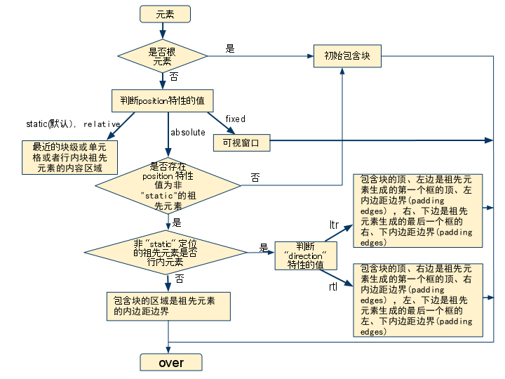

## 包含块&初始包含块

- `static` 或 `relative` 的包含块就是它的最近的祖先**块元素**或**BFC**的**content-box**
- `absolute`的包含块就是离它最近的 `position` 的值不是 `static`的祖先元素的`padding-box`，如果不存在这样的元素，那么会相对于初始包含块定位。
- `fixed`的包含块就是视口。
- 如果`position`属性是`fixed`和`absolute`，当元素祖先的 `transform` 属性非 none 时，祖先元素会形成一个新的包含块，元素的包含块变成了该祖先。
- 初始包含块是视口。

## 定位

所有的元素都是根据包含块定位的。

- `inherit`

  规定应该从父元素继承 `position` 属性的值。

- `static`（静态定位）

  对象遵循标准文档流中，没有定位，`top`， `right`， `bottom`，` left`，`z-index`等属性失效。


- `relative`(相对定位)

  对象遵循标准文档流中，依赖`top`， `right`，`bottom`, `left` 等属性**相对于该对象在标准文档流中的位置进行偏移**，其占据的空间仍然保留。同时可通过`z-index`定义层叠关系。相对定位元素会创建一个包含块，用于作为内部子元素定位的基点。

- `absolute`(绝对定位)

  对象脱离标准文档流。此时其原有空间为0，附近元素也会重新排列。同时，该元素内部产生`BFC`。上下外边距不会合并，不会因为内部浮动元素产生高度塌陷。

  绝对定位元素具有包裹性，按其内容大小调整尺寸。但可以通过同时指定`top/bottom`以及`left/right`使元素具有流体的特性。 

  如下（颜色省略）：

  

  ```css
  .father{
              width: 500px;
      		height: 20px;
              position: relative;
              padding-bottom: 10%;
          }
  .child{
              position: absolute;
              left: 20px;
              right: 20px;
              height: 100%;
  }
  ```

- `fixed`(固定定位)

  对象脱离标准文档流，相对于屏幕视口定位，元素位置不随屏幕滚动改变。同时，该元素也会产生`BFC`。不兼容`IE`。

- `sticky`(粘性定位)
  可以被认为是相对定位和固定定位的混合。元素在进入特定阈值前为相对定位，之后为固定定位。

  举个例子：当`top=20px`时，在元素往上移动的过程中，一旦进入`top=20px`的范围，就会固定定位。`position: sticky` 对 `table` 元素的效果与 `position: relative` 相同。不兼容`IE`。


## 元素的宽高等属性计算

如果某些属性被赋予一个百分值的话，它的计算值是由这个元素的包含块计算而来的。

1.  [`height`](https://developer.mozilla.org/zh-CN/docs/Web/CSS/height) [`top`](https://developer.mozilla.org/zh-CN/docs/Web/CSS/top) 及 [`bottom`](https://developer.mozilla.org/zh-CN/docs/Web/CSS/bottom) 中的百分值，是通过包含块的 `height` 的值来计算的。
2.  [`width`](https://developer.mozilla.org/zh-CN/docs/Web/CSS/width), [`left`](https://developer.mozilla.org/zh-CN/docs/Web/CSS/left), [`right`](https://developer.mozilla.org/zh-CN/docs/Web/CSS/right), [`padding`](https://developer.mozilla.org/zh-CN/docs/Web/CSS/padding), [`margin`](https://developer.mozilla.org/zh-CN/docs/Web/CSS/margin) 这些属性由包含块的 `width` 属性的值来计算。




