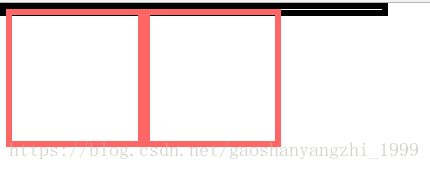

## 一、塌陷问题
#### 类型一：父子嵌套（`margin`塌陷）
```css
.father{
    width:400px;
    height:400px;
    background: #00FFFF;
    margin-top: 20px;
  }  
.son{
    width:200px;
    height:200px;
    background: #FE2EF7;
    margin-top: 40px;
}
```
 我们对一对嵌套的盒子作如上样式设置，我们期望父级上边距为`20px`;子元素上边距为`40px`;实际上，父元素和子元素的上边距都变成了`40px`。

针对类型一：触发父级`BFC`，因为`BFC`容器内部的子元素是不会影响到外部元素的。

- `float`的属性不是`none`; 
- `overflow`的属性不是`visible`; 
- `position:absolute / fixed`; 
- `display：inline-block / table-cells / table-caption`

#### 类型二 :垂直相邻（`margin`折叠）
```css
.box1{
    width:200px;
    height:200px;
    background: #00FFFF;
    margin-bottom: 40px;
  }  
.box2{
    width:200px;
    height:200px;
    background: #FE2EF7;
    margin-top: 20px;
}
```
在`css`中对垂直相邻块级元素作如上样式设置，我们期望的间距是`60px`,实际上，它们之间的距离只有`40px`。

针对类型二：

*   我们可以在设置边距时只设置一个边距来解决。
*   还有一个办法，我自己想的，只有属于同一个`BFC`的相邻垂直盒才会发生`margin`折叠，所以我们可以把一个盒子用`div`包起来，触发这个`div`的`BFC`，这样这两个盒子就不属于一个`BFC`了

`margin`重叠时`margin`值计算方法：

- 正值取大
- 负值取小
- 正负取和

#### 类型三 :浮动引起父元素塌陷

浮动：当盒子设置`float：left/right`就会脱离文档流，变成浮动元素。允许文本和内联元素环绕它。

```css
.father{
    border: 5px solid black;
    width: 300px;
}  
.son1{
    border: 5px solid #f66;
    width: 100px;
    height: 100px;
    float: left;
}
.son2{
    border: 5px solid #f66;
    width:100px;
    height: 100px;
    float: left;
}
```

效果图：

清除浮动

- 块级元素清除浮动

1. 最后一个子元素添加

```css
p{
	clear:both;
}
```

2. 伪元素清除浮动：

```css
.father::after {
    content: '';
    display: block;//clear 很特殊，想让他生效，必须是块级元素才可以，而::after 是行级元素
    clear: both;
    width: 0;
    height: 0;
    visibility:hidden;//允许浏览器渲染它，但是不显示出来，这样才能实现清楚浮动。
}
.father{
     zoom:1;  /*==for IE6/7 Maxthon2==*/
}
```

3. 触发父级`BFC `：`BFC`在计算的时候会把浮动元素的高度计算在内。