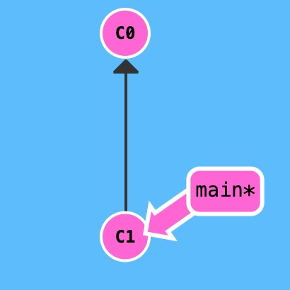
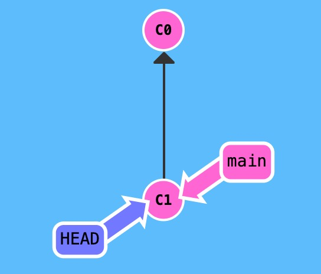

首先，我们要知道，`checkout`切换的是`HEAD`的指向。

- 切换分支

```bash
# 分支切换
git checkout dev 

# 切换远程分支
git checkout origin/test 

# 基于远程分支创建本地分支，并跟踪对应来自 'origin' 的远程分支
git checkout --track origin/feature-test 

# 基于本地分支开出新分支
git checkout -b testbranch 

# 彻底丢弃某个文件的改动
git checkout -- file

# 放弃本地所有改动
git checkout .

# 切换上一个分支
git checkout -

```

- 切换到某一次提交

大多数人只知道`git checkout`可以切换分支，但是其实`git checkout`还可以切换到某一次提交。

总所周知，`HEAD`一般都指向当前所处分支，如图，`*`号就是`HEAD`的指向，此时`HEAD->main`，`main->C1`



我们可以使用`git checkout`让他和顶端分离，此时`HEAD->C1`,`main->C1`

```bash
git checkout C1//这里的C1是hash号
```



