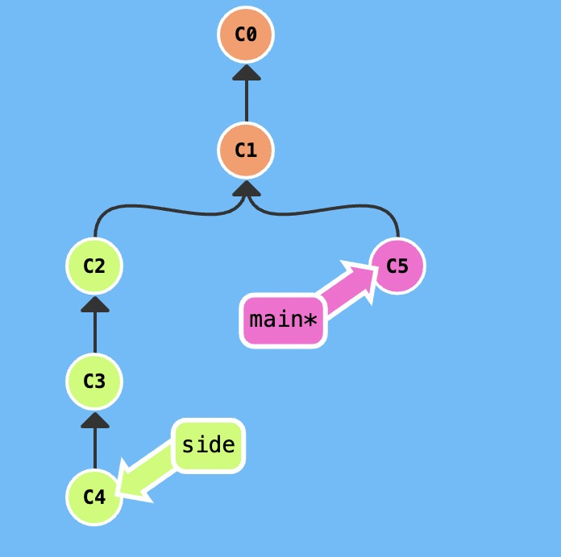
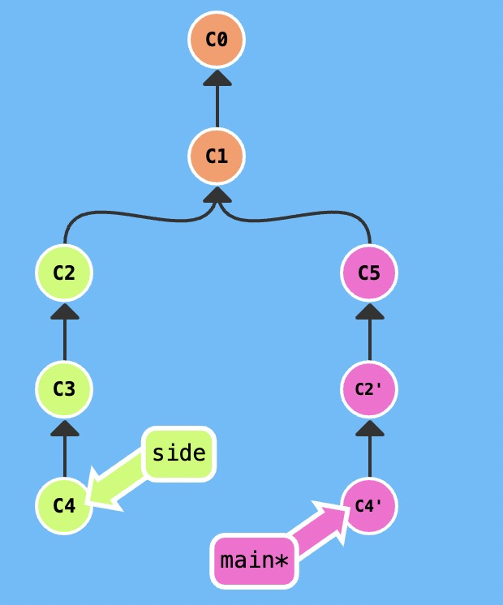

`git cherry-pick <你想复制的提交号>...`

如果你想将一些提交复制到当前所在的位置（`HEAD`）下面的话， Cherry-pick 是最直接的方式了。

这里有一个仓库, 如下



我们想将 `side` 分支上的工作复制到 `main` 分支，可以这么操作

```
git cherry-pick C2 C4
```
如下图所示，`C2`和`C4`这两个提交记录就被放在`main`分支下了

