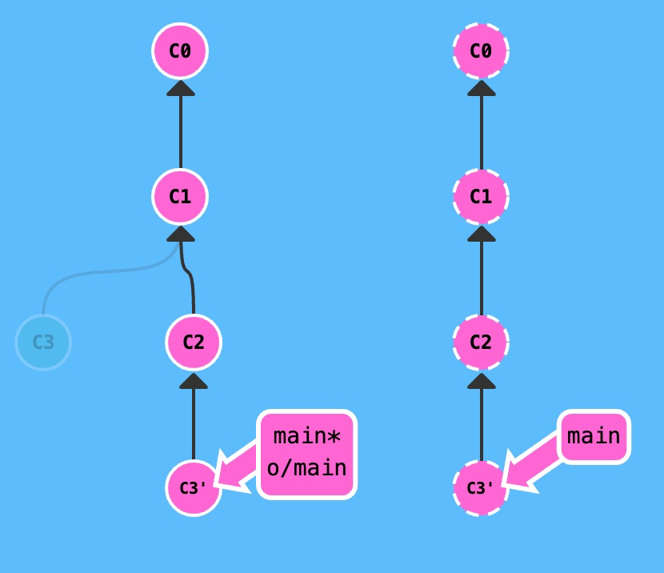

### 远程分支

在学习`git fetch`之前，我们需要先了解一下远程分支的概念。

当你执行`git clone`命令之后，你可能注意到的第一个事就是在我们的本地仓库多了一个名为 `o/main` 的分支, 这种类型的分支就叫**远程**分支。

远程分支有一个特别的属性，在你检出它时自动进入分离 `HEAD` 状态。Git 这么做是出于不能直接在这些分支上进行操作的原因, 你必须在别的地方完成你的工作, （更新了远程分支之后）再用远程分享你的工作成果。

先看个例子，左边的是本地仓库，右边的是远程仓库

`main`是本地分支，`o/main`是远程分支，其中`o`是`origin`的缩写，是远程仓库的默认名字。


我们可以对远程分支进行检出

```bash
git checkout o/main
git commit
```

当检出远程分支之后，本地分支就会变成`HEAD`分离状态，当我们进行一次提交，`main`不会更新，因为`HEAD`已经不指向`main`了。

与此同时，`o/main`也不会进行更新。这是因为 `o/main` 只有在远程仓库中相应的分支更新了以后才会更新。


### 远程跟踪分支

`Git` 好像知道 `main` 与 `o/main` 是相关的。当然这些分支的名字是相似的，可能会让你觉得是依此将远程分支` main `和本地的` main `分支进行了关联。这种关联在以下两种情况下可以清楚地得到展示：

- `pull` 操作时, 提交记录会被先下载到` o/main` 上（`fetch`），之后再合并到本地的` main` 分支（`merge`或者`rebase`）。隐含的合并目标由这个关联确定的。
- `push` 操作时, 我们把工作从 `main` 推到远程仓库中的 `main` 分支(同时会更新远程分支 `o/main`) 。这个推送的目的地也是由这种关联确定的！

直接了当地讲，`main` 和 `o/main` 的关联关系就是由分支的“remote tracking”属性决定的。`main` 被设定为跟踪 `o/main` —— 这意味着为 `main` 分支指定了推送的目的地以及拉取后合并的目标。

你可能想知道 `main` 分支上这个属性是怎么被设定的，你并没有用任何命令指定过这个属性呀！好吧, 当你克隆仓库的时候, Git 就自动帮你把这个属性设置好了。

当你克隆时, Git 会为远程仓库中的每个分支在本地仓库中创建一个远程分支（比如 `o/main`）。然后再创建一个跟踪远程仓库中活动分支的本地分支，默认情况下这个本地分支会被命名为 `main`。

克隆完成后，你会得到一个本地分支（如果没有这个本地分支的话，你的目录就是“空白”的），但是可以查看远程仓库中所有的分支（如果你好奇心很强的话）。这样做对于本地仓库和远程仓库来说，都是最佳选择。

这也解释了为什么会在克隆的时候会看到下面的输出：

```
local branch "main" set to track remote branch "o/main"
```

#### 能自己指定这个属性吗？

当然！你可以让任意分支跟踪 `o/main`, 然后该分支会像 `main` 分支一样得到隐含的 push 目的地以及 merge 的目标。 这意味着你可以在分支 `totallyNotMain` 上执行 `git push`，将工作推送到远程仓库的 `main` 分支上。

有两种方法设置这个属性，

- 第一种，通过远程分支检出一个新的分支，执行:

```
git checkout -b foo o/main
```

就可以创建一个名为 `foo` 的分支，它跟踪远程分支 `o/main`。

举个例子，分支树如图


当我们执行

```bash
git checkout -b foo o/main
git pull
```

分支将如下图所示，远端分支`main`首先被`fetch`到远程分支`o/main`，接着`o/main`被`merge`到`foo`分支。⚠️注意，`main`分支没有被更新。


对于`git push`也同样适用。

再举个例子，分支树如图


当我们执行如下代码

```bash
git checkout -b foo o/main
git commit
git push
```

分支将如下图所示，我们将一个并不叫 `main` 的分支上的工作推送到了远程仓库中的 `main` 分支上


- 第二种方法

  另一种设置远程追踪分支的方法就是使用：`git branch -u` 命令，执行：

  ```bash
  git branch -u o/main foo
  ```

  这样 `foo` 就会跟踪 `o/main` 了。如果当前就在 foo 分支上, 还可以省略 foo：

  ```bash
  git branch -u o/main
  ```

这个方法和方法一效果一样，但是这个命令更加明确。

### `git fetch`

`git fetch` 完成了仅有的但是很重要的两步:

- 从远程仓库下载本地仓库中缺失的提交记录
- 更新远程分支指针(如 `o/main`)

`git fetch` 实际上将本地仓库中的远程分支更新成了远程仓库相应分支最新的状态。

远程分支反映了远程仓库在你**最后一次与它通信时**的状态，`git fetch` 就是你与远程仓库通信的方式了

`git fetch` 并不会改变你本地仓库的状态。它不会更新你的 `main` 分支，也不会修改你磁盘上的文件。

理解这一点很重要，因为许多开发人员误以为执行了 `git fetch` 以后，他们本地仓库就与远程仓库同步了。它可能已经将进行这一操作所需的所有数据都下载了下来，但是**并没有**修改你本地的文件。

所以, 你可以将 `git fetch` 的理解为单纯的下载操作。

#### 无参数

举个例子，下图中左边是本地仓库，右边是远程仓库


让我们执行以下命令

```bash
git fetch
```

如下图所示，如果 `git fetch` 没有参数，它会下载所有的提交记录到各个远程分支


#### `<place>`参数

当然，你也可以通过制定`place`参数取回特定分支的更新

来看个例子，初始分支树如下图所示


我们通过以下代码命令指定`place`

```bash
git fetch origin foo
```

如下图所示，我们只下载了远程仓库中 `foo` 分支中的最新提交记录，并更新了` o/foo`


#### `<source>:<destination>`参数

如果你觉得直接更新本地分支很爽，那你就用冒号分隔的 `refspec `吧。不过，你不能在当前检出的分支上干这个事，但是其它分支是可以的。

这里有一点是需要注意的 —— `source` 现在指的是远程仓库中的位置，而 `<destination>` 才是要放置提交的本地仓库的位置。它与` git push` 刚好相反，这是可以讲的通的，因为我们在往相反的方向传送数据。

理论上虽然行的通，但开发人员很少这么做。

举个例子，初始分支树如下所示：


当我们执行以下代码

```
git fetch origin foo～1:bar
```

Git 将 `foo~1` 解析成一个` origin` 仓库的位置，然后将那些提交记录下载到了本地的 `bar` 分支（一个本地分支）上。注意由于我们指定了目标分支，`foo` 和 `o/foo` 都没有被更新。


如果执行命令前目标分支不存在会怎样呢？

初始分支树如下图所示


当我们执行以下命令

```bash
git fetch origin foo~1:bar
```

如下图所示，跟` git push `一样，`Git` 会在` fetch` 前自己创建立本地分支, 就像是` Git `在` push `时，如果远程仓库中不存在目标分支，会自己建立一样。


#### ：`<destination>`

你可以在 ` git fetch` 时不指定任何 `source`，方法就是仅保留冒号和` destination `部分，`source `部分留空。

举个例子，初始分支树如下图所示：


当执行以下代码

```bash
git fetch origin :bar
```

结果如下图所示，在本地创建了一个新的分支`bar`


#### 用法

综上，我们可以总结出以下用法

```bash
# 这个命令将某个远程主机的更新全部取回本地
$ git fetch <origin> 
# 取回特定分支的更新
$ git fetch <origin> <place>
# 把远程a分支(source)的更新拉取到b分支(destination)
$ git fetch <origin> <source>:<destination>
# 创建新分支（destination)(拉取远程空分支)
$ git fetch <origin> :<destination>
```

### `git pull`

当远程分支中有新的提交时，你可以像合并本地分支那样来合并远程分支。也就是说就是你可以执行以下命令:

实际上，由于先抓取更新再合并到本地分支这个流程很常用，因此 `git pull` 提供了一个专门的命令来完成这两个操作。它就是我们要讲的 `git pull`。

#### 无参数

举个例子，下图中左边是本地仓库，右边是远程仓库。


我们先来看看 `fetch`、`merge` 依次执行的效果

```bash
git fetch
git merge o/main
```

我们用 `fetch` 下载了 `C3`, 然后通过 `git merge o/main`合并了这一提交记录。现在我们的 `main` 分支包含了远程仓库中的更新


而上面的`fetch`和`merge`两个命令，只要使用了`git pull`就能达到一样的效果，这清楚地说明了 `git pull` 就是 `git fetch `和 `git merge` 的缩写！

另外，执行`git fetch`时，默认会下载所有远程仓库的数据，更新**远程**分支。

而执行`git pull`时，由于`git pull`还包含合并的操作，所以需要你的本地分支有一个`track`的**远程**分支，这样才能在**远程**分支拉取到远程主机对应分支的更新后，进行本地分支和**远程**分支合并的操作。

#### `<place>`参数

如果我们指定要抓取的 `place`，所有的事情都会跟之前一样发生，只是增加了 `merge `操作

`<place>`可以把远端仓库分支拉取到远程分支，接着远程分支**会被合并进入我们当前检出的分支**。

举个例子，初始分支树如下图所示


当我们执行以下命令

```bash
git pull origin main
```

组件树如下图所示，通过指定 `main` 我们更新了 `o/main`。然后将 `o/main` merge 到我们的检出位置，**无论**我们当前检出的位置是哪。


#### `<source>:<destination>`参数

`pull` 也可以用` source:destination `

初始分支树如下图所示


当我们执行以下命令

```bash
git pull origin main:foo
```

组件树如下图所示，它先在本地创建了一个叫 `foo`的分支，从远程仓库中的 `main` 分支中下载提交记录，并合并到 `foo`，然后再 `merge `到我们的当前检出的分支 `bar`上。相当于`foo`代替了`<place>`命令中远程分支的位置。


### `git pull`和`git pull --rebase`

假设你周一克隆了一个仓库，然后开始研发某个新功能。到周五时，你新功能开发测试完毕，可以发布了。但是你的同事这周写了一堆代码，还改了许多你的功能中使用的 API，这些变动会导致你新开发的功能变得不可用。但是他们已经将那些提交推送到远程仓库了，因此你的工作就变成了基于项目**旧版**的代码，与远程仓库最新的代码不匹配了，如下图所示


这种情况下, `Git` 是不会允许你 `push` 变更的。实际上它会强制你先合并远程最新的代码，然后才能分享你的工作。

这时候我们可以用`rebase`

```bash
git fetch
git rebase o/main//注意，远程分支的commit在前
git push
```

我们用 `git fetch` 更新了本地仓库中的远程分支，然后用`rebase` 将我们的工作移动到最新的提交记录下，最后再用 `git push` 推送到远程仓库。



- 还可以用`merge`

尽管 `git merge` 不会移动你的工作（它会创建新的合并提交），但是它会告诉 Git 你已经合并了远程仓库的所有变更。这是因为远程分支现在是你本地分支的祖先，也就是说你的提交已经包含了远程分支的所有变化。

```bash
git fetch
git merge o/main
git push
```

我们用 `git fetch` 更新了本地仓库中的远程分支，然后**合并**了新变更到我们的本地分支（为了包含远程仓库的变更），最后我们用 `git push` 把工作推送到远程仓库


前面已经介绍过 `git pull` 就是 `fetch` 和 `merge` 的简写，类似的 `git pull --rebase` 就是 `fetch `和 `rebase `的简写！