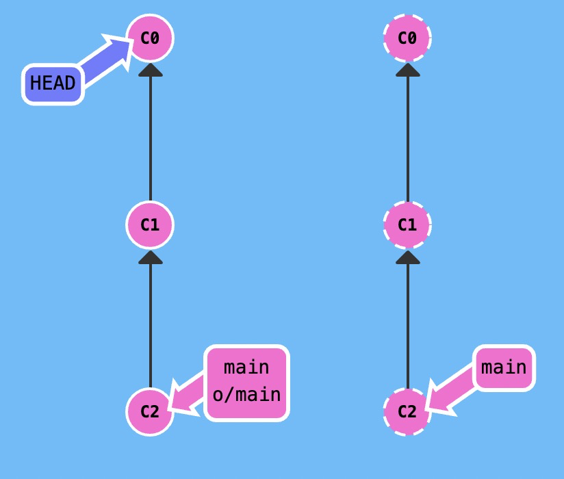
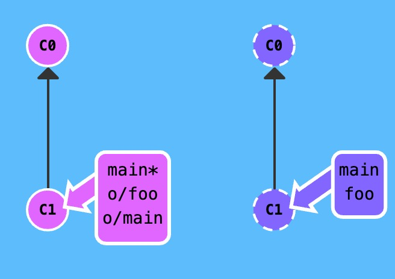

### 什么是`git push`

`git push` 负责将**你的**变更上传到指定的远程仓库，并在远程仓库上合并你的新提交记录。

*注意 —— `git push` 不带任何参数时的行为与 Git 的一个名为 `push.default` 的配置有关。它的默认值取决于你正使用的 Git 的版本，在你的项目中进行推送之前，最好检查一下这个配置。*

### 不带参数的提交

如下图所示，左边是本地仓库，右边是远程仓库，本地仓库中有一些远程仓库中没有的提交记录。


我们执行以下命令试试

```bash
git push
```

远程仓库接收了 `C2`，远程仓库中的 `main` 分支也被更新到指向 `C2` 了，我们的远程分支 (o/main) 也同样被更新了。所有的分支都同步了！


### 带参数的提交

##### `<place>`参数

我们可以为` push `指定参数，语法是：

```
git push <remote> <place>
```

`<place>` 参数是什么意思呢？我们稍后会深入其中的细节, 先看看例子, 这个命令是:

```
git push origin main
```

把这个命令翻译过来就是：

*切到本地仓库中的“main”分支，获取所有的提交，再到远程仓库“origin”中找到“main”分支，将远程仓库中没有的提交记录都添加上去，搞定之后告诉我。*

我们通过“place”参数来告诉 Git 提交记录来自于 main, 要推送到远程仓库中的 main。它实际就是要同步的两个仓库的位置。

需要注意的是，因为我们通过指定参数告诉了 Git 所有它需要的信息, **所以它就忽略了我们所检出的分支的属性**！

举个例子，分支树如下图所示，由于这张图会被用到两遍，我称呼他为图1：


当我们执行以下命令

```bash
git checkout C0
git push origin main
```

如下图所示，虽然`HEAD`指向了`C0`，但是由于我们通过指定参数告诉了 Git 所有它需要的信息, **所以它就忽略了我们所检出的分支的属性**，远程仓库中的 `main` 分支得到了更新。



那如果不指定参数呢？初始分支树还是如图一所示，当我们执行以下命令

```bash
git checkout C0
git push origin main
```

结果如下图，命令失败了（正如你看到的，什么也没有发生）! 因为我们所检出的 HEAD 没有跟踪任何分支。


综上所述，我们可以得知，当`git push` 指定 place 参数为 `main` 时，我们同时指定了提交记录的来源和去向。

#####  `<source>:<destination>`参数

如果来源和去向分支的名称不同呢？比如你想把本地的 `foo` 分支推送到远程仓库中的 `bar` 分支。

要同时为源和目的地指定 `<place>` 的话，只需要用冒号 `:` 将二者连起来就可以了：

```bash
git push origin <source>:<destination>
```

这个参数实际的值是个 `refspec`，“refspec” 是一个自造的词，意思是 `git` 能识别的位置（比如分支 `foo` 或者 `HEAD~1`）

一旦你指定了独立的来源和目的地，就可以组织出言简意赅的远程操作命令了，让我们看看演示！

首先，初始代码树如图所示：


`source` 可以是任何 Git 能识别的位置

```bash
git push origin foo^:main
```

执行结果如下图所示，这是个令人困惑的命令，但是它确实是可以运行的 —— Git 将 `foo^` 解析为一个位置，上传所有未被包含到远程仓库里 `main` 分支中的提交记录。


如果你要推送到的目的分支不存在会怎么样呢？没问题！Git 会在远程仓库中根据你提供的名称帮你创建这个分支！

初始分支树如图所示


当我们执行以下代码

```bash
git push origin main:newBranch
```

执行结果如下图所示，`git` 在远程仓库中创建了`newBranch`分支，并且在本地创建了远程分支`o/newBranch`


##### :`<destination>`参数

你可以在 `git push`时不指定任何 `source`，方法就是仅保留冒号和` destination` 部分，`source` 部分留空。

```bash
git push origin :side
```

那结果会怎么样呢？

举个例子，初始分支树如下图所示：



我们执行以下代码

```bash
git push origin :foo
```

执行结果如下图所示，`push` 空 到远程仓库会删除远程仓库中的分支！


