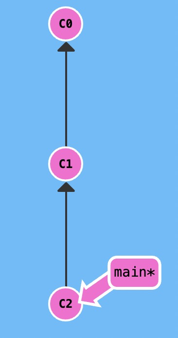
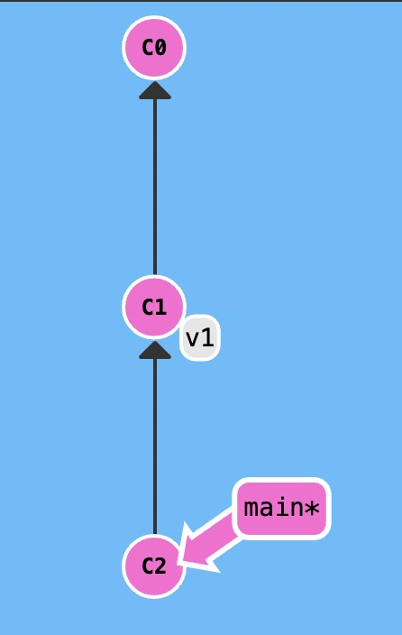
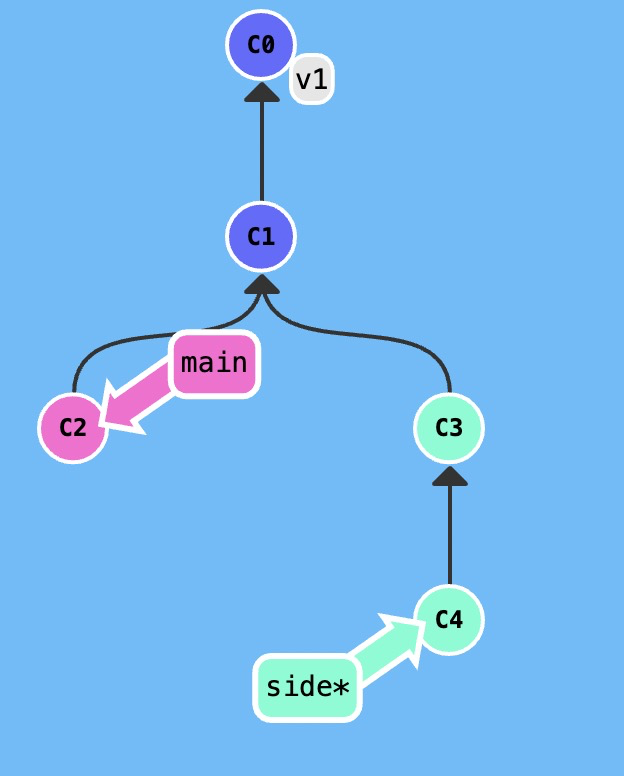
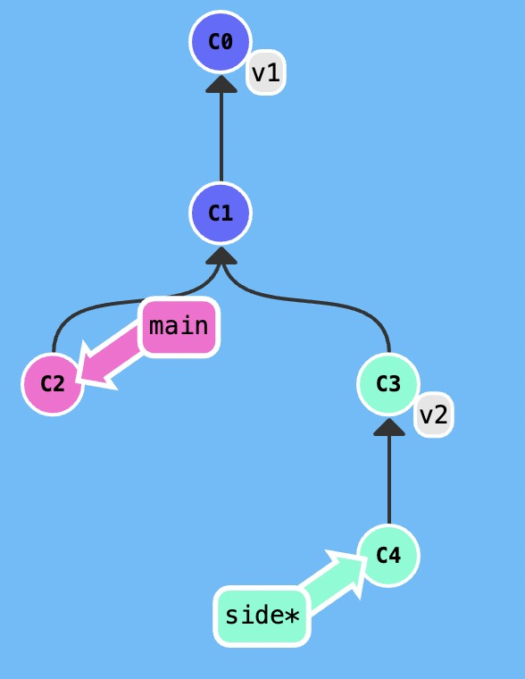

### git tags

分支很容易被人为移动，并且当有新的提交时，它也会移动。分支很容易被改变，大部分分支还只是临时的，并且还一直在变。

Git 的 tag 可以永久地将某个特定的提交命名为里程碑，它不会随着新的提交而移动。你也不能检出到某个标签上面进行修改提交，它就像是提交树上的一个锚点，标识了某个特定的位置。

仓库如图所示



我们现在可以给`commit C1`打一个标签，称为`v1`，表示这是`1.0`版本

```
git tag v1 C1
```

如下图所示，`v1`指向`C1`



如果不指定`commit`为`C1`，使用如下命令，`Git` 会用 `HEAD` 所指向的位置，

```
git tag v1
```

### git describe

`git describe` 的语法是：

```
git describe <ref>
```

`<ref>` 可以是任何能被 Git 识别成提交记录的引用，如果你没有指定的话，Git 会以你目前所检出的位置（`HEAD`）。

它输出的结果是这样的：

```
<tag>_<numCommits>_g<hash>
```

`tag` 表示的是离 `ref` 最近的标签， `numCommits` 是表示这个 `ref` 与 `tag` 相差有多少个提交记录， `hash` 表示的是你所给定的 `ref` 所表示的提交记录哈希值的前几位。

当 `ref` 提交记录上有某个标签时，则只输出标签名称

对于如下的提交树



当你给`C3`打了一个标签

```
git tag v2 C3
```

提交树将会变得如下图



```
git describe main 会输出：

v1_2_gC2

git describe side 会输出：

v2_1_gC4
```

