### `git merge`和`git rebase`

在 Git 中整合来自不同分支的修改主要有两种方法：`merge` 以及 `rebase`。

### merge

你本来在`iss53`分支上开发新功能，突然系统出现了一个紧急线上问题，你从`master`拉取了一个`hotfix`分支，进行修复，你应该怎么操作？

```bash
$ git checkout master
Switched to branch 'master'
$ git checkout -b hotfix
Switched to a new branch 'hotfix'
$ vim index.html
$ git commit -a -m 'fixed the broken email address'
[hotfix 1fb7853] fixed the broken email address
 1 file changed, 2 insertions(+)
```
当进行如上操作后，系统的分支状态将会如下图所示：


接着，当修复完成，你需要把`hotfix`分支合入`master`分支

```bash
$ git checkout master
$ git merge hotfix//这里相当于 merge hotfix into master
Updating f42c576..3a0874c
Fast-forward
 index.html | 2 ++
 1 file changed, 2 insertions(+)
```

#### 快进合并

在合并的时候，你应该注意到了“快进（fast-forward）”这个词。

什么时候会出现快进合并的状况呢？当你**想要合并的分支`hotfix`所指向的提交`C4`所指向的`commit`是你所在的提交`C2`的直接后继**，换句话说，当你想合并两个分支时，如果顺着当前分枝走下去能到达要被合并的分支，只会简单的将指针向前推进（指针右移），因为**这种情况下的合并操作没有需要解决的分歧——这就叫做 “快进”**。

快进合并的结果如下图所示。


#### 非快进合并

现在你可以切换回你正在工作的分支继续你的工作，也就是针对 #53 问题的那个分支（iss53 分支）。

```bash
$ git checkout iss53
Switched to branch "iss53"
$ vim index.html
$ git commit -a -m 'finished the new footer [issue 53]'
[iss53 ad82d7a] finished the new footer [issue 53]
1 file changed, 1 insertion(+)
```

假设你已经修正了 #53 问题，并且打算将你的工作合并入 `master` 分支。 为此，你需要合并 `iss53` 分支到 `master` 分支，这和之前你合并 `hotfix` 分支所做的工作差不多。 你只需要检出到你想合并入的分支，然后运行 `git merge` 命令：

```console
$ git checkout master
Switched to branch 'master'
$ git merge iss53
Merge made by the 'recursive' strategy.
index.html |    1 +
1 file changed, 1 insertion(+)
```

这和你之前合并 `hotfix` 分支的时候看起来有一点不一样。 在这种情况下，你的开发历史从一个更早的地方开始分叉开来）。 因为，**`master` 分支所在提交并不是 `iss53` 分支所在提交的直接祖先**，Git 不得不做一些额外的工作。 出现这种情况的时候，Git 会**使用两个分支的末端所指的快照（`C4` 和 `C5`）以及这两个分支的公共祖先（`C2`），做一个简单的三方合并**。


和之前将分支指针向前推进所不同的是，Git 将此次三方合并的结果做了一个新的快照并且自动创建一个新的提交指向它。 这个被称作一次合并提交，它的特别之处在于他有不止一个父提交。


#### 设置非快进合并

当你不想进行快进合并的时候，你可以给merge设置`-no-ff`参数，这样就算是在可以快进合并的轻快下也会生成新的提交进行合并。

```bash
git merge hotfix -no-ff
```

#### 遇到冲突时的分支合并

有时候合并操作不会如此顺利。 如果你在两个不同的分支中，对同一个文件的同一个部分进行了不同的修改，Git 就没法干净的合并它们。 如果你对 #53 问题的修改和有关 `hotfix` 分支的修改都涉及到同一个文件的同一处，在合并它们的时候就会产生合并冲突，此时 Git 做了合并，但是没有自动地创建一个新的合并提交。 Git会在工作区产生一个有冲突待解决的文件，看起来像下面这个样子：

```html
<<<<<<< HEAD:index.html
<div id="footer">contact : email.support@github.com</div>
=======
<div id="footer">
 please contact us at support@github.com
</div>
>>>>>>> iss53:index.html
```

你只要解决冲突之后把文件提交即可


### rebase

rebase就是**变基** ，即：改变一条分支的 **基点** ，使原分支从指定的节点（commit）延续。。

当你想把`experiment`分支合并到`master`分支，如下图。


可以提取在 `C4` 中引入的补丁和修改，然后在 `C3` 的基础上应用一次。 你可以使用 `rebase` 命令将提交到某一分支上的所有修改都移至另一分支上，就好像“重新播放”一样。

```bash
$ git checkout experiment
$ git rebase master
First, rewinding head to replay your work on top of it...
Applying: added staged command
```

它的原理是首先找到这两个分支（即当前分支 `experiment`、变基操作的目标基底分支 `master`） 的最近共同祖先 `C2`，然后对比当前分支相对于该祖先的历次提交，提取相应的修改并存为临时文件， 然后将当前分支指向目标基底 `C3`, 最后以此将之前另存为临时文件的修改依序应用。 （译注：写明了 commit id，以便理解，下同）


现在回到 `master` 分支，进行一次快进合并（快进合并的概念我在上边阐述过，这里就不赘述了）。

```bash
$ git checkout master
$ git merge experiment
```


### 变基的一些用法

#### 1.合并多个commit为一个完整commit

当我们在本地仓库中提交了多次，在我们把本地提交push到公共仓库中之前，为了让提交记录更简洁明了，我们希望把如下分支B、C、D三个提交记录合并为一个完整的提交，然后再push到公共仓库。

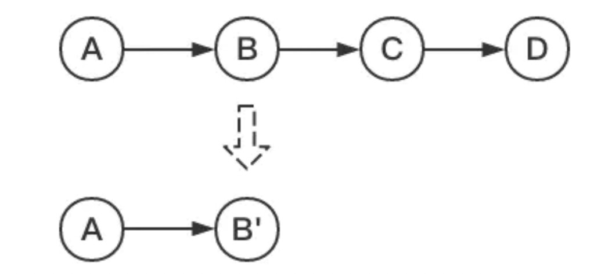

现在我们在测试分支上添加了四次提交，我们的目标是把最后三个提交合并为一个提交：


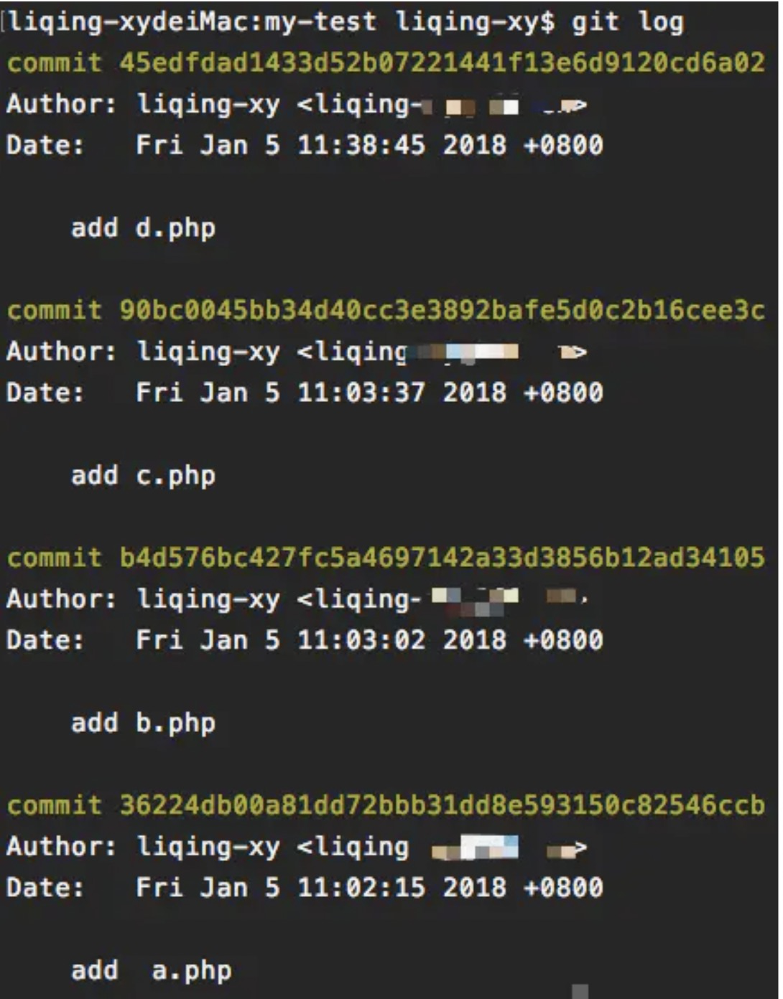

这里我们使用命令:

```css
  git rebase -i  [startpoint]  [endpoint]
```

其中`-i`的意思是`--interactive`，即弹出交互式的界面让用户编辑完成合并操作，`[startpoint]`  `[endpoint]`则指定了一个编辑区间，如果不指定`[endpoint]`，则该区间的终点默认是当前分支`HEAD`所指向的`commit`(注：该区间指定的是一个前开后闭的区间)。
 在查看到了log日志后，我们运行以下命令：

```undefined
git rebase -i 36224db
```

或:

```undefined
git rebase -i HEAD~3 
```

然后我们会看到如下界面:

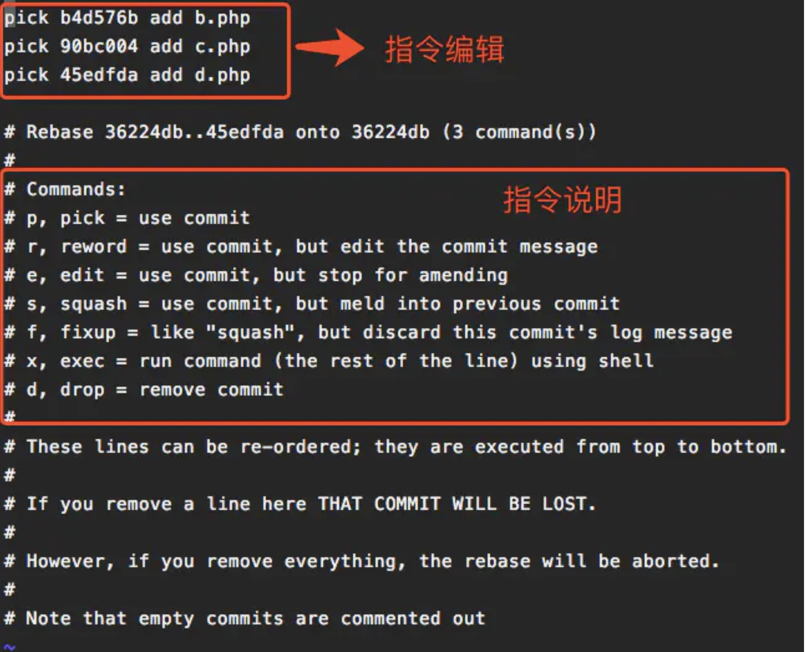


 上面未被注释的部分列出的是我们本次rebase操作包含的所有提交，下面注释部分是git为我们提供的命令说明。每一个commit id 前面的`pick`表示指令类型，git 为我们提供了以下几个命令:


> - pick：保留该commit（缩写:p）
> - reword：保留该commit，但我需要修改该commit的注释（缩写:r）
> - edit：保留该commit, 但我要停下来修改该提交(不仅仅修改注释)（缩写:e）
> - squash：将该commit和前一个commit合并（缩写:s）
> - fixup：将该commit和前一个commit合并，但我不要保留该提交的注释信息（缩写:f）
> - exec：执行shell命令（缩写:x）
> - drop：我要丢弃该commit（缩写:d）


根据我们的需求，我们将commit内容编辑如下:

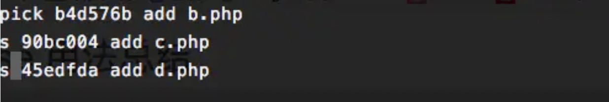

然后是注释修改界面:


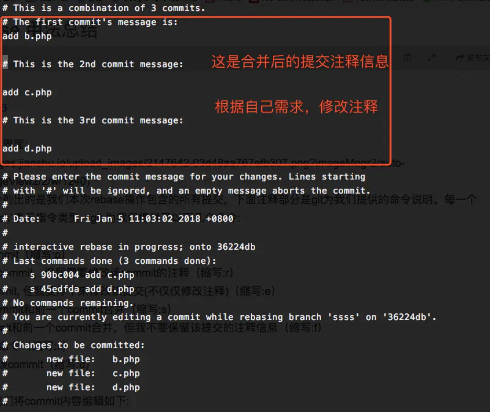

编辑完保存即可完成commit的合并了：

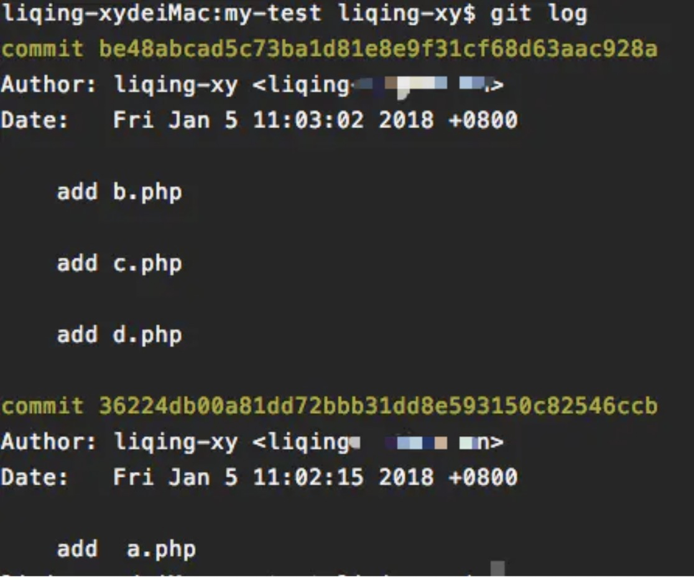

#### 2.拆分一个commit为多个commit

如果想把某个 commit 拆分成多个 commit，可以使用 `edit` 作为 action，edit 表示 **使用该提交，但是先在这一步停一下，等我重新编辑完再进行下一步。**

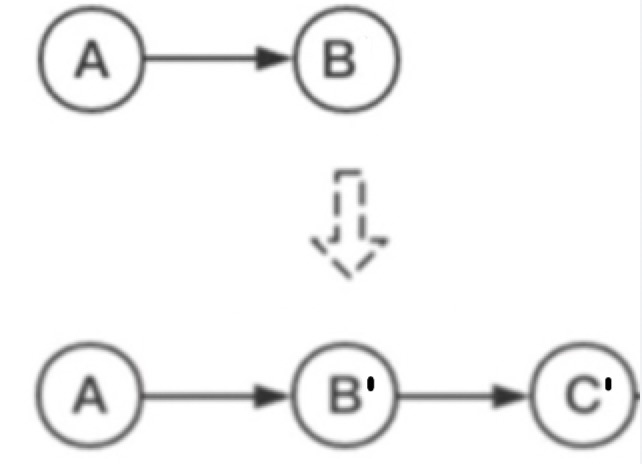

初始状态如下：


`just add a new line` 这个 commit 修改了两个文件 `myfile.txt` 和 `anothorfile.txt`，我们希望把它拆成两个 commit，每个文件的修改各提交一个 commit。

执行 git rebase -i 13243ea，然后修改 865b2ac 这个 commit 的 action 为 edit，如下。

```bash
git rebase -i 13243ea
```

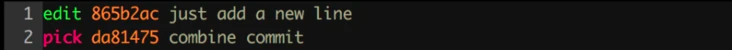


我们这里是要拆分 commit，所以要先对 commit 内容 reset，然后重新提交

```bash
➜  git reset HEAD^ # 撤销提交
Unstaged changes after reset:
M   myfile.txt
M   anotherfile.txt
➜  git add myfile.txt # 拆解出第一个提交
➜  git commit -m 'first part of split commit'
[detached HEAD d0727f7] first part of split commit
 1 file changed, 1 insertion(+)
➜  git add anotherfile.txt # 拆解出第二个提交
➜  git commit -m 'second part of split commit'
[detached HEAD 2302fc7] second part of split commit
 1 file changed, 1 insertion(+)
 create mode 100644 anotherfile.txt
➜  git rebase --continue
Successfully rebased and updated refs/heads/master.
```

拆分完成后使用 `git rebase --continue` 即结束 rebase，结果如下：


#### 3.将某一段commit粘贴到另一个分支上

当我们项目中存在多个分支，有时候我们需要将某一个分支中的一段提交同时应用到其他分支中，就像下图：

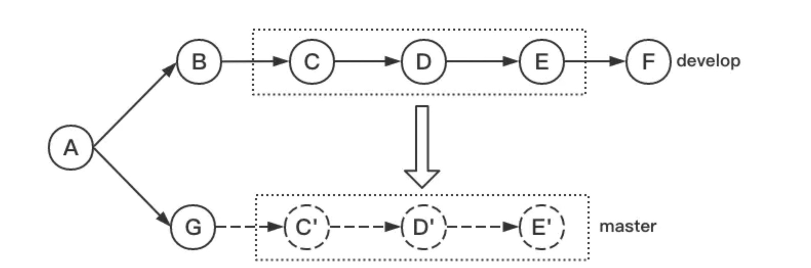

 我们希望将develop分支中的C~E部分复制到master分支中，这时我们就可以通过rebase命令来实现（如果只是复制某一两个提交到其他分支，建议使用更简单的命令:`git cherry-pick`）。
 在实际模拟中，我们创建了master和develop两个分支:
**master分支:**

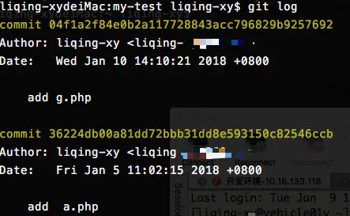

**develop分支:**

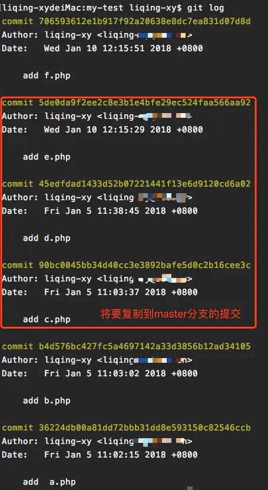

我们使用命令的形式为:

```css
    git rebase   [startpoint]   [endpoint]  --onto  [branchName]
```

其中，`[startpoint]`  `[endpoint]`仍然和上一个命令一样指定了一个编辑区间(前开后闭)，`--onto`的意思是要将该指定的提交复制到哪个分支上。
 所以，在找到C(90bc0045b)和E(5de0da9f2)的提交id后，我们运行以下命令：

```undefined
    git  rebase   90bc0045b^   5de0da9f2   --onto master
```

注:因为`[startpoint]`  `[endpoint]`指定的是一个前开后闭的区间，为了让这个区间包含C提交，我们将区间起始点向后退了一步。
 运行完成后查看当前分支的日志:

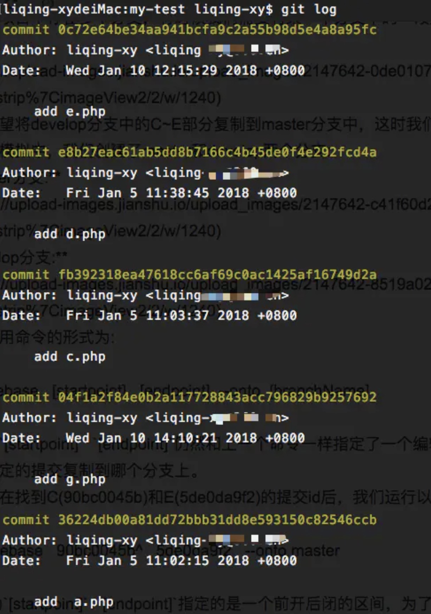

可以看到，C~E部分的提交内容已经复制到了G的后面了，大功告成？NO！我们看一下当前分支的状态:

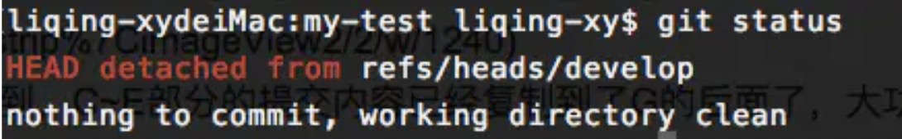

当前HEAD处于游离状态，实际上，此时所有分支的状态应该是这样:

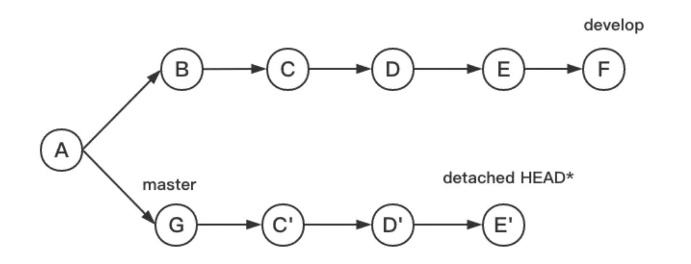


 所以，虽然此时HEAD所指向的内容正是我们所需要的，但是master分支是没有任何变化的，`git`只是将C~E部分的提交内容复制一份粘贴到了master所指向的提交后面，我们需要做的就是将master所指向的提交id设置为当前HEAD所指向的提交id就可以了，即:

```undefined
      git checkout master
      git reset --hard  0c72e64
```

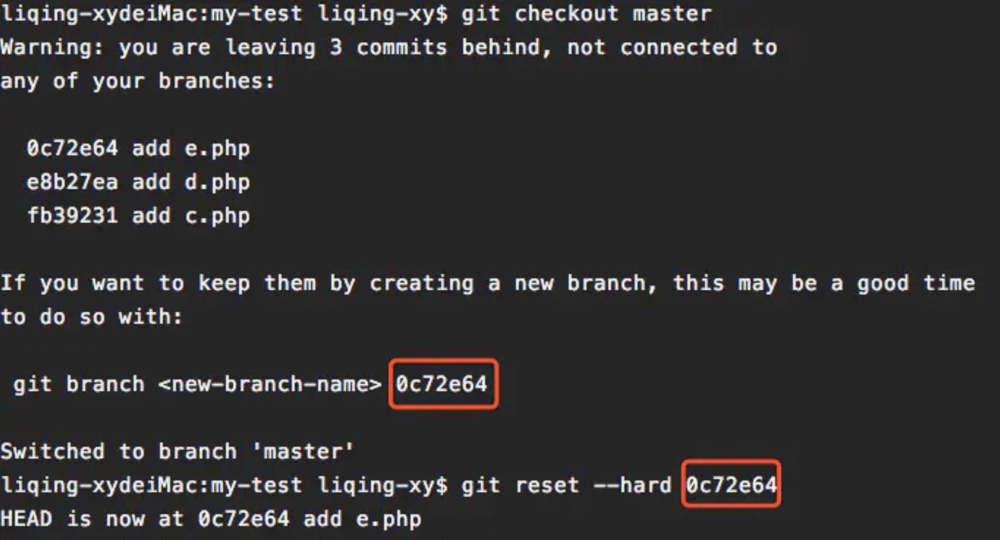

此时我们才大功告成！

#### 4.删除提交

如果想删除某个提交，使用 git rebase -i 后直接在编辑器中删除那一行 commit 即可

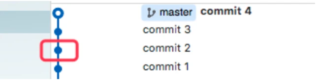

假设删除的是 commit 2，那么编辑完成后 git 会比较 commit 1 与 commit 3 的差异，如果有冲突，需要手动解决冲突后 add 并 `git rebase --continue`


### git merge 和 git rebase的区别

举个例子：
初始状态如下图所示：

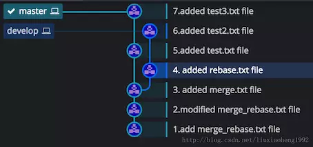

develop分支在 (3.added merge.txt file)处从master分支拉取develop分支。在上图情况下，在master分支的7commit处，执行git merge develop，结果如下图所示：

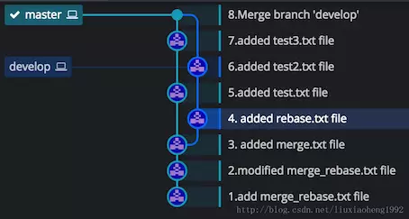

执行git rebase master，结果应该为：1235746（因为原文作者把把master rebase到 dev里，写反了，因此不用他的图）

从上图可以看出：

1. 当需要把`develop`分支合并到`master`分支上的时候，可以

   ```bash
   git checkout master
   git merge develop
   ```

   也可以

   ```bash
   git checkout dev
   git rebase master
   git checkout master
   git merge dev(快进合并)
   ```

2. `merge`结果能够体现出时间线，但是rebase会打乱时间线。

3. 而`rebase`看起来简洁，但是`merge`看起来不太简洁。

另外，还有一些区别

1. 如果使用 `merge` 进行合并，可以使用` revert `命令对 `merge `的内容进行撤销操作（参考 [revert](https://segmentfault.com/a/1190000012897697)），而使用 `rebase` 则不行（已经没有` merge commit` 了），而需要使用 `rebase -i` 对提交进行重新编辑。
2. `dev`在`rebase master`后，会由原来的两个分叉的分支变成重叠的分支，这样会产生本地的`dev`分支和远程的`dev`分支分离的情况。

```bash
Your branch and 'origin/dev' have diverged,
and have 1 and 1 different commits each, respectively.
  (use "git pull" to merge the remote branch into yours)
```

这时需要用`git push -f`强制推送，覆盖远程分支。若使用了提示中的`git pull`，结果会变成合并，并产生一个合并提交点。

**慎用`git push -f`!**

3. 当需要把`dev`分支合并到`master`

### 参考

[什么是合并](https://git-scm.com/book/zh/v2/Git-%E5%88%86%E6%94%AF-%E5%88%86%E6%94%AF%E7%9A%84%E6%96%B0%E5%BB%BA%E4%B8%8E%E5%90%88%E5%B9%B6#_basic_merging)

[什么是变基](https://link.juejin.cn/?target=https%3A%2F%2Fgit-scm.com%2Fbook%2Fzh%2Fv2%2FGit-%E5%88%86%E6%94%AF-%E5%8F%98%E5%9F%BA)

[变基的一些用法](https://link.juejin.cn/?target=https%3A%2F%2Fwww.jianshu.com%2Fp%2F4a8f4af4e803)

[交互式rebase](https://segmentfault.com/a/1190000012897755)

[如何优雅的使用git](https://juejin.cn/post/6844903546104135694#heading-9)

[git rebase 和 git merge 的区别](https://segmentfault.com/a/1190000018580144?utm_source=tag-newest)
