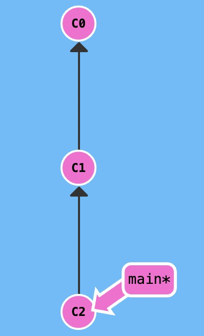
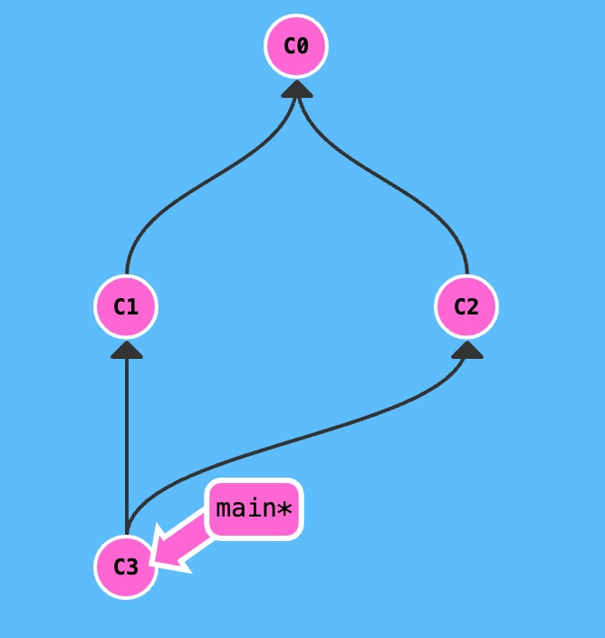
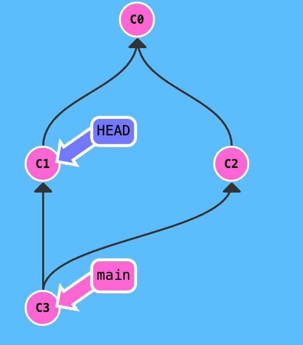
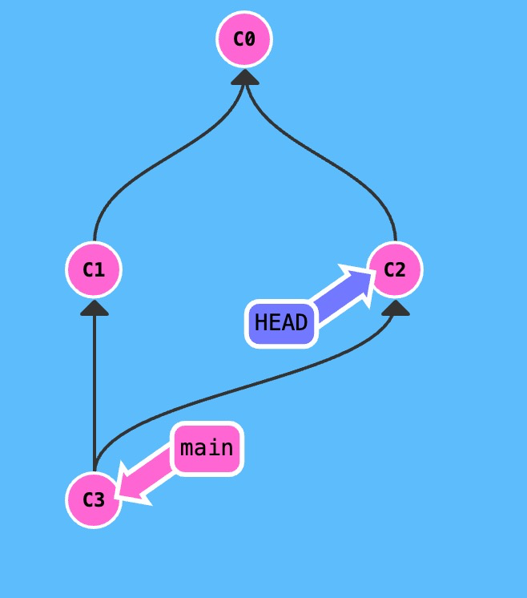
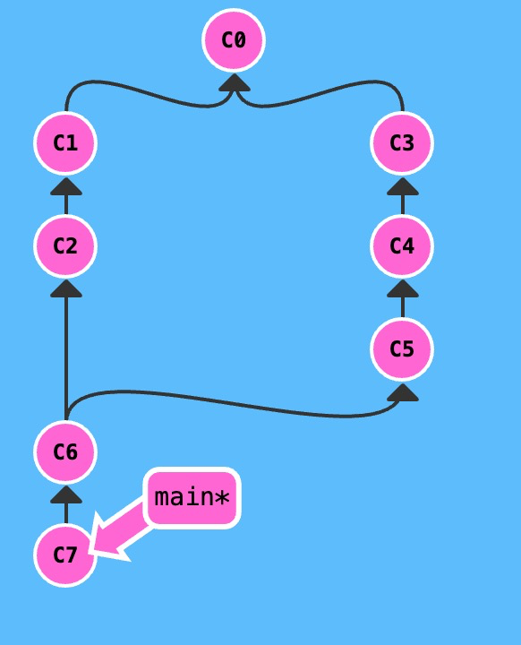
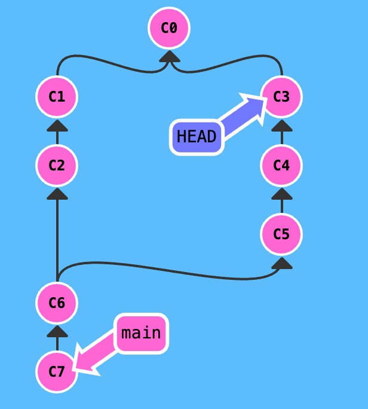

### 向上移动

- 使用 `^` 向上移动 1 个提交记录
- 使用 `~<num>` 向上移动`num`个提交记录，如 `~3`

我们可以用`^`移动`HEAD`或者当前分支的指向（由`git checkout`可得，`HEAD`和当前分支的指向是可以分离的）

如下图所示，`HEAD->main`，`main->C2`




如果我们想让`HEAD`指向`C0`

```bash
git checkout HEAD^^
或者
git checkout HEAD~2
或者
git checkout main^^ //我们知道，git checkout改变的永远是HEAD的指向
或者
git checkout main~2如果我们想让`main`指向`C0`呢？
```

 `-f` 则容许我们将分支强制移动到那个位置。

```bash
git branch -f main HEAD^^
或者
git branch -f main HEAD~2
```

### 选择某一个父提交记录

操作符 `^` 与 `~` 符一样，后面也可以跟一个数字。

但是该操作符后面的数字与 `~` 后面的不同，并不是用来指定向上返回几代，而是指定合并提交记录的某个父提交。还记得前面提到过的一个合并提交有两个父提交吧，所以遇到这样的节点时该选择哪条路径就不是很清晰了。

Git 默认选择合并提交的“第一个”父提交，在操作符 `^` 后跟一个数字可以改变这一默认行为。

废话不多说，举个例子。

这里有一个合并提交记录。如果不加数字修改符直接检出 `main^`，会回到第一个父提交记录。

(*在我们的图示中，第一个父提交记录是指合并提交记录正上方的那个提交记录。*)



当我们执行以下命令

```bash
git checkout main^
```

`HEAD`会指向`C3`的第一个父节点，如下图所示



那如果我们想让`HEAD`指向`C3`的第二个父节点，要怎么操作呢？我们可以使用以下代码

```bash
git checkout main^2
```

成功啦！



### 链式操作

另外，~和^还支持链式操，提交树如下



如果执行以下代码

```
git checkout HEAD~^2~2
```

猜猜会到哪个节点？

HEAD的指向顺序应该是

~(C6)，^2(C5)，～2(C3)

因此最后会指向C3节点，如下图所示



