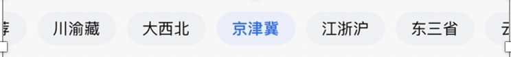
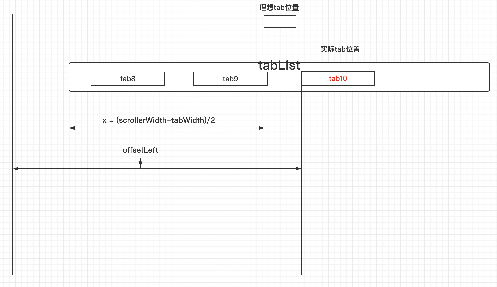
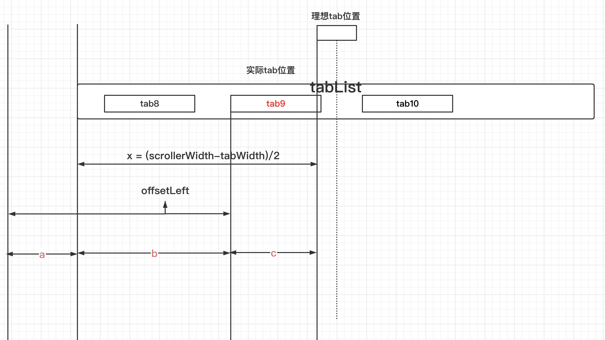

### 1.offsetLeft和offsetTop

这两个都是**只读属性**。offsetLeft从字面意思上理解，就是以**父元素**作为参照点（父元素的定位不能是static），当前元素相对于父元素左边的偏移量。那么offsetTop就是以父元素为参照物，当前元素相对于父元素上边的偏移量。如果没有父元素那么参照点就是body。


这里要注意一点，如果当前定位元素本身是固定定位(position:fixed;)，那么就别费心找爹了，返回的是当前元素与可视窗口的距离。

**offsetLeft/offsetTop和style.left/style.top的区别**

style.left/style.top和offsetLeft/offsetTop的功能一样，那么它们有什么区别呢？

1.返回值不一样：style.left/style.top返回的是字符串，带了单位（px）的，而offsetLeft/offsetTop只返回数字（小数会四舍五入）。

2.可读写性不同：offsetLeft/offsetTop只读，而style.left/style.top 可读写。

3.若是没有给 HTML 元素指定过 top 样式，则 style.top 返回的是空字符串（而且必须要定义在html里，如果定义在css里，style.left的值仍然为空，这也是个坑啊，大家谨慎）。

### 2.offsetWidth和offsetHeight

这两个也是**只读属性**，先上公式：**offsetHeight || offsetWidth = boder + padding + content（不包括margin）**


相信大家看了图和公式都很明白了，这里就不再赘述了。

**offsetHeight/offsetWidth和style.height/style.width的区别**

1.返回值不一样：offsetHeight/offsetWidth返回纯数字（小数会四舍五入），style.height/style.width返回字符串，带单位（px）。

2.可读写性不一样：offsetHeight/offsetWidth只读，style.height/style.width可读写。

3.style.height/style.width是不包含边框的哦。还是用和公式表示一下：offsetWidth = style.width + style.padding + style.border

4.如果没有为元素设置高度，offsetHeight会根据内容获取高度值，style.height会返回undefind

5.style.width仅仅能返回在HTML中定义的内部样式表的width属性值，如果定义在CSS中就获取不到。

### 3.clientWidth和clientHeight

**只读属性**，返回当前节点的**可视宽度**和**可视高度**（不包括边框、外边距）（包括内边距）clientHeight = topPadding + bottomPadding+ height - scrollbar.height。

### 4.scrollTop、scrollLeft、scrollWidth、scrollHeight

scrollTop和scrollLeft是**可读写属性** 。scrollTop：返回网页滚动条垂直方向滚去的距离； scrollLeft：返回网页滚动条水平方向滚去的距离；

scrollWidth和scrolltHeight是**只读属性**，返回当前节点的实际宽度和实际高度（不包括边框）,没有滚动条时和clientWidth和clientHeight一样


### 5.event.clientX、event.clientY、event.pageX、event.pageY

event.clientX /event.clientY是目标点距离浏览器可视范围的X轴/Y轴坐标

event.pageX /event.pageY 是目标点距离document最左上角的X轴/Y轴坐标


### 6.innerHeight/innerWidth和outerHeight/outerWidth

innerHeight/innerWidth为**只读属性**，返回窗口文档显示区的高度和宽度，不包括菜单栏、工具栏和滚动条的宽高。（ 注：IE不支持这些属性，它用document.documentElement 或document.body 的 clientWidth和 clientHeight属性作为替代。）

outerHeight/outerWidth为**可读写属性**，设置或返回一个窗口的高度和宽度，包括所有界面元素（如工具栏/滚动条）。

### 如何实现滚动居中




`tabList`如上图所示，我们要如何实现，使得被选中的tab能够自动居中呢？

一共有三种情况

1. tab本身居中，这是一种特殊情况
2. tab偏右
3. tab偏左

因为tab偏右的情况比较好入手，所以我们先从tab偏右开始讨论



如图可知，如果我们想让`tab10`移动到理想`tab`位置，只需要把除了`x`以外的偏移滚动掉就可以了。

`tab10`的`scrollerLeft`只需要等于

```javascript
offsetLeft - x
即
offsetLeft - (scrollerWidth - tabWidth) / 2
```

那么当`tab`偏左时呢



当tab偏左的时候，我们的`scrollerLeft`值为`a`

且 `a = offsetLeft - b`

因为`tab`偏左，显然滚动的有点多

我们希望`scrollerLeft`能少滚动点，把`c`部分腾出来

所以我们希望

```javascript
scrollerLeft = offsetLeft - b - c
```

等等...

```javascript
scrollerLeft 
	= offsetLeft - b - c 
	= offsetLeft - ( b + c) 
	= offsetLeft - x
	= offsetLeft - (scrollerWidth - tabWidth) / 2
```

当`tab`居中的时候，`scrollerLeft`的值则刚刚好满足

```javascript
scrollerLeft = offsetLeft - (scrollerWidth - tabWidth) / 2
```

综上所述，三种情况验证完毕

