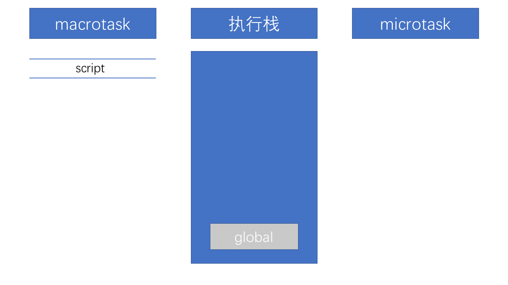

# JavaScript 的事件循环

 <https://github.com/Advanced-Frontend/Daily-Interview-Question/issues/7>

[从浏览器多进程到JS单线程，JS运行机制最全面的一次梳理](https://juejin.im/post/5a6547d0f265da3e283a1df7#heading-8)

浏览器是多进程的，其中，浏览器内核就是浏览器渲染进程，浏览器内核是多线程的，它包括以下线程

- `GUI`渲染线程：负责渲染浏览器界面
- `JS`引擎线程：执行解析执行`JS`脚本

它们俩是互斥的（`JS`可操作`DOM`，边修改边渲染会造成元素数据不一致）`JS`引擎执行时`GUI`会被挂起，`GUI`更新会被保存到一个队列中，等到`JS`引擎空闲时再被执行。所以如果`JS`执行的时间过长（可创建一个`worker`子线程，计算出结果再`postMessage`给主线程），就会造成页面的渲染不连贯，导致页面加载阻塞。

- 事件触发线程：用来控制事件循环，当事件的符合触发条件被触发时，该线程会把该事件添加到宏任务队列的队尾，等待`JS`引擎的处理。
- 定时器触发线程：`setInterval`和`setTimeout`所在线程，对定时器计时并触发定时，计时完毕，会被事件触发线程添加到任务队列的队尾。

🌟注意：`W3C`在`HTML`标准中规定，`setTimeout`中低于`4ms`的时间间隔算为`4ms`。

- 异步`http`请求线程：在`XMLHttpRequest`连接后，通过浏览器新开一个线程请求，在检测到状态变更时，触发状态变更事件，事件触发线程会将事件的回调放入任务队列的队尾。

## 任务队列

首先我们需要明白以下几件事情：

- `JS`分为同步任务和异步任务
- 同步任务都在主线程上执行，形成一个**执行栈**
- 主线程之外，**事件触发线程**管理着一个**任务队列**，只要异步任务有了运行结果，就在任务队列之中放置一个事件。
- 一旦**执行栈**中的所有同步任务执行完毕（此时`JS`引擎空闲），系统就会读取**任务队列**，将可运行的异步任务添加到可执行栈中，开始执行。

事件循环是通过[任务队列](https://www.w3.org/TR/html5/webappapis.html#task-queues)的机制来进行协调的。一个事件循环中，可以有一个或者多个任务队列，一个任务队列便是一系列有序任务的集合；**每个任务都有一个任务源，源自同一个任务源的任务必须放到同一个任务队列，从不同源来的则被添加到不同队列。** `setTimeout`/`Promise` 等`API`便是任务源，而进入任务队列的是他们指定的具体执行任务。

## `setTimeout`和`setInterval`的区别

因为每次`setTimeout`计时到后就会去执行，然后执行一段时间后才会继续`setTimeout`，中间就多了误差(误差多少与代码执行时间有关）

`setInterval`则是每次都精确的隔一段时间推入一个事件，如果当前事件队列中有`setInterval`的回调，不会重复添加。

## 宏任务`macrotask`

每次执行栈执行的代码就是一个宏任务（包括每次从事件队列中获取一个事件回调并放到执行栈中执行）

- 每一个宏任务都会从头到尾执行完毕，不会执行其他
- 浏览器为了能够使得`JS`内部宏任务与`DOM`任务能够有序的执行，**会在一个宏任务执行结束后，下一个宏任务执行开始前，对页面进行重新渲染**（`  宏任务->渲染->宏任务->...`）
- 由事件触发线程维护

宏任务主要包含：`script(整体代码)`、`setTimeout`、`setInterval`、`I/O`、`UI交互事件`、`postMessage`、`MessageChannel`、`setImmediate(Node.js 环境)`

## 微任务`microtask`

**在当前 task 执行结束后立即执行的任务**。（`  宏任务->微任务->渲染->宏任务->...`）

- 它的响应速度相比`setTimeout`（`setTimeout`是宏任务）会更快，因为无需等渲染。
- 在某一个`macrotask`执行完后，就会将在它执行期间产生的所有`microtask`都执行完毕。
- 由`js`引擎线程维护

`microtask`主要包含：`Promise.then`、`MutaionObserver`、`process.nextTick`(`Node.js` 环境)

**补充：在node环境下，`process.nextTick`的优先级高于`Promise`**，也就是可以简单理解为：在宏任务结束后会先执行微任务队列中的`nextTickQueue`部分，然后才会执行微任务中的`Promise`部分。

## 运行机制

在事件循环中，每进行一次循环操作称为 tick

- 执行一个宏任务（栈中没有就从任务队列中获取）
- 执行过程中如果遇到微任务，就将它添加到微任务的任务队列中
- 宏任务执行完毕后，立即执行当前微任务队列中的所有微任务（依次执行）
- 当前宏任务执行完毕，开始检查渲染，然后GUI线程接管渲染
- 渲染完毕后，JS线程继续接管，开始下一个宏任务（从任务队列中获取）

流程图如下：

[](https://camo.githubusercontent.com/47479c8773d91e8eef4a359eca57bb1361183b9e/68747470733a2f2f692e6c6f6c692e6e65742f323031392f30322f30382f356335643661353238626461662e6a7067)

## `Promise`和`async`中的立即执行

我们知道`Promise`中的异步体现在`then`和`catch`中，所以写在`Promise`中的代码是被当做同步任务立即执行的。而在`async/await`中，在出现`await`出现之前，其中的代码也是立即执行的。那么出现了`await`时候发生了什么呢？

## await做了什么

从字面意思上看`await`就是等待，`await` 等待的是一个表达式，这个表达式的返回值可以是一个`promise`对象也可以是其他值。

很多人以为await会一直等待之后的表达式执行完之后才会继续执行后面的代码，**实际上`await`是一个让出线程的标志。`await`后面的表达式会先执行一遍，将`await`后面的代码加入到`microtask`中，然后就会跳出整个`async`函数来执行后面的代码。**

由于因为`async await` 是`generator`的语法糖。所以`await`后面的代码是微任务。所以对于本题中的

```javascript
async function async1() {
	console.log('async1 start');
	await async2();
	console.log('async1 end');
}
```

等价于

```javascript
async function async1() {
	console.log('async1 start');
	Promise.resolve(async2()).then(() =>{
                console.log('async1 end');
        })
}
```

## 回到本题

```javascript
//请写出输出内容
async function async1() {
    console.log('async1 start');//2
    await async2();//3 await后面的表达式会先执行一遍，将await后面的代码加入到microtask中
    console.log('async1 end');//6
}
async function async2() {
	console.log('async2');
}

console.log('script start');  // 1

setTimeout(function() {
    console.log('setTimeout');//8
}, 0)

async1();

new Promise(function(resolve) {
    console.log('promise1');//4
    resolve();
}).then(function() {
    console.log('promise2');//7
});
console.log('script end');//5

/*
script start
async1 start
async2
promise1
script end
async1 end
promise2
setTimeout
*/
```

这道题主要考察的是事件循环中函数执行顺序的问题，其中包括`async` ，`await`，`setTimeout`，`Promise`函数。下面来说一下本题中涉及到的知识点。

以上就本道题涉及到的所有相关知识点了，下面我们再回到这道题来一步一步看看怎么回事儿。

1. 首先，事件循环从宏任务队列开始，这个时候，宏任务队列中，只有一个script(整体代码)任务；当遇到任务源(task source)时，则会先分发任务到对应的任务队列中去。所以，上面例子的第一步执行如下图所示：

   [](https://camo.githubusercontent.com/15b3ae9733b0b5b6a144f519396ff88eaeca40fb/68747470733a2f2f692e6c6f6c692e6e65742f323031392f30322f30382f356335643639623432316166332e706e67)

2. 然后我们看到首先定义了两个`async`函数，接着往下看，然后遇到了 `console` 语句，直接输出 `script start`。输出之后，script 任务继续往下执行，遇到 `setTimeout`，其作为一个宏任务源，则会先将其任务分发到对应的队列中：
   [](https://camo.githubusercontent.com/0a6e6cd2cc52d18a0f97ec01659058e830305a45/68747470733a2f2f692e6c6f6c692e6e65742f323031392f30322f30382f356335643639623432353530612e706e67)

3. script 任务继续往下执行，执行了async1()函数，前面讲过async函数中在await之前的代码是立即执行的，所以会立即输出`async1 start`。
   遇到了await时，会将await后面的表达式执行一遍，所以就紧接着输出`async2`，然后将await后面的代码也就是`console.log('async1 end')`加入到microtask中的Promise队列中，接着跳出async1函数来执行后面的代码。
   [](https://camo.githubusercontent.com/93ec5469b0846f0f161641fc718005dbe994d190/68747470733a2f2f692e6c6f6c692e6e65742f323031392f30322f31382f356336616435383333376165642e706e67)

4. script任务继续往下执行，遇到Promise实例。由于Promise中的函数是立即执行的，而后续的 `.then` 则会被分发到 `microtask` 的 `Promise` 队列中去。所以会先输出 `promise1`，然后执行 `resolve`，将 `promise2` 分配到对应队列。
   [](https://camo.githubusercontent.com/6f617a237607ce7a71fabcab61d2952a8b412205/68747470733a2f2f692e6c6f6c692e6e65742f323031392f30322f31382f356336616435383334376135652e706e67)

5. script任务继续往下执行，最后只有一句输出了 `script end`，至此，全局任务就执行完毕了。
   根据上述，每次执行完一个宏任务之后，会去检查是否存在微任务；如果有，则执行微任务直至清空微任务队列。
   因而在`script`任务执行完毕之后，开始查找清空微任务队列。此时，微任务中， `Promise` 队列有的两个任务`async1 end`和`promise2`，因此按先后顺序输出 `async1 end，promise2`。当所有的微任务执行完毕之后，表示第一轮的循环就结束了。

6. 第二轮循环开始，这个时候就会跳回`async1`函数中执行后面的代码，然后遇到了同步任务 `console` 语句，直接输出 `async1 end`。这样第二轮的循环就结束了。（也可以理解为被加入到`script`任务队列中，所以会先与`setTimeout`队列执行）

7. 第二轮循环依旧从宏任务队列开始。此时宏任务中只有一个 `setTimeout`，取出直接输出即可，至此整个流程结束。

下面我会改变一下代码来加深印象。

## 变式一

在第一个变式中我将`async2`中的函数也变成了`Promise`函数，代码如下：

```javascript
async function async1() {
    console.log('async1 start');
    await async2();
    console.log('async1 end');
}
async function async2() {
    new Promise(function(resolve) {
    console.log('promise1');
    resolve();
}).then(function() {
    console.log('promise2');
    });
}
console.log('script start');
setTimeout(function() {
    console.log('setTimeout');
}, 0)
async1();

new Promise(function(resolve) {
    console.log('promise3');
    resolve();
}).then(function() {
    console.log('promise4');
});

console.log('script end');
```

可以先自己看看输出顺序会是什么，下面来公布结果：

```
script start
async1 start
promise1
promise3
script end
promise2
async1 end
promise4
setTimeout
```

## 变式二

在第二个变式中，我将async1中await后面的代码和async2的代码都改为异步的，代码如下：

```javascript
async function async1() {
    console.log('async1 start');//2
    await async2();
    //更改如下：
    setTimeout(function() {
        console.log('setTimeout1')//宏3
    },0)
}
async function async2() {
    //更改如下：
	setTimeout(function() {
		console.log('setTimeout2')//宏2
	},0)
}
console.log('script start');//1

setTimeout(function() {
    console.log('setTimeout3');//宏1
}, 0)
async1();

new Promise(function(resolve) {
    console.log('promise1');//3
    resolve();
}).then(function() {
    console.log('promise2');//微1
});
console.log('script end');//4
```

可以先自己看看输出顺序会是什么，下面来公布结果：

```
script start
async1 start
promise1
script end
promise2
setTimeout3
setTimeout2
setTimeout1
```

## 变式三

变式三是我在一篇面经中看到的原题，整体来说大同小异，代码如下：

```javascript
async function a1 () {
    console.log('a1 start')//2
    await a2()
    console.log('a1 end')//微2
}
async function a2 () {
    console.log('a2')//3
}

console.log('script start')//1

setTimeout(() =>{
    console.log('setTimeout')//宏1
}, 0)

Promise.resolve().then(() =>{
    console.log('promise1')//微1
})

a1()

let promise2 = new Promise((resolve) =>{
    resolve('promise2.then')
    console.log('promise2')//4
})

promise2.then((res) =>{
    console.log(res)//微3
    Promise.resolve().then(() =>{
        console.log('promise3')//微4
    })
})
console.log('script end')//5
```

无非是在微任务那块儿做点文章，前面的内容如果你都看懂了的话这道题一定没问题的，结果如下：

```
script start
a1 start
a2
promise2
script end
promise1
a1 end
promise2.then
promise3
setTimeout
```

### 总结

事件循环机制要点：

- 宏任务：`script`、`setTimeout`、`setTimeInterval`、`I/O`、`postMessage`、`setImmediate(node)`
- 微任务：`promise.then`、`process.nextTick`、`await`后面的代码
- `promise`和`async`后的表达式立即执行
- `await`机制：让出线程，执行关键字后面的表达式，而await后面的代码加入微任务队列。