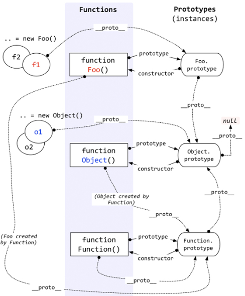

## 构造函数创建对象

构造函数的`prototype`属性指向它的原型，构造函数的`prototype`的`constructor`指向构造函数本身。若使用构造函数创建一个实例，实例的`__proto__`就会指向构造函数的`prototype`，可以从`prototype`中继承属性。当读取实例的属性时，如果找不到，就会查找与对象关联的原型中的属性，如果还查不到，就去找原型的原型，一直找到最顶层为止。因为原型对象就是通过 `Object` 构造函数生成的，原型链的最顶层就是`Object.prototype`，为了防止循环应用，所以让`Object.prototype`的`__proto__`为`null`。

```javascript
person.constructor === Person.prototype.constructor
```


