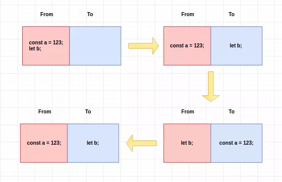

## 什么是垃圾回收机制

**执行环境**会负责**管理**代码执行过程中使用的**内存**。

GC做什么了：

- 找到内存空间中的垃圾。
- 回收垃圾，让程序员能再次利用这部分空间。

## V8 回收策略

新生代的对象为存活时间较短的对象，老生代中的对象为存活时间较长或常驻内存的对象。分别对新生代和老生代使用 不同的垃圾回收算法来提升垃圾回收的效率。对象起初都会被分配到新生代，当新生代中的对象满足某些条件时，会被移动到老生代（晋升）。

## 新生代到老生代转化条件

- 新生代中的对象是否已经经历过一次 Scavenge 算法，如果经历过的话，会将对象从新生代空间移到老生代空间中。
- **To 空间的对象占比大小超过 25 %。** 在这种情况下，为了不影响到内存分配，会将对象从新生代空间移到老生代空间中。

## 新生代算法

### 复制算法

内存空间分为大小相等的两块，分别为 From 空间和 To 空间，每次只使用其中一块。新分配的对象会被放入 From 空间中，当 From 空间被占满时，启动`GC`，把 From 空间中存活的对象复制到 To 空间中，销毁失活的对象。当复制完成后将 `From` 空间和 `To` 空间互换，这样 `GC` 结束 



- 每次都是对整个半区进行回收，内存分配时不用考虑内存碎片等复杂情况，只要移动堆顶指针，按顺序分配内存即可

缺点

- 将内存缩小为原来的一半

## 老生代算法

### 引用计数

顾名思义：**跟踪记录每个值被引用的次数**。

垃圾回收器运行时，会释放那些应用次数为0的值所占的内存。

```
var a = new Object(); // 此时'这个对象'的引用计数为1（a在引用）
var b = a; // ‘这个对象’的引用计数是2（a,b）
a = null; // reference_count = 1
b = null; // reference_count = 0 
// 下一步 GC来回收‘这个对象’了
```

但是引用计数会出现循环应用的问题

**循环引用：**对象A中包含一个指向对象B的指针，而对象B中也包含一个指向对象A的指针。循环引用会造成**内存泄漏**

**内存泄漏**：程序中己动态分配的堆内存由于某种原因程序未释放或无法释放，造成系统内存的浪费，导致程序运行速度减慢甚至系统崩溃等严重后果。

如何避免循环应用呢？在不使用他们的时候手工断开连接，把被循环应用的值设为null。

**优势**

- 即时回收，GC时JS停止运行，GC时间短的话，最大暂停时间短。

- 不用去遍历堆里面的所有活动对象和非活动对象

**缺点**

- 计数器占位大
- 无法解决循环引用问题

> 该算法已经逐渐被 ‘标记-清除’ 算法替代，在V8引擎里面，使用最多的就是 标记-清除算法


### 标记清除算法

变量进入环境，标记为进入环境；离开环境，标记为离开环境。

垃圾回收器在运行的时候会**（1）给存储在内存中的所有变量都加上标记**。然后，它会**（2）去掉环境中的变量以及被环境中的变量引用的变量的标记**。而**（3）在此之后再被加上标记的变量将被视为准备删除的变量**，原因是环境中的变量已经无法访问到这些变量了。最后，垃圾回收器完成内存清除工作，销毁那些带标记的值并回收它们所占用的内存空间。

**优点**

- 实现简单，打标记就打和不打两种情况，可用一位二进制表示
- 解决了循环引用的问题

**缺点**

- 造成碎片化
- 再分配时遍历次数多，没有找到合适大小的内存块，就会遍历空闲链表(保存堆中所有空闲地址空间的地址形成的链表）到尾端

## 性能提升

- 为什么

垃圾收集器是**周期性运行**的，如果为变量分配的内存很可观，那么回收工作也是相当大的。

- 怎么做

IE7的垃圾收集例程改变了工作方式：**动态修正触发垃圾收集的变量分配、字面量和数组元素的临界值**。**回收的内存分配量低于15%**，则变量、字面量和和数组元素的**临界值就会加倍**，**回收了85%的内存分配量**，则将**临界值设为默认值**。

> IE中window.CollectGabage()方法会立即执行垃圾收集。Opera7以及更高window.opera.CollectGabage()方法也会启动垃圾收集例程。

## 管理内存

### 为什么要管理内存

为了防止系统崩溃，分配给Web浏览器的可用内存数量通常比分配给桌面应用程序的少

### 如何管理内存

为执行中的代码只保存必要的数据。一旦数据不再有用，就将其设置为null来释放其应用——这个做法叫做**解除引用**。其作用是让值脱离执行欢迎，以便垃圾回收下次运行的时候将其回收。