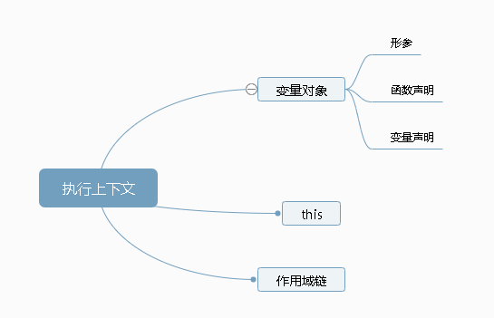

## 执行上下文栈

"执行上下文"是执行函数时的“**准备工作**”。执行上下文栈是用来管理执行上下文的

初始化的时候首先就会向执行上下文栈压入一个全局执行上下文，并且只有当整个应用程序结束的时候，执行上下文栈才会被清空，所以程序结束之前， 执行上下文栈最底部永远有个全局执行上下文

当**执行一个函数的时候，就会创建一个执行上下文，并且压入执行上下文栈**，当**函数执行完毕的时候，就会将函数的执行上下文从栈中弹出**。

## 执行上下文

当 `JavaScript` 代码执行一段可执行代码时，会创建对应的执行上下文

对于**每个执行上下文**，都有三个重要属性：

- 变量对象
- 作用域链
- `this`



### 变量对象

变量对象是与执行上下文相关的数据作用域，**存储了在上下文中定义的变量和函数声明**。

全局上下文下的**变量对象为全局对象**，函数上下文下的**变量对象为活动对象**。

#### 变量对象

1. 函数的所有**形参**
   - 由名称和对应值组成的一个变量对象的属性被创建
   - 没有实参，属性值设为 undefined
2. **函数声明**
3. **变量声明**
   - 由名称和对应值（undefined）组成一个变量对象的属性被创建；
   - **如果变量名称跟已经声明的形式参数或函数相同，则变量声明不会干扰已经存在的这类属性**

#### 全局对象:

1.客户端 `JavaScript` 中，全局对象就是 `Window` 对象。

2.全局对象是由 `Object` 构造函数实例化的一个**对象**。

3.**预定义**了许多函数和属性。如`Math.random()`

4.作为**全局变量的宿主**。

#### 活动对象

活动对象是被激活的变量对象，这个变量对象在进入函数执行上下文时刻被激活，它通过函数的 `arguments` 属性初始化。变量对象在被激活前不可访问。

#### 总结

1. 全局上下文的变量对象初始化是全局对象
2. 函数上下文的变量对象初始化只包括`Arguments` 对象
3. 在进入执行上下文时会给变量对象添加形参、函数声明、变量声明等初始的属性值
4. 在代码执行阶段，会再次修改变量对象的属性值

### 作用域

作用域是指程序源代码中**定义变量**的区域，它在**函数定义**的时候就决定了。

这是因为函数有一个内部属性 [[scope]]，当函数创建的时候，就会保存所有父变量对象到其中，你可以理解 [[scope]] 就是**所有父变量对象的层级链**，但是注意：[[scope]] 并不代表完整的作用域链！

 **JavaScript 采用的是词法作用域，当函数激活时，进入函数上下文，**创建 `VO`/`AO` 后，就会将**活动对象添加到作用链的前端**创建出作用域链。

因此我们也可以这样理解，作用域链和作用域没有必然的关系，只是因为[[scope]]是在创建的时候就会保存父作用域链，所以`JS`的作用域是词法作用域。

### 作用域链

**作用域链是由多个执行上下文的<font color='red'>变量对象</font>构成的链表**。

## 捋一捋

以下面的例子为例，结合着之前讲的变量对象和执行上下文栈，我们来总结一下函数执行上下文中作用域链和变量对象的创建过程：

```js
var scope = "global scope";
function checkscope(){
    var scope2 = 'local scope';
    return scope2;
}
checkscope()
```

执行过程如下：

1. `checkscope` 函数被创建，保存作用域链到内部属性**[[scope]]（所有父变量对象的层级链）**

```js
checkscope.[[scope]] = [
    globalContext.VO
]
```

2. **执行 `checkscope` 函数，创建 `checkscope` 函数执行上下文**，`checkscope` 函数执行上下文被压入执行上下文栈

```js
ECStack = [
    checkscopeContext,
    globalContext
]
```

3. `checkscope` 函数并不立刻执行，开始做准备工作，第一步：复制函数[[scope]]属性到**checkscope 函数执行上下文**创建作用域链

```js
checkscopeContext = {
    Scope: checkscope.[[scope]],
}
```

4. 用 `arguments` 创建活动对象，随后初始化活动对象，加入形参、函数声明、变量声明

```js
checkscopeContext = {
    AO: {
        arguments: {
            length: 0
        },
        scope2: undefined
    }
}
```

5. 将活动对象压入 `checkscope` 作用域链顶端

```
checkscopeContext = {
    AO: {
        arguments: {
            length: 0
        },
        scope2: undefined
    },
    Scope: [AO, [[Scope]]]
}复制代码
```

6. 准备工作做完，开始执行函数，随着函数的执行，修改 `AO` 的属性值

```
checkscopeContext = {
    AO: {
        arguments: {
            length: 0
        },
        scope2: 'local scope'
    },
    Scope: [AO, [[Scope]]]
}
```

7. 查找到 `scope2` 的值，**返回后函数执行完毕，函数上下文从执行上下文栈中弹出**

```
ECStack = [
    globalContext
];
```

