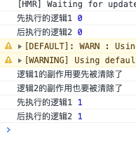
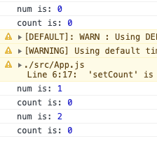

### 什么是 `useEffect`

类似 componentDidMount/Update, componentWillUnmount，当效果为 componentDidMount/Update 时，总是在整个更新周期的最后（页面渲染完成后）才执行。

### 基本使用

`useEffect`在每次渲染后执行，包括第一次渲染，它接受两个参数。

- 第一个参数，`"effect"`函数：在 `"effect"`中，进行一些副作用的操作。如果副作用的操作需要清除，`"effect"`可以返回一个函数。每次要执行更新的 `"effect"`之前，都会先执行这个函数，进行副作用的清除工作。
- 第二个参数，依赖项数组（可选）

  - 传入要比较的 `state`或者 `props`属性，如果依赖数组中的项在两次重渲染之间没有发生变化，你可以通知 `React`跳过对 `"effect`"的调用。
  - 依赖项数组为空数组，那么 `"effect"`只会执行一次。因为你的 `"effect"` 不依赖于 `props` 或 `state `中的任何值，所以它永远都不需要重复执行。
  - 如果依赖项数组没有填写，那么 `"effect"`每次渲染都执行

### 应用&场景（如何使用useEffect替代生命周期函数）

在探讨 `useEffect`的应用之前，我们可以先看一下下面这张react的生命周期图。

众所周知，`render` 函数是不应该有任何副作用的。因为在这里执行操作太早了，我们基本上都希望在 `render`后才执行我们的操作。


而 `useEffect`会在每次 `render`后执行。

`useEffect` Hook 类似于类组件中的 `componentDidMount`、`componentDidUpdate` 和 `componentWillUnmount` 生命周期方法，它使得在函数组件中执行副作用成为可能。

```jsx
import React, { useState, useEffect } from 'react';

function ExampleComponent() {
  const [count, setCount] = useState(0);

  // 模拟 componentDidMount 和 componentDidUpdate:
  useEffect(() => {
    // 使用浏览器的 API 更新页面标题
    document.title = `You clicked ${count} times`;

    // 没有指定依赖项，所以这个 effect 会在每次渲染后运行
  });

  // 模拟 componentDidMount：
  useEffect(() => {
    // 只需在组件加载时执行一次的操作，比如API请求等
    console.log('Component did mount');

    // 传递一个空数组作为依赖项，所以这个 effect 只会在组件挂载后运行一次
  }, []);

  // 模拟 componentWillUnmount:
  useEffect(() => {
    return () => {
      // 在此进行清理操作，比如取消网络请求、移除事件监听等
      console.log('Component will unmount');
    };

    // 空数组表示这个 effect 不依赖于任何 props 或 state，并且清理函数只会在组件销毁时执行一次
  }, []);

  // 模拟带依赖项的 componentDidUpdate:
  useEffect(() => {
    // 仅在特定变量（在此例中为 'count'）发生改变时运行这个 effect
    console.log('This runs only if count changes');

    // 指定 'count' 作为依赖项
  }, [count]);

  return (
    <div>
      <p>You clicked {count} times</p>
      <button onClick={() => setCount(count + 1)}>Click me</button>
    </div>
  );
}

export default ExampleComponent;

```

### 相比生命周期函数的优势

1. **多个 `useEffect`实现关注点分离**：`useEffect`相当于和 `componentDidMount`和 `componentDidUpdate`和 `componentWillUnmount`这三个函数的组合 ，它既可以把分散在多个生命周期的相关代码聚合在一个 `useEffect`中，也可以把聚合在一个生命中期的无关代码分散在多个 `useEffect`当中。

   并且代码中的 `useEffect`会按书写顺序由上而下的执行。每个 `"effect"`返回的清除函数在下次的"effect"执行之前，也会由上到下的执行。

   场景：屏幕中有一个按钮，count的初始值为0，点击按钮之后，count的数目会加一。

   

```javascript
 function App() {
  const [count, setCount] = useState(0);
  useEffect(() => {
    console.log('先执行的逻辑1',count);
    return ()=>{
      console.log('逻辑1的副作用要先被清除了');
    }
  },[count]);
  useEffect(() => {
    console.log('后执行的逻辑2',count);
    return ()=>{
      console.log('逻辑2的副作用也要被清除了');
    }
  },[count]);
  return (
    <div>
      <p>You clicked {count} times</p>
      <button onClick={() => setCount(count + 1)}>
        Click me
      </button>
    </div>
  );
}
```

下图为点击了一次按钮后



2. 与 `componentDidMount` 或 `componentDidUpdate` 不同，使用 `useEffect` 调度的 `"effect"` 不会阻塞浏览器更新屏幕，这让你的应用看起来响应更快。大多数情况下，`"effect"` 不需要同步地执行。在个别情况下（例如测量布局），有单独的 useLayoutEffect Hook 供你使用，其 API 与 useEffect 相同。

### 踩的一些坑&注意事项⚠️

1. 初始值就算是一个变量，也只能初始化一次

```javascript
function App() {
  const [num,setNum] = useState(0);
  const [count, setCount] = useState(num);
  useEffect(() => {
    console.log(num)
    console.log(count);
  });
  return (
    <div>
      <button onClick={() => setNum(num + 1)}>
        Click me
      </button>
    </div>
  );
}
```



2. 出现死循环的问题

场景：你在 `useEffect`中发起了一个请求，并且没有设置依赖项。并根据请求的结果改变了组件的状态。组件因为状态的改变重新渲染。由于你没有设置依赖项，所以在重新渲染后 `useEffect`再次执行，形成了死循环。

3. 不要欺骗依赖项

场景：设置一个定时器，并且在定时器不需要使用的时候进行清除。

一开始我们没有填写依赖项。企图在设置了定时器之后清除，但是由于没有依赖项，"effect"不会更新，

"effect"中的state和props是固化的，所以只是重复的进行setCount(0+1)的动作。又因为，**清除的动作是在"effect"更新之前执行的**，因此清除动作也不会执行。

```javascript
useEffect(() => {
    const id = setInterval(() => {
      console.log('设置')
      setCount(count+1);
    }, 1000);
    return () => {
      console.log('清除')
      return clearInterval(id);
    }
  }, []);
```

如果我们填写了依赖项呢？

```javascript
useEffect(() => {
    const id = setInterval(() => {
      console.log('设置')
      setCount(count+1);
    }, 1000);
    return () => {
      console.log('清除')
      return clearInterval(id);
    }
  }, [count]);
```

此时在count更新的过程中，会不断生成新的"effect"，因此会不断的设置和清除定时器，会造成一定的时差以及性能损耗。

那此时我们要怎么办呢 => 抽除依赖项count

此时的useEffect不再依赖count变量，它可以成功的设置定时器，并且进行count变量的更新。

```javascript
useEffect(() => {
    const id = setInterval(() => {
      console.log('设置')
      setCount(c=>c+1);
    }, 1000);
    return () => {
      console.log('清除')
      return clearInterval(id);
    }
}, []);
```

4. 在effect里拿到的是旧的state或prop

Effect拿到的总是定义它的那次渲染中的props和state。

### 深入useEffect的原理

### 本文参考

[react官方文档（使用 Effect Hook）](https://zh-hans.reactjs.org/docs/hooks-effect.html)

[精读《useEffect 完全指南》](https://juejin.im/post/5c9827745188250ff85afe50)

[终于搞懂 React Hooks了！！！！！](https://juejin.im/post/5e53d9116fb9a07c9070da44)

[React Hooks 详解 【近 1W 字】+ 项目实战](https://juejin.im/post/5dbbdbd5f265da4d4b5fe57d#heading-17)

[useEffect完整指南](https://overreacted.io/zh-hans/a-complete-guide-to-useeffect/)
