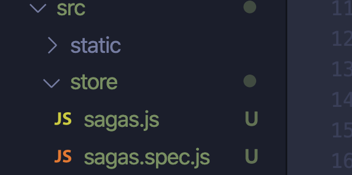

### 简介：

`redux-saga`主要用来处理异步的`actions`。

把`action->reducer`的过程变为`action->中间件->reducer`。

### 描述：

如果按照原始的`redux`工作流程，当组件中产生一个`action`后会直接触发`reducer`修改`state`，`reducer`又是一个纯函数，也就是不能在`reducer`中进行异步操作。

**而往往实际中，组件中发生的`action`后，在进入`reducer`之前需要完成一个异步任务,比如发送`ajax`请求后拿到数据后，再进入`reducer`,显然原生的`redux`是不支持这种操作的**

这个时候急需一个中间件来处理这种业务场景，目前最优雅的处理方式自然就是`redux-saga`


### 准备：

##### 安装

```sh
$ yarn add react-saga
```
##### 引入

```javascript
//main.js
import { createStore,applyMiddleware } from 'redux'//applyMiddleware把中间件应用起来，可以放多个
import createSagaMiddleware from 'redux-saga'
import rootSaga from './sagas'
//使用 `redux-saga` 中间件将 Saga 与 Redux Store 建立连接。
const sagaMiddleware = createSagaMiddleware();
const store = createStore(
  rootReducer,
  applyMiddleware(sagaMiddleware)
)
sagaMiddleware.run(rootSaga)
```

有多个`saga`同时启动，需要进行整合，在`saga.js`模块中引入`rootSaga`

```javascript
//sagas.js
import { delay } from 'redux-saga'
import { put, takeEvery,all } from 'redux-saga/effects'
export function* helloSaga() {
  console.log('Hello Sagas!');
}
export function* incrementAsync() {
  ...
}

function* watchIncrementAsync() {
	...
}
export default function* rootSaga() {
  yield all([
    helloSaga(),
    watchIncrementAsync()
  ])
}
```

### 方法介绍：

##### effect：

##### call：调用函数（阻塞）

我们从 Generator 里` yield Effect`以表达 Saga 逻辑。 

`yield`后如果是一个`promise`，因为`promise`不能进行比较，为了**方便测试**，在调用函数的时候都写成`call`的形式。`yield` 后的表达式 `call(fetch, '/users')` 被传递给 `next` 的调用者。

- 先后执行多个任务

```javascript
import { call } from 'redux-saga/effects'

const users = yield call(fetch, '/users'),
      repos = yield call(fetch, '/repos')
```

- 同步执行多个任务

当我们需要 `yield` 一个包含 effects 的数组， generator 会被阻塞**直到所有的 effects 都执行完毕**，或者当一个 effect 被拒绝。一旦其中任何一个任务被拒绝，并行的 Effect 将会被拒绝。在这种情况中，所有其他的 Effect 将被自动取消。

```javascript
import { call } from 'redux-saga/effects'

const [users, repos] = yield [
  call(fetch, '/users'),
  call(fetch, '/repos')
]
```

- 获取执行最快的任务 

在 `race` Effect 中。所有参与 race 的任务，除了优胜者（译注：最先完成的任务），其他任务都会被取消。

1. 可用作超时处理

```javascript
import { race, call, put } from 'redux-saga/effects'
import { delay } from 'redux-saga'

function* fetchPostsWithTimeout() {
  //这里的 posts和timeout 只有执行快的那个能取得值
  const {posts, timeout} = yield race({
    posts: call(fetchApi, '/posts'),
    timeout: call(delay, 1000)
  })

  if (posts)
    put({type: 'POSTS_RECEIVED', posts})
  else
    put({type: 'TIMEOUT_ERROR'})
}	
```

2. 自动取消失败的 `Effects`。

```javascript
import { race, take, call } from 'redux-saga/effects'

function* backgroundTask() {
  while (true) { ... }
}

function* watchStartBackgroundTask() {
  while (true) {
    yield take('START_BACKGROUND_TASK')
    //当 CANCEL_TASK 被发起，race 将自动取消 backgroundTask，并在 backgroundTask 中抛出取消错误。
    yield race({
      task: call(backgroundTask),
      cancel: take('CANCEL_TASK')
    })
  }
}
```

##### put：发起action（非阻塞）

 `put`，这个函数用于创建 dispatch Effect。这个 `effect` 是非阻塞型的，并且所有向下游抛出的错误（例如在` reducer` 中），都不会冒泡回到` saga `当中。

```javascript
import { call, put } from 'redux-saga/effects'
//...

function* fetchProducts() {
  const products = yield call(Api.fetch, '/products')
 // 创建并 yield 一个 dispatch Effect
 //dispatch({ type: 'PRODUCTS_RECEIVED', products })
  yield put({ type: 'PRODUCTS_RECEIVED', products })
}
```

##### 使用 saga 辅助函数

- takeEvery： 允许多个 `fetchData` 实例同时启动。在每一个`action`到来时派生一个新的任务。

- takeLatest：得到最新那个请求的响应。 如果已经有一个任务在执行的时候启动另一个 `fetchData` ，那之前的这个任务会被自动取消。

```javascript
//sagas.js
import { takeEvery,takeLatest } from 'redux-saga'
function* fetchData(action) { ... }

function* watchFetchData() {
  yield* takeEvery('FETCH_REQUESTED', fetchData)
}
function* watchFetchData1() {
  yield* takeLatest('FETCH_REQUESTED', fetchData)
}
```

如果你有多个 `Saga` 监视不同的 `action` ，可以用多个内置辅助函数创建不同的观察者

```javascript
import { takeEvery } from 'redux-saga/effects'

// FETCH_USERS
function* fetchUsers(action) { ... }

// CREATE_USER
function* createUser(action) { ... }

// 同时使用它们
export default function* rootSaga() {
  yield takeEvery('FETCH_USERS', fetchUsers)
  yield takeEvery('CREATE_USER', createUser)
}
```

##### take：等待action

1. `takeEvery`

把监听的动作换为通配符`*`。在每次`action `被匹配时一遍又一遍地被调用。**无法控制何时被调用**，**无法控制何时停止监听**。

```javascript
import { select, takeEvery } from 'redux-saga/effects'

function* watchAndLog() {
  yield takeEvery('*', function* logger(action) {
    const state = yield select()

    console.log('action', action)
    console.log('state after', state)
  })
}
```

2. `take`

  `take` 会暂停 `Generator `直到一个匹配的 `action` 被主动拉取。

- 监听单个`action`

  take('LOGOUT')

- 监听多个并发的`action`，只要捕获到多个`action`中的一个，就执行take之后的内容。

  take(['LOGOUT', 'LOGIN_ERROR'])

- 监听所有的`action`

  take('*')

```javascript
import { select, take } from 'redux-saga/effects'

function* watchAndLog() {
  while (true) {
    const action = yield take('*')
    const state = yield select()

    console.log('action', action)
    console.log('state after', state)
  }
}
```

我们先把上面的代码`copy`下来

```javascript
import { takeEvery } from 'redux-saga/effects'

// FETCH_USERS
function* fetchUsers(action) { ... }

// CREATE_USER
function* createUser(action) { ... }

// 同时使用它们
export default function* rootSaga() {
  yield takeEvery('FETCH_USERS', fetchUsers)
  yield takeEvery('CREATE_USER', createUser)
}
```

当两到多个`action`互相之间没有逻辑关系时，我们可以使用`takeEvery`。

但是，当`action`之间存在逻辑关系后，使用`takeEvery`就会出现问题。比如登陆和登出。

由于`takeEvery`对`action`的分开监管降低了可读性，程序员必须阅读多个处理函数的`takeEvery`源代码并建立起它们之间的逻辑关系。

我们可以用`take`把它改成这样，这样两个代码

```javascript
export default function* loginFlow() {
  while(true) {
    yield take('LOGIN')
    // ... perform the login logic
    yield take('LOGOUT')
    // ... perform the logout logic
  }
}

export default function* rootSaga() {
  yield* userSaga()
}
```

优点

1. `saga`主动拉取`action`，可以控制监听的开始和结束
2. 用同步的风格描述控制流，提高了可读性。

##### 无阻塞调用（fork)和取消调用(cancel)

`call`调用时会发生阻塞。 当我们不想错过`call`下面的`take`等待的`action`，想让异步调用和等待并行发生时，我们可以用`fork`取代`call`。

当 `fork` 被调用时，它会在后台启动 task 并返回 task 对象。

```javascript
import { take, put, call, fork, cancel } from 'redux-saga/effects'

// ...

function* loginFlow() {
  while(true) {
    const {user, password} = yield take('LOGIN_REQUEST')
    // fork return a Task object
    const task = yield fork(authorize, user, password)
    const action = yield take(['LOGOUT', 'LOGIN_ERROR'])
    if(action.type === 'LOGOUT')
      yield cancel(task)
    yield call(Api.clearItem('token'))
  }
}
```

一旦任务被 `fork`，可以使用 `yield cancel(task)` 来中止任务执行。取消正在运行的任务。

`cancel` 会导致被 `fork` 的 `task` 跳进它的` finally` 区块，我们可以在`finally`区块中进行清理状态的操作。

`finally` 区块中，可使用 `yield cancelled()` 来检查 Generator 是否已经被取消。

```javascript
import { take, call, put, cancelled } from 'redux-saga/effects'
import Api from '...'

function* authorize(user, password) {
  try {
    const token = yield call(Api.authorize, user, password)
    yield put({type: 'LOGIN_SUCCESS', token})
    yield call(Api.storeItem, {token})
    return token
  } catch(error) {
    yield put({type: 'LOGIN_ERROR', error})
  } finally {
    if (yield cancelled()) {
      // ... put special cancellation handling code here
    }
  }
}
```

⚠️注意：`yield cancel(task)` **不会等待被取消的任务完成（即执行其 catch 区块）**。一旦取消，任务通常应尽快完成它的清理逻辑然后返回。

##### 错误处理

1. 使用 `try/catch` 语法在 Saga 中捕获错误

```javascript
import Api from './path/to/api'
import { call, put } from 'redux-saga/effects'

// ...

function* fetchProducts() {
  try {
    const products = yield call(Api.fetch, '/products')
    yield put({ type: 'PRODUCTS_RECEIVED', products })
  }
  catch(error) {
    yield put({ type: 'PRODUCTS_REQUEST_FAILED', error })
  }
}
```

2. 捕捉 `Promise `的拒绝操作，并将它们映射到一个错误字段对象。

```javascript
import Api from './path/to/api'
import { call, put } from 'redux-saga/effects'

function fetchProductsApi() {
  return Api.fetch('/products')
    .then(response => ({ response }))
    .catch(error => ({ error }))
}

function* fetchProducts() {
  const { response, error } = yield call(fetchProductsApi)
  if (response)
    yield put({ type: 'PRODUCTS_RECEIVED', products: response })
  else
    yield put({ type: 'PRODUCTS_REQUEST_FAILED', error })
}
```

##### 测试

```javascript
//saga.spec.js
import { call, put } from 'redux-saga/effects'
import Api from '...'

const iterator = fetchProducts()

// 期望一个 call 指令
assert.deepEqual(
  iterator.next().value,
  call(Api.fetch, '/products'),
  "fetchProducts should yield an Effect call(Api.fetch, './products')"
)

// 创建一个假的响应对象
const products = {}

// 期望一个 dispatch 指令
assert.deepEqual(
  iterator.next(products).value,
  put({ type: 'PRODUCTS_RECEIVED', products }),
  "fetchProducts should yield an Effect put({ type: 'PRODUCTS_RECEIVED', products })"
)

// 创建一个模拟的 error 对象
const error = {}

// 期望一个 dispatch 指令
assert.deepEqual(
  iterator.throw(error).value,
  put({ type: 'PRODUCTS_REQUEST_FAILED', error }),
  "fetchProducts should yield an Effect put({ type: 'PRODUCTS_REQUEST_FAILED', error })"
)
```

当测试出现分叉的时候，可以调用`clone`方法

```javascript
import { put, take } from 'redux-saga/effects';
import { cloneableGenerator } from 'redux-saga/utils';

test('doStuffThenChangeColor', assert => {
  const gen = cloneableGenerator(doStuffThenChangeColor)();
  //前面都是一样的
  gen.next(); // DO_STUFF
  gen.next(); // CHOOSE_NUMBER
	
  
  //判断奇偶的时候出现了分叉
  assert.test('user choose an even number', a => {
    const clone = gen.clone();
    a.deepEqual(
      clone.next(chooseNumber(2)).value,
      put(changeUI('red')),
      'should change the color to red'
    );

    a.equal(
      clone.next().done,
      true,
      'it should be done'
    );

    a.end();
  });

  assert.test('user choose an odd number', a => {
    const clone = gen.clone();
    a.deepEqual(
      clone.next(chooseNumber(3)).value,
      put(changeUI('blue')),
      'should change the color to blue'
    );

    a.equal(
      clone.next().done,
      true,
      'it should be done'
    );

    a.end();
  });
});

```

为了运行上面的测试代码，我们需要运行：

```sh
$ yarn test
```

## 落地：



