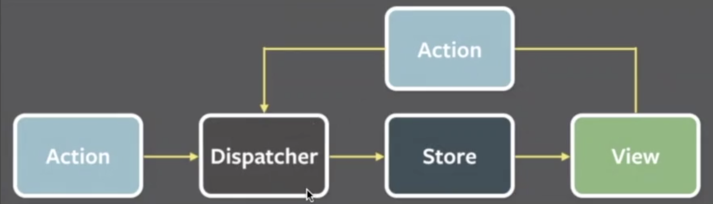
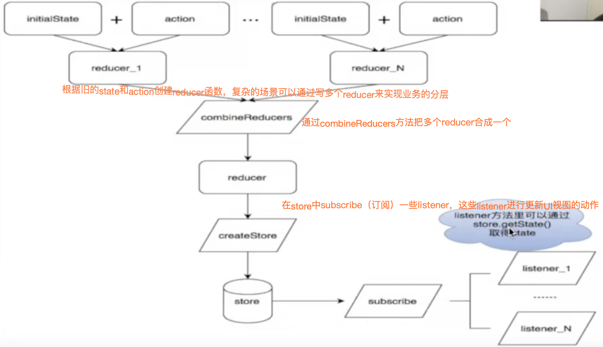
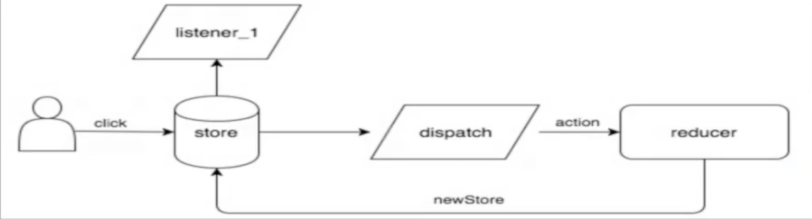
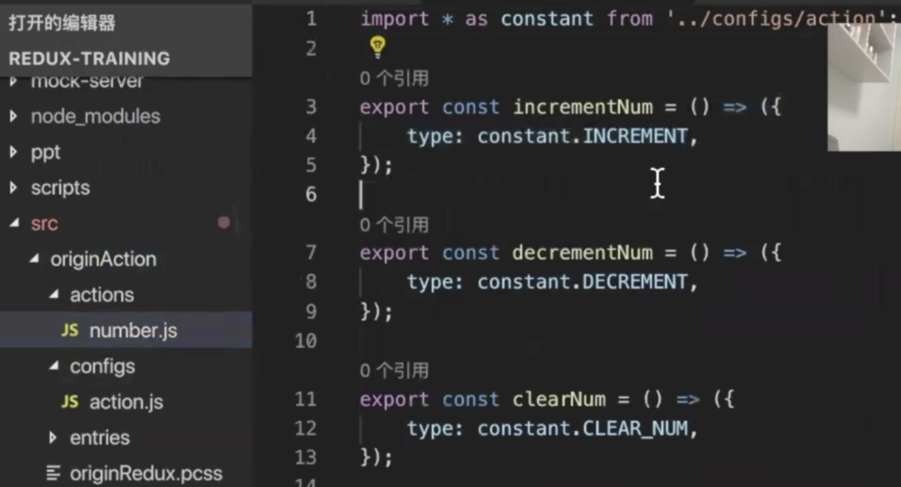
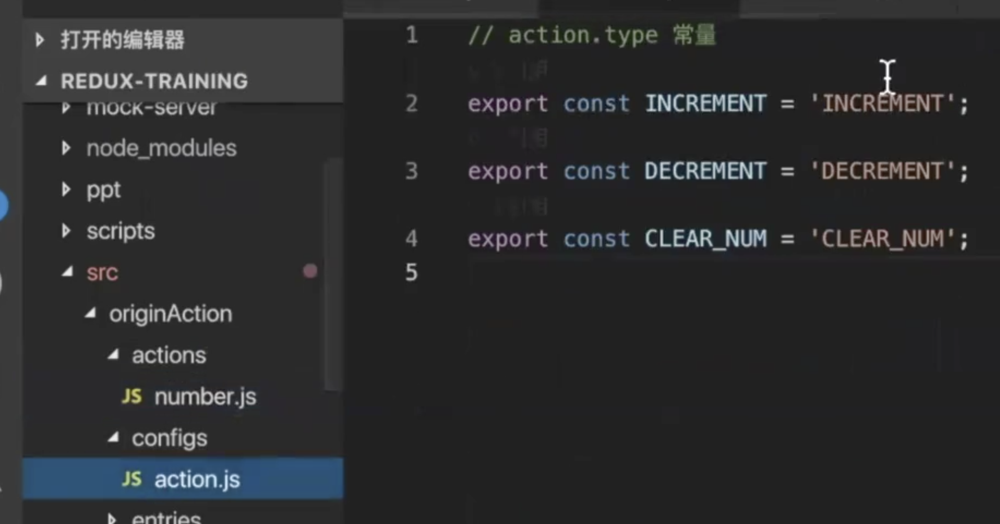
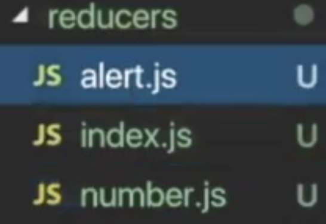
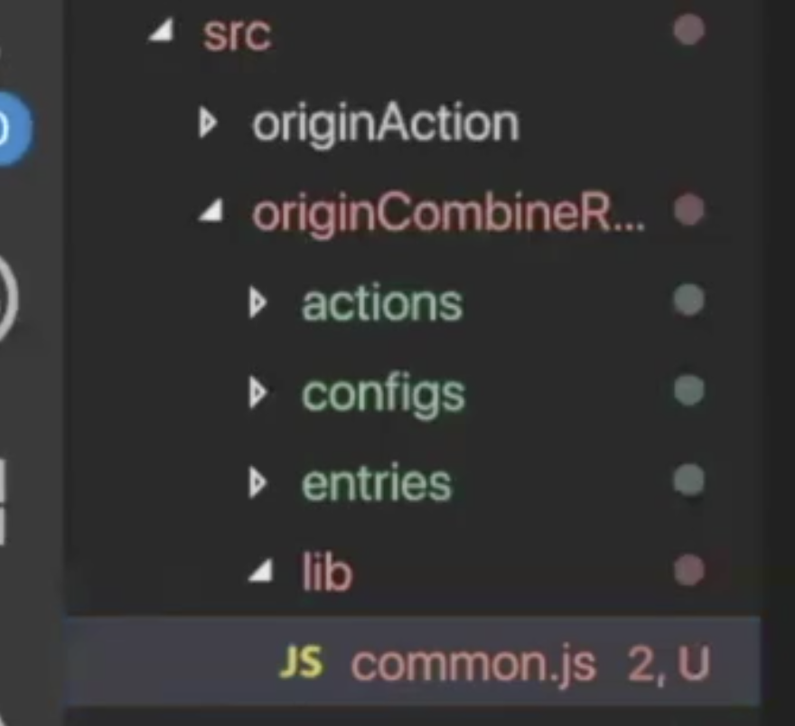

### 概述

 在`redux`出现之前，`js`使用的是传统的`mvc`框架。

 

在大型的`js`应用中势必存在非常多的 `View`和`Model`，由于它们之间存在双向绑定的关系，如果处理不好就会出现混乱的绑定关系，对于项目的维护和问题的追踪都不友好。针对这种现象，`facebook`团队提出了`flux`设计思想，即单向数据流，禁止`view`直接对话`model`



从流程图中可以观察到，`View`的展示是根据数据去驱动的，如果在`View`层面想改变数据，会抛出一个`Action`，`Action`会被`Dispatcher`统一的获取和处理，`Dispatcher`获取到`Action`命令以后，会执行修改`state` 的动作，修改完数据以后，再由数据去驱动`View`视图的更新变化。

`Redux`是一种基于`Flux`思想的具体实现，替你维护难以管理的`state`，让`state`的变化可控。

`Redux`三大原则

1. 单一数据源`Store`，这点和`Flux`的设计思想不同，`Flux`设想是有多个数据源
2. 只能通过`Dispatch Action`来修改`state`
3. 使用`Reducer`纯函数来执行修改`state`

使用`Redux`有两个动作，一个是初始化，一个是更新。

先看初始化：



再看更新：

在新的网页中，用户会有非常多的交互行为，比如用户点击页面的按钮，去改变页面的数据。



用户点击，会调用`store`的`dispatch`方法， `dispatch`出一个`action`由 `reducer`接受，`reducer`会根据`action`生成一个新的`state`，接着把它放到`store`中存储。在初始化过程当中，注册在`store`上的`listener` 就会被一一调用和执行， 我们通常会在`listener`中做视图的更新动作，并且在视图更新中获取`store`的最新数据，通过获取和更新，用户就可以看到页面中数据的展示。

### Action

定义：描述已发生事件，能够携带数据的普通对象。

作用：

- 告诉`Reducer`发生了什么事
- 携带数据

典型的`action`

- 必须有`type`属性，用于告知`Reducer`发生了什么事
- `Payload`，存放一些数据，给`Reducer`的处理做一些辅助的作用

```jsx
//例1
{
	type:'ADD_TODO',
	payload:{
		text:'do something'
	}
}
//例2
{
	type:'ADD_TODO',
	payload:new Error(),
	error:true
}
```

我们可以把`action`写成函数形式去存放



通常`action`的`type`都是大写常量形式，我们可以把它抽离成常量存放



### Reducer

定义：`Reducer`是一个<font color='red'>纯函数</font>，执行计算，返回新的`state`。

不要做一些副作用的动作，如打印时间，修改外部变量。

作用：返回新的`state`

参数：旧的`state`和`action`

```jsx
(state,action) => newState
```

⚠️注意：

- 首次执行`Redux`时，需要给`state`一个初始值（初始化时，`Redux`自动执行一次`Reducer`，此时`state`是`undefined`，我们应该初始化`state`。
- `Reducer`每次更新状态需要一个新的`state`，因此不要修改旧的`state`参数，而是将旧的`state`参数复制一份，在副本上修改值，返回这个副本。

```jsx
if(typeof state === 'undefined'){
  return initialState;
}
...
return {
  ...state,
  //更新state中的值
}
```

取代`switch-case`，把`default`封装在函数内

```jsx
export const createReducer = (initialState,handlers)=>{
  return (state = initialState,action)=>{
    	if(handlers.hasOwnProperty(action.type)){
         return handlers[action.type](state,action);
      }else{
        return state;
      }
  }
}
```

`reducer`分层





我们可以在上面这个目录下用`combineReducer`的方法将两个`reducer`合并成一个

```jsx
export const combineReducer = (reducerObj){
	return (state={},action) => {
		const newState = {};
		Object.keys(reducerObj).forEach( reducerName =>{
			const reducer = reducerObj[reducerName];
      newState[reducerName] = reducer(state[reducerName],action);
      //这里的state根据reducerName做了一个分层，reducer处理旧的state和action，生成新的state，再挂号到对应的层。
		});
    return {
      ...state,
      ...newState
    }
	}
}
```

### Store

由`createStore`创建，提供`getState`，`dispatch`，`subscribe`方法，内部存储数据的仓库。


createStore(reducer,[initialState],[enhancer])
- initialState用来初始化state
- enhancer是高阶函数，用来增强Store

#### getState

获取`store`里面存储的`state`

```jsx
store.getState().changeNumber.number;
```

#### dispatch

派发`Action`，通知`Reducer`去更新`state`

```jsx
store.dispatch(actions.number.incrementNum());
```

#### subscribe(listener)

- 注册回调函数，当`state`发生变化时，会自动触发回调函数

```jsx
const update = ()=>{//更新view}
store.subscribe(update);
```

- 该方法的返回值也是一个函数对象，调用后可以取消注册的回调函数

```jsx
const update = ()=>{//更新view}
const cancelUpdate = store.subscribe(update);
<Button onClick={cancelUpdate}>unsubscribe</Button>
```

### 结合React（用法）

 `react`中有两种组件形式，`container`和`component`

`container`目录中的组件需要关心`redux`

`component`目录中的组件仅做展示用，不需关心`Redux`

`react`和`redux`结合，基于`react-redux`包，这个包只有两个`api`

#### `<Provider store>`

作用：将入口组件包进去（被包进的组件及其子组件才能访问到`Store`，才能使用`connect`方法

```jsx
import { Provider } from 'react-redux';
...
render(
	<Provider>
  	<Sample />
  </Provider>，
  document.getElementById('app')
)
```

#### Connect

被`Provider`包裹的数据就可以使用`connect`

connect([mapStateToProps],[mapDispatchToprops],[mergeProps],[options])

##### `mapStateToProps`

- 是一个`function`，负责输入

- 作用：将`Store`里的`state`变成组件的`props`。当`state`更新时，会同步更新组件的`props`，触发组件的`render`方法。
- 返回值：`key-value`的普通对象
- 如果`mapStateToProps`为空（ 即设置为()=>({}) )，那组件里的任何更新都不会触发组件的`render`方法

```jsx
const mapStateToProps = (state)=>{
	return {
		...
	}
}
```

##### `mapDispatchToprops`

- 可以是一个对象，也可以是一个函数（负责输出）

- 作用：将`dispatch(action)`绑定到组件的`props`上，这样组件就可以派发`Action`，更新`state`了

##### `object`型`mapDispatchToprops`

- `key-value`的普通对象
- `key`是组件`props`，`value`是`Actor creator`

```jsx
const mapDispatchToProps = {
  incrementNum:action.number.incrementNum,
  decrementNum:action.number.decrementNum,
  clearNum:action.number.clearNum,
}
```

这样组件就可以通过`this.props.incrementNum()`来派发`action`

但为何不是`dispatch(this.props.incrementNum())`？

##### `function`型`mapDispatchToprops`

- 是一个`function`
- 参数是`dispatch`方法
- 返回值是`object`型`mapDispatchToprops`

```jsx
import { bindActionCreators } from 'redux';
const mapDispatchToProps2 = (dispatch,ownProps)=>{
	return {
    incrementNum:bindActionCreators(action.number.incrementNum,dispatch),
    decrementNum:bindActionCreators(action.number.decrementNum,dispatch),
    clearNum:bindActionCreators(action.number.clearNum,dispatch),
  }
}
```

解释了上一页的疑问，其实`dispatch`已经被`bindActionCreators`绑定在`creator`上了

##### mergeProps

经过`connect`的`props`有三个来源

- 由`mapStateToProps`将`state`映射的`props`
- 由`mapDispatchToprops`将`dispatch(action)`映射的`props`
- 组件自身的`props`

`mergeProps`的参数对应了这三个来源，作用就是整合这三个来源（过滤，重新组织，根据`ownProps`绑定不同的`stateProps`和`dispatchprops`

