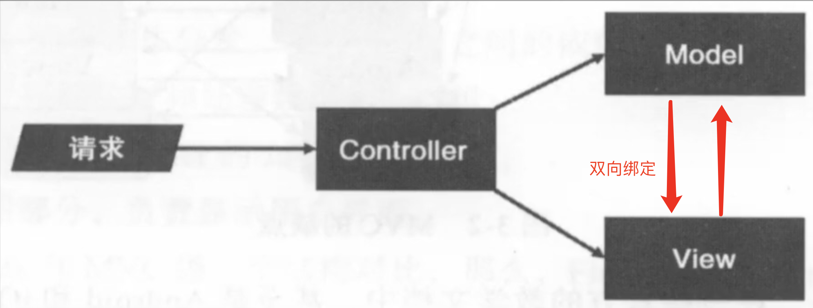

## Redux的出现

 在 `redux`出现之前，`js`使用的是传统的 `mvc`框架。

 

在大型的 `js`应用中势必存在非常多的 `View`和 `Model`，且它们之间存在双向绑定的关系，如果处理不好就会出现混乱的绑定关系，对于项目的维护和问题的追踪都不友好。针对这种现象，`facebook`团队提出了单向数据流，禁止 `view`直接对话 `model`。

## Redux是什么

Redux 是一个用于应用程序状态管理的库。

Redux 包含三个核心概念：action、reducer 和 store。

1. **Action** : 描述了有什么改变发生的普通对象。每个 action 都有一个 `type` 字段，用来表示要执行的行为类型。Actions 是唯一的信息源，只能通过 `store.dispatch()` 发送到 store。
2. **Reducer** : 是纯函数，它接收前一个状态和一个 action，然后返回一个新状态。给定相同的输入，总是返回相同的输出，不会有任何副作用。Reducers 指明了如何根据 action 更新状态。
3. **Store** : 是把 actions 和 reducers 联系到一起的对象。它持有应用的状态，并且可以通过 `getState()` 获取当前状态，在应用启动时通过 `replaceReducer()` 替换 reducer，同时可以通过 `dispatch(action)` 更新状态，还能通过 `subscribe(listener)` 注册监听器。

而 `combineReducers`, `createStore`, 和 `applyMiddleware` 是 Redux 提供的辅助函数，它们提供了实施上述核心概念的具体实现机制。

* `combineReducers` 用于将多个 reducers 合并成一个单一的 root reducer，主要用于大型应用中，便于对状态管理进行模块化设计。
* `createStore` 用于创建一个 Redux store 来以存储整个应用的状态树。
* `applyMiddleware` 用于增强 Redux，通过中间件来扩展 Redux 的功能，例如为了支持异步 action 等。

通过将这些函数与 Redux 的核心概念配合使用，开发者能够构建一个健壮、可扩展且易于维护的状态管理系统。

## Redux的概念细说

### Action

定义：描述已发生事件，能够携带数据的普通对象。

- 必须有 `type`属性，用于告知 `Reducer`发生了什么事
- `Payload`，存放一些数据，给 `Reducer`的处理做一些辅助的作用

```jsx
//例1
{
	type:'ADD_TODO',
	payload:{
		text:'do something'
	}
}
//例2
{
	type:'ADD_TODO',
	payload:new Error(),
	error:true
}
```

我们可以把 `action`写成函数形式去存放，把 `action`的 `type`抽离成大写常量形式存放

### Reducer

定义：`Reducer`是一个纯函数，执行计算，返回新的 `state`。

不要做一些副作用的动作，如打印时间，修改外部变量。

```jsx
(oldState,action) => newState
```

⚠️注意：

- 首次执行 `Redux`时，`Redux`自动执行一次 `Reducer`，此时 `state`是 `undefined`，我们应该初始化 `state`
- `Reducer`每次更新状态需要一个新的 `state`，因此不要修改旧的 `state`参数，而是将旧的 `state`参数做一个拷贝

```jsx
if(typeof state === 'undefined'){
  return initialState;
}
return {
  ...state,
  //更新state中的值
}
```

### Action和Reducer之间的关系

**action没有直接dispatch到特定的reducer，而是dispatch到store，那么reducers是怎么接受到action的呢？**

redux不会监听action。

已知store内部维护了一系列reducer和当前的应用状态state。

当action被dispatch到store之后，store会自动调用所有的reducer，并传入两个参数，当前的state和被呈递的action。

**当多个reducer接收到actions，在reducer中处理的时候，会生成新的state，新的state会发生冲突吗？**

不会，因为当多个reducer需要响应同一个action时，它们各自独立处理自己的状态部分，并返回新的状态。redux会把这些返回的状态合并成一个新的状态。 `combineReducers`

```jsx
import { combineReducers } from 'redux';

const rootReducer = combineReducers({
  user: userReducer,
  todos: todosReducer,
  // 可以继续添加其他 reducers
});
```

入参：一个对象，对象中的每个键都对应一个 reducer 函数，键名将决定状态树中的哪个部分会被该 reducer 函数管理。

返回值：`combineReducers` 创建一个新的 `rootReducer`，`rootReducer` 会把状态对象的 `user` 键的状态管理权交给 `userReducer`，把 `todos` 键的状态管理权交给 `todosReducer`。

新创建的 `rootReducer` 函数接受两个参数：当前状态树（state）和要处理的 action。它返回的是下一个状态树。

**根 reducer 函数的伪代码表示如下：**

```js
function rootReducer(state = {}, action) {
  return {
    user: userReducer(state.user, action),
    todos: todosReducer(state.todos, action),
    // 继续处理其他子状态片段
  };
}
```

这个过程确保每个 reducer 只处理状态树中它所负责的那部分，这允许开发者将 reducer 逻辑组织得更清晰、更模块化。每个 reducer 独立管理自己的状态片段，因此不会相互干扰。

最后，自动生成的 `rootReducer` 通常会被传递给 `createStore` 函数，以初始化整个 Redux store 的状态：

```js
const store = createStore(rootReducer);

```

知道了上述combineReducer的入参，出参和用法，接下来我们可以看看 `combineReducer`的实现。

```jsx
function combineReducers(reducers) {
  // 返回生成的根 reducer 函数
  return function combination(state = {}, action) {
    let hasChanged = false; // 标志整个 state 对象是否发生了变化

    // 使用 reduce 方法遍历 reducers 对象的 entries
    // 累加器 newState 作为新状态的容器，最终返回它
    const nextState = Object.entries(reducers).reduce((newState, [key, reducer]) => {
      // 提取对应 key 的旧状态
      const previousStateForKey = state[key];
      // 执行当前的 reducer，得到新的状态
      const nextStateForKey = reducer(previousStateForKey, action);

      // 将新状态保存到 newState 对象中
      newState[key] = nextStateForKey;
      // 通过比较新旧状态来决定是否发生了变化
      hasChanged = hasChanged || nextStateForKey !== previousStateForKey;
  
      return newState; // 逐步构建并返回最终的新状态对象
    }, {});

    // 如果 reducer 的数量与 state 对象 key 的数量不匹配，
    // 或者通过上面的处理发现有变化，则整个状态对象都视为发生了变化
    const stateKeysLength = Object.keys(state).length;
    const reducersKeysLength = Object.keys(reducers).length;
    hasChanged = hasChanged || stateKeysLength !== reducersKeysLength;
  
    // 如果有变化则返回新的状态对象否则返回旧的状态对象
    return hasChanged ? nextState : state;
  };
}

```

这段代码做了什么？

- 它接收一个 `reducers` 对象作为参数
- 它返回一个新的 rootReducer（`combination` 函数），该函数将处理整个应用的状态（`state`）和动作（`action`）
- `combination` 函数内部，使用 `Object.entries` 和 `reduce` 方法遍历每个 reducer。每个派发的action都会导致每个state的重新计算。每个旧的state会被对应的reducer进行处理，根据action得到新的state对象。并合并处理后的结果来构建最终的状态对象（`nextState`）。
- `hasChanged` 变量跟踪状态是否已经发生了变化。
- 如果 `nextState` 与 `state` 不同，或者 `reducers` 对象的 reducers 数量和 `state` 对象中的 keys 数量不匹配（意味着可能有新的 reducers 被添加或移除了），则标记 `hasChanged` 为 `true`
- 根据 `hasChanged` 的值，如果有变化，返回 `nextState`；如果没有变化，则返回原先的 `state` 对象，确保了 state 的引用不变，优化了性能

rootReducer在创建store时通过 `createStore` 或 `configureStore`（如果使用 Redux Toolkit）传入。一旦 store 被创建，它会保持对这个传入的根 reducer 的引用。Store 使用这个根 reducer 来处理派发的 action，并计算新的 state。

#### **一些问题**

**rootReducer在什么情况下会发生变化？**

通常情况下，reducers 在应用的整个生命周期内都不会变。它们是在编写应用时静态定义的。不过，Redux Toolkit 和 Redux 提供了一	些增强的 API 支持 reducer 的动态注入或替换，比如 `replaceReducer` 方法。这通常在代码拆分和按需加载时使用，当新的代码块（包括新的 reducer）被下载并执行时，可能会动态添加到应用中。

**如果 reducers 发生变化，应该要生成新的 combination 吗？**

这通常在**代码拆分和异步加载 reducer 的情况下发生** —— 你需要使用 store 的 `replaceReducer` 方法来传入新的根 reducer。这样做会替换 store 中的现有 reducer，并且以后派发的 action 会使用这个新的 reducer 来计算 state。

**如果每次更新 reducers 都会生成新的 combination，为什么会存在 state 和 reducer 长度不一致的情况呢？**

这通常意味着存在配置错误。例如，可能在调用 `combineReducers` 时，传入了一个新的 reducer集合，但某些 reducer 缺失了初始状态。`combineReducers` 函数实现中检查 state 和 reducer 长度不一致的逻辑，主要是作为一种健壮性和正确性的保障，保证在这种意外情况发生时，我们能得到一个可预测和一致的 state 结构。

在某些高级用例或异步加载/code-splitting 的场景中，你可能会动态地注入新的 reducer 或者替换现有的 reducer。在这种情况下，你需要显式地告诉 store 使用新的 reducer 通过调用 `replaceReducer`。否则可能就会出现长度不一致的情况。

### Store

它是维护应用状态的对象。

- 组件通过调用 `store.dispatch(action)` 方法来派发 actions，从而触发状态变化。
- 通过 `store.getState()` 获取当前 state
- 通过 `store.subscribe(listener)` 注册监听函数以响应状态变化。

### store中方法的使用

#### getState

获取 `store`里面存储的 `state`

```jsx
store.getState().changeNumber.number;
```

#### dispatch

派发 `Action`，通知 `Reducer`去更新 `state`

```jsx
store.dispatch(actions.number.incrementNum());
```

#### subscribe(listener)

- 注册回调函数，当 `state`发生变化时，会自动触发回调函数

```jsx
const update = ()=>{}//更新view
store.subscribe(update);
```

- 该方法的返回值也是一个函数对象，调用后可以取消注册的回调函数

```jsx
const update = ()=>{}//更新view
const cancelUpdate = store.subscribe(update);
<Button onClick={cancelUpdate}>unsubscribe</Button>
```

store用createStore创建，所以createStore包含以上四种方法。

#### `replaceReducer(nextReducer)`

- Redux store 中的一个方法，用于替换 store 当前的 reducer 并且触发一次 action 以使新的 reducer 重新计算整个状态树。

```js
function newReducer(state = { count: 0 }, action) {
  switch (action.type) {
    /* ... 其它 action 处理逻辑 ... */
    default:
      return state;
  }
}
// 使用新的 reducer 替换当前的 reducer
store.replaceReducer(newReducer);
```

### createStore

创建 `store`

```javascript
const store = createStore(reducer,[initialState],[enhancer]);
// initialState用来初始化state
// enhancer是高阶函数，一般来说会使用applyMiddleware添加中间件，增强Store，applyMiddleware我们在下面说
```

看看createStore源码

```js
function createStore(reducer, preloadedState, enhancer) {
  // 如果 preloadedState 是函数而不是状态对象，说明它是中间件的增强器
  if (typeof preloadedState === 'function' && typeof enhancer === 'undefined') {
    enhancer = preloadedState;
    preloadedState = undefined;
  }

  // 如果存在 enhancer，那么使用 enhancer 来增强 createStore 函数
  if (typeof enhancer !== 'undefined') {
    return enhancer(createStore)(reducer, preloadedState);
  }

  let currentReducer = reducer;
  let currentState = preloadedState;
  let currentListeners = []; // 监听器数组，存放监听state变化的回调函数
  let nextListeners = currentListeners;
  let isDispatching = false;

  // 功能函数，确保nextListeners和currentListeners是独立的
  function ensureCanMutateNextListeners() {
    if (nextListeners === currentListeners) {
      nextListeners = currentListeners.slice();
    }
  }

  // 获取当前的 state
  function getState() {
    return currentState;
  }
  
  // 派发 action
  function dispatch(action) {
    if (typeof action !== 'object' || action === null || typeof action.type === 'undefined') {
      throw new Error('Action must be a plain object and contain a `type` property');
    }

    if (isDispatching) {
	//isDispatching 用于标记是否当前正处于派发（dispatch）action 的过程中。
	//isDispatching 为 true 时，正在执行的 reducer 函数尝试再次派发 action 是不被允许的。
      throw new Error('Reducers may not dispatch actions');
    }

    try {
      isDispatching = true;
      currentState = currentReducer(currentState, action);
    } finally {
      isDispatching = false;
    }

    const listeners = (currentListeners = nextListeners);
    for (let i = 0; i < listeners.length; i++) {
      const listener = listeners[i];
      //发布订阅模式的发布部分
      listener();
    }

    return action;
  }

    // 注册监听函数
  function subscribe(listener) {
    let isSubscribed = true;

    ensureCanMutateNextListeners();
    nextListeners.push(listener);

    return function unsubscribe() {
      if (!isSubscribed) {
        return;
      }

      isSubscribed = false;

      ensureCanMutateNextListeners();
      const index = nextListeners.indexOf(listener);
      nextListeners.splice(index, 1);
    };
  }

  // 当我们创建 store 时，我们需要派发一个初始化的 action
  // 以便每个 reducer 返回它们的初始 state
  dispatch({ type: '@@redux/INIT' });

  return {
    dispatch,
    subscribe,
    getState,
  };
}

export default createStore;

```

#### 一些问题

**什么情况会导致isDispatching为true的错误？**

- 在reducer中dispatch action
- `dispatch` 方法在中间件(middleware)中被错误地同步调用，可能也会引起冲突。举个例子：中间件在捕获某个action的同时dispacth了同一个action，导致死循环。

  ```js
  const incrementMiddleware = store => next => action => {
    if (action.type === 'INCREMENT') {
      console.log('Current count:', store.getState().count);

      // 错误的同步调用 dispatch，尝试再次派发相同的 action
      store.dispatch({ type: 'INCREMENT' }); // 这将导致无限循环

      // 这个递归调用没有结束的条件，因此 'INCREMENT' action 会被无限派发
    }

    // Pass the action to the next middleware in the chain
    return next(action);
  };
  ```

**为什么要确保 `nextListeners` 和 `currentListeners` 是独立的**

`ensureCanMutateNextListeners` 函数的目的是，当任何订阅者（listener）正在监听状态变化时，如果有新的订阅或取消订阅操作发生，我们不想直接修改 `currentListeners` 数组。因为这样做可能会影响到正在进行的遍历操作（比如在某个listener回调中执行了订阅/取消订阅操作）。所以，我们创建 `nextListeners` 副本进行修改，**保证 `currentListeners` 在当前的dispatch调用期间保持不变**。

同时，下一次的dispatch会使用更新后的 `nextListeners`

```js
const listeners = currentListeners = nextListeners;

```

下面的部分我们讲中间件的增强器，也就是createStore的第三个参数

### 中间件增强器机制：洋葱圈模型

```
action -> middleware1 -> middleware2 -> original dispatch -> reducers
```

这个模型可以将中间件想象成一个个洋葱圈，每一个“圈”对应一个中间件，第一个中间件在洋葱圈的最外层。

当一个 action 被派发时，它首先被 `middleware1` 所处理，然后是 `middleware2`，接着是 `middleware3`，最后到达 reducer。

所以action流动的流程是：

1. 当一个 action 被派发时，它会从第一个中间件开始，通过中间件栈的每一层。
2. 每个中间件可以修改action、产生副作用。
3. 如果中间件不调用 `next(action)`，那么 action 就不会继续传递下去，Redux 的 dispatch 过程就在这里停止。
4. 如果中间件调用了 `next(action)`，action 将继续向下传递经过可能的其他中间件，直到到达到达实际的 reducer。
5. 在执行完所有 reducer 之后，state 更新完成。

接着是堆栈回溯：

1. 是next(action)函数调用之后的流程，可以理解为中间件堆栈的一个回溯。
2. 这部分代码在后续中间件处理 action 并且 action 到达 reducer、state 更新以后才执行。
3. **中间件函数里的 `next(action)` 之后的代码通常会在同一个事件循环中同步执行** 。当然，也可以创建异步的中间件，它可能会在未来的某一时刻调用 `next()`，或者根据一些异步操作（如 API 调用）的结果来决定是否和何时调用 `next()`。

⚠️注意：

- 如果你尝试在 `next(action)` 前同步地 dispatch 另一个 action，Redux 会抛出错误，因为在内部 `isDispatching` 标志仍然是 `true`。要在中间件中 dispatch 新的 action，你应该确保它发生在 `next(action)` 调用之后，或者在异步逻辑中。
- 异步逻辑的处理，如在中间件内使用 setTimeout 或处理 Promise 结果时，dispatch 调用会被放入到事件循环的下一个“tick”，在该 tick 时当前的 action 已经处理完毕，`isDispatching` 也会被复位为 `false`，因此可以安全地执行新的 dispatch 调用。以下是一个异步场景的示例：
  ```js
  const asyncMiddleware = ({ dispatch }) => next => action => {
    if (action.type === 'ASYNC_ACTION_TYPE') {
      // 异步操作，在一段时间后 dispatch 新的 action
      setTimeout(() => {
        dispatch({ type: 'RESULT_OF_ASYNC_ACTION' });
      }, 1000);
    }

    next(action);
  };
  ```

说完了机制，我们接下来看看源码。

### applyMiddleware

在 Redux 中，中间件是通过 `applyMiddleware()` 函数添加的。这个函数实质上是一个 "store enhancer"，它接收多个中间件作为参数，然后增强 `createStore` 函数，允许中间件在 `action` 发送到 `reducer `之前进行操作。

以下是 `applyMiddleware` 的源码

```js
export default function applyMiddleware(...middlewares) {
  return (createStore) => (reducer, preloadedState, enhancer) => {
    // 创建一个没有中间件功能的 store
    const store = createStore(reducer, preloadedState, enhancer);
  
    //这个占位函数的目的是防止在构建中间件管道期间发出 dispatch。
    let dispatch = () => {
      throw new Error(
        'Dispatching while constructing your middleware is not allowed. ' +
          'Other middleware would not be applied to this dispatch.'
      )
    }

    // 提供给每个中间件的 API，一个简易的store对象
    const middlewareAPI = {
      getState: store.getState,
      dispatch:  (...args) => dispatch(...args),
    };

    // 用每个中间件处理并增强 middlewareAPI
    const chain = middlewares.map(middleware => middleware(middlewareAPI));

    // 使用 compose 函数将所有中间件组合到一个 dispatch 函数中
    dispatch = compose(...chain)(store.dispatch);

    // 返回强化的 store，替换原本的 store.dispatch
    return {
      ...store,
      dispatch
    };
  };
}

// compose 函数，将函数从右到左组合成一个函数。
function compose(...funcs) {
  if (funcs.length === 0) {
    return arg => arg;
  }

  if (funcs.length === 1) {
    return funcs[0];
  }
  //第一个传入的函数会最后调用
  return funcs.reduce((pre,cur) => (...args) => pre(cur(...args)));
}

```

#### 一些问题

##### 问题1：middleware的调用顺序

洋葱圈模型中action的流动是从第一个中间件->最后一个中间件。

但是源码中compose函数会把中间件函数从右到左组合成一个函数，最右的函数在最中间的位置。

这容易让我们对middleware究竟是从左到右调用，还是从右到左调用有一些疑惑。

为了解释这个疑惑，我们用以下的demo进行解释。

设想我们按如下顺序调用 `applyMiddleware`：

```
applyMiddleware(middleware1, middleware2)

```

这两个中间件内部长这样

```ts
function middleware1(store) {
  return function(next) {
    return function(action) {
      console.log('middleware1 start');
      next(action);
      console.log('middleware1 end');
    };
  };
}

function middleware2(store) {
  return function(next) {
    return function(action) {
      console.log('middleware2 start');
      next(action);
      console.log('middleware2 end');
    };
  };
}
```

处理为 `chain`队列之后，他的内部的数据结构是这样的

```
next=>action=>{
	next(action)
}
```

接着我们执行 `compose`，在 `compose` 中，会不断用之前的中间件包裹新的中间件，这样最后一个中间件就会在最里面

`compose(...chain)`的结果是这样的

```js
arg=>middle1(middle2(arg))
```

接着源码调用了它

```j
const enhanceDispatch = compose(...chain)(store.dispatch)
//在这个demo中等价于
const enhanceDispatch =middleware1(middleware2(store.dispatch))
```

我们最后使用 `enhanceDispatch`来呈递 `action`

```
enhanceDispatch(action)
```

在执行 `enhanceDispatch(action)`的时候，因为中间件的结构是next=>action=>{}，所以store.dispatch作为 `middleware2`的 `next`传入，并形成闭包。

因为中间件的形式是这样的

```
next=>action=>{next(action)}
```

所以当传入 `next`参数的时候，中间件就调用完毕，返回 `action=>{next(action)}`，这正好是一个 `dispatch`的形式。

 `middleware2`返回的 `dispatch`，又会作为 `middleware1`的 `next`传入。最终 `middleware1`返回了一个 `action=>{next(action)}`。

当调用这个最终 `middleware1`返回的 `action`的时候，函数的形式是这样的

```
action=>{next(action)}
```

其实 `action`是从 `middleware1->middleware2->store.dispatch->reducers`

让我们看看最后的结果

```
store.dispatch = enhanceDispatch;
store.dispatch({ type: 'TEST_ACTION' }) 
//middleware1 start
//middleware2 start
//middleware2 end
//middleware1 end
```

##### 问题2：middlewareAPI的赋值问题

```js
const middlewareAPI = {
      getState: store.getState,
      dispatch: (...args) => dispatch(...args),
      //为什么不直接给dispatch的引用
}
```

目的：为了 `middlewares`内部能拿到最新的 `dispatch`

根据源码，我们可以知道，中间件的构建过程分为两个主要的步骤：

1.创建中间件函数链：

```js
const chain = middlewares.map(middleware => middleware(middlewareAPI));
```

利用 `map` 函数遍历中间件，调用它们并传入被构造的 `middlewareAPI` 对象，每个中间件使用这个对象来获取当前的 `state` 以及 `dispatch`（尽管此时的 `dispatch` 还是一个抛出错误的临时版本）。每个中间件都返回一个执行 `dispatch` 逻辑的函数（ `(next) => (action) => {}` ）。

2.组合中间件增强的 `dispatch` 函数：

```js
dispatch = compose(...chain)(store.dispatch);
```

这一步调用 `compose` 函数并传入前一步构建的中间件函数链 `chain`。`compose` 从右向左将所有中间件的 `(next) => (action) => {}` 函数组合成一个单一的增强版 `dispatch` 函数。这个组合结束的结果是从第一个中间件到最后一个中间件的嵌套调用，每个中间件都包装了下一个 `dispatch` 函数，而内部最初的 `dispatch` 是原始的 `store.dispatch`。

当运行 `compose(...chain)(store.dispatch)` 之后，我们得到了最终的增强版 `dispatch` 函数，该函数内部包含了所有中间件的逻辑，并且可以处理和转发 actions。这就是 Redux 中间件的功效：在 action 达到 reducer 之前，你可以进行日志记录、调用异步接口、处理 action 的数据等等。

最后，这个增强版的 `dispatch` 会替换原来的 `store.dispatch`，中间件的构建过程在这里就完成了。

在 dispatch 被替换成增强版的dispatch之前，如果有任何调用dispatch的行为，都会报错。

```
    //这个占位函数的目的是防止在构建中间件管道期间发出 dispatch。
    let dispatch = () => {
      throw new Error(
        'Dispatching while constructing your middleware is not allowed. ' +
          'Other middleware would not be applied to this dispatch.'
      )
    }
```

`dispatch`函数被替换后，由于闭包机制，如果在构建好的增强版 `dispatch`，即 `(action) => {}`这一层的函数中执行 `dispatch(action)` 不会抛出错误，因为此时 `dispatch` 已经是组合后的、可用的真正 `dispatch` 函数了。

### 自定义中间件

Redux 中间件是一系列依次调用的函数，他们有一个统一的形式。

每个中间件接受一个简易的 `store` 对象（仅包含getState和dispatch方法）作为参数，并返回一个函数。

这个函数又会被调用并传入 `next` 函数，并返回另一个接受 `action` 的函数。这就是中间件的标准形式，你可以根据需要自定义中间件。

```ts
const middleware1 = (store) => (next) => (action) => {
  console.log('middleware1 start');
  next(action);
  console.log('middleware1 end');
};
```

### redux为什么要使用发布订阅模式

1. 解耦：组件不需要直接与store交互，只需订阅其感兴趣的状态变化，这降低了组件间的耦合度。
2. 单向数据流：所有的状态变更都会流经同一路径，通过发布订阅模式来通知订阅者，使得数据流清晰且易于追踪。
3. 灵活的通信机制：组件可以任意订阅或取消订阅状态变化事件，便于管理它们的相应逻辑。
4. 易于扩展：随着应用程序的发展，可以轻松地添加或移除订阅者而不影响其他部分的代码。

### 实例

1. 安装

```nginx
npm install redux -S // 安装
```

2. 引入

```javascript
//1. 
import { createStore } from 'redux'
import rootReducer from './reducers';//reducer在文件内可省略
```

3. 创建 `reducer`

   a. 可以直接在同一个文件中这么写

```javascript
const reducer = (state = {count: 0}, action)
  switch (action.type){
    case 'INCREASE': return {count: state.count + 1};
    case 'DECREASE': return {count: state.count - 1};
    default: return state;
  }
}
```

    b. 也可以创建一个`reducer`文件夹，在内部用 `combineReducers`把多个 `reducer`进行一个整合

```javascript
//reducers/index.js
import {combineReducers} from 'redux';
import users from './users';
import counter from './counter';
export default combineReducers({
  users,
  counter
})

//reducers/user.js
const users = (state={},action={})=>{
  switch (action.type){
    default:return state;
  }
}
export default users;

//reducer/counter.js
const counter = (state= 1 ,action={})=>{
  switch (action.type){
    default:return state;
  }
}
export default counter;
```

4. 创建 `actions`

```javascript
import {INCREASE,DECREASE} from './constants';
// 我们可以把大写常量放在constants中
const actions = {
  increase: () => ({type: INCREASE}),
  decrease: () => ({type: DECREASE})
}
```

5. 创建store

```javascript
const store = createStore(reducer);---------->⑶
store.subscribe(() =>
  console.log(store.getState())
);
store.dispatch(actions.increase()) // {count: 1}
store.dispatch(actions.increase()) // {count: 2}
store.dispatch(actions.increase()) // {count: 3}
```

## redux-saga

如果按照原始的 `redux`工作流程，当组件中产生一个 `action`后会直接触发 `reducer`修改 `state`，`reducer`又是一个纯函数，也就是不能再 `reducer`中进行异步操作；

**而往往实际中，组件中发生的 `action`后，在进入 `reducer`之前需要完成一个异步任务,比如发送 `ajax`请求后拿到数据后，再进入 `reducer`,显然原生的 `redux`是不支持这种操作的**

这个时候急需一个中间件来处理这种业务场景，目前最优雅的处理方式自然就是 `redux-saga`
