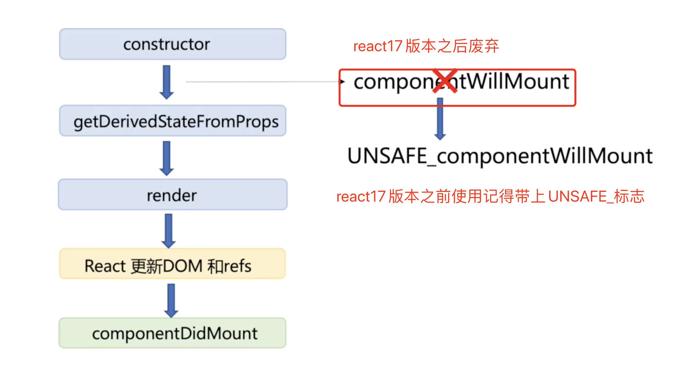
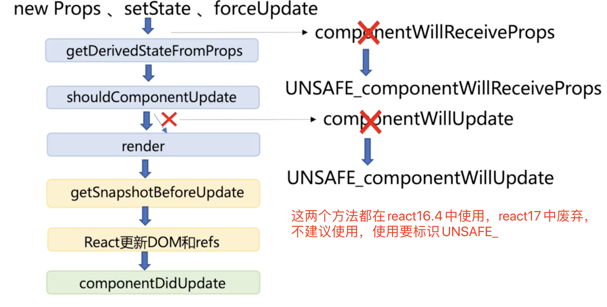

### state

`state`是在`constructor`中被初始化的。

`state`是组件私有的，它可以向下流动。`state`中数据的更新会被检测到，触发组件的`render`。

在class中添加一个如下的构造函数，就可以使用state了

```jsx
constructor(props) {
    super(props);//将 props 传递到父类的构造函数中
    this.state = {date: new Date()};//给state赋初值
}
```

直接修改`this.state.date`是不会触发render的，要想更新`state`中的数据，需要调用`this.setState`进行更新

### setState

当你调用 `setState()` 的时候，React 会把你提供的对象**浅合并**到当前的 state。

`setState`有两种调用方式

- 传入对象，第一个参数是传入的对象，第二个是可选参数，可以传入一个回调，因为state的更新是异步的，所以回调中可以通过读取`this.state`获取到最新的`state`的值

```jsx
this.setState({counter: 1},()=>{
  console.log(this.state)
});
```

- 传入函数

⚠️**State 的更新可能是异步的**，出于性能考虑，React 可能会把多个 `setState()` 调用合并成一个调用。

因为 `this.props` 和 `this.state` 可能会异步更新，所以你不要依赖他们的值来更新下一个状态。

要解决这个问题，可以让 `setState()` 接收一个函数而不是一个对象。这个函数用上一个 state 作为第一个参数，将此次更新被应用时的 props 做为第二个参数，返回值就是要更新的state对象：

```jsx
// Correct
this.setState((state, props) => ({
  counter: state.counter + props.increment
}));
```

### 生命周期

函数组件没有状态变化，没有生命周期，这里的生命周期指的是类组件的生命周期。


### 挂载时



⚠️注意：当组件的`render`的返回值为null，可以不进行任何渲染，但是依然会触发`componentDidMount`哦。

#### constructor

应用场景：

- `state`进行初始化
- 进行方法绑定

⚠️注意：不能在`constructor`中使用`this.setState`，因为此时`state` 还没有进行初始化完毕。

#### getDerivedStateFromProps（谨慎使用 )

在<font color='red'>每次渲染前</font>都会调用

<font color='red'>static</font> getDerivedStateFromProps(props,state)=>obj||null

参数：在挂载阶段组件的`props`和`state`值，就是组件初始化的时候定义的`props`和`state`。

返回值：如果返回obj就对组件当前的`state`进行更新，如果返回null就不对组件当前的`state`进行更新。

目的：让用户在`props`变化时更新`state`

⚠️注意：

- 该方法是一个静态方法，获取不到组件的实例对象，因此在这个方法中不能使用`this`。
- 该方法是将返回的obj和之前的state做一个浅合并，进行相应属性的覆盖

#### render

检测`state` 和`props`值的变化，根据最新的`state`和`props`值生成相应的`UI`描述。

`render`方法是一个 <font color='red'>纯函数</font>。即在`state`和`props`没有任何变化的时候调用`render`方法都应该返回相同的结果值。因此不要在`render`方法中使用任何有副作用的方法，比如调用`this.setState`方法等等。

是`class`中<font color='red'>唯一必须</font>要实现的方法。

| 返回的类型       | 🌰                      |
| ---------------- | ---------------------- |
| React元素        | <div/>、<MyComponent/> |
| 数组或fragments  |                        |
| Portals          |                        |
| 字符串或数值类型 | 会被渲染成文本节点     |
| 布尔类型或null   | 终端界面无渲染         |

⚠️注意：`render`方法返回的只是一个`UI`描述，并不负责实际的渲染工作。

#### componentDidMount

在组件挂载后（插入`DOM`树中）立即调用。

| 使用场景              | 🌰                       |
| --------------------- | ----------------------- |
| 依赖于DOM节点的初始化 | ReactDOM.findDOMNode    |
| 通过网络请求获取数据  | ajax请求=>this.setState |

### 更新时



 更新是被动行为，当传入新的`props`，调用`setState`或`forceUpdate`方法时才会触发更新。

#### getDerivedStateFromProps（谨慎使用 )

参数：在更新阶段组件的`props`和`state`值，就是更新以后组件的`props`和`state`。其余的使用方式和注意事项和挂载阶段一样。

#### shouldComponentUpdate（谨慎使用）

决定组件是否继续执行更新过程，如果返回值为`false` ，组件更新阶段的后续方法将会停止执行。

shouldComponentUpdate(nextProps,nextState)=>bool

参数：nextProps,nextState是最新的props和state值，通过把它们和`this.state`， `this.props` 进行比较，如果发现没有值更新，就返回false，跳过更新阶段。

目的：性能优化

⚠️注意：

- 不建议深层比较或用`JSON.stringify`方法去操作，否则会影响性能。
- 在之后的版本中，react会把返回值当作一种提示，而不是一种严格的指令。也就是说即使返回了false，也有可能会继续执行之后的方法，所以建议谨慎使用。

#### render

读取最新的`props`和`state`值，生成新的`UI`描述。

#### getSnapshotBeforeUpdate

在最近一次渲染输出（提交到`DOM`节点之前调用）。在这个方法执行的时候`DOM`节点还未做更新，因此从中读取到的`DOM`节点，是上一个阶段的`DOM`节点

getSnapshotBeforeUpdate(prevProps,prevState)=>snapshot||null

参数：prevProps，prevState是更新前的`props` ，`state`值

返回值：某个时刻的快照，在更新`DOM`前需要保存的结果值。

应用：一般在处理页面滚动的时候会用到

#### componentDidUpdate

在`DOM`更新以后会被立刻调用，对更新后的`DOM`进行操作

componentDidUpdate(prevProps,prevState,snapshot)=>void

参数：prevProps，prevState是更新前的`props` ，`state`值，`snapshot`是上一个方法传来的`snapshot`值

应用：比较`this.state`，`this.props`的值和prevProps，prevState的变化来决定要不要发起ajax请求。

#### componentWillUnmount

在组件卸载及销毁之前直接调用

应用：执行一些必要的清理操作，比如清理timer，取消网络请求，或者消除在`componentDidMount`中创造的一些订阅方法等。

⚠️注意：不应调用`setState` ，因为在这个方法中，组件永远不会被重新渲染，组件实例渲染以后将永远不会再挂载它。

### 其他

#### forceUpdate（谨慎使用）

强制组件更新，跳过shouldComponentUpdate，直接出发render方法的执行。

使用场景：依赖于其他数据，但不是组件的`props`，`state`。