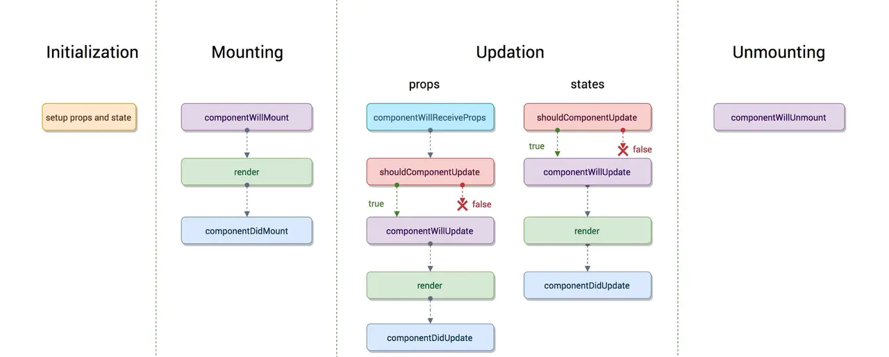
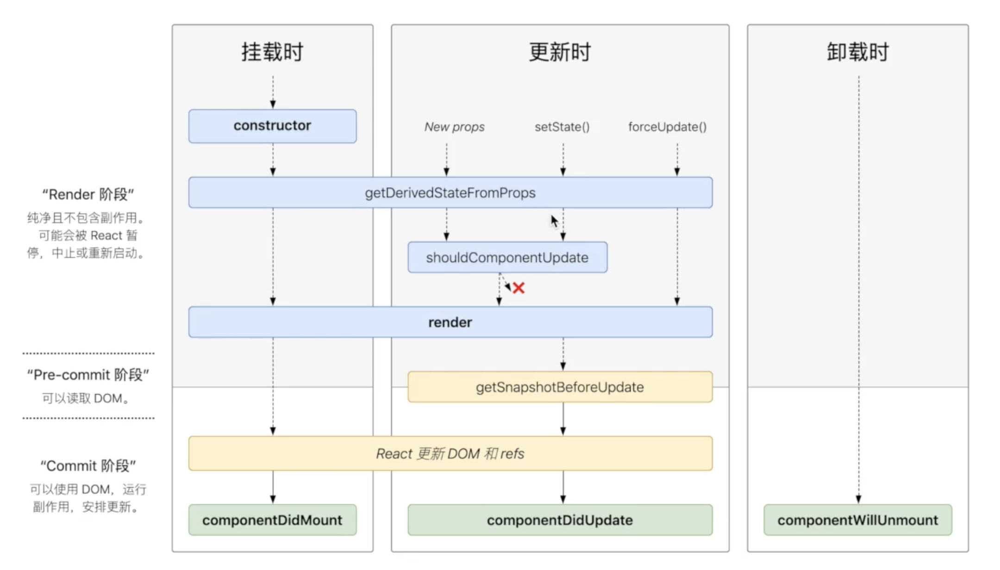
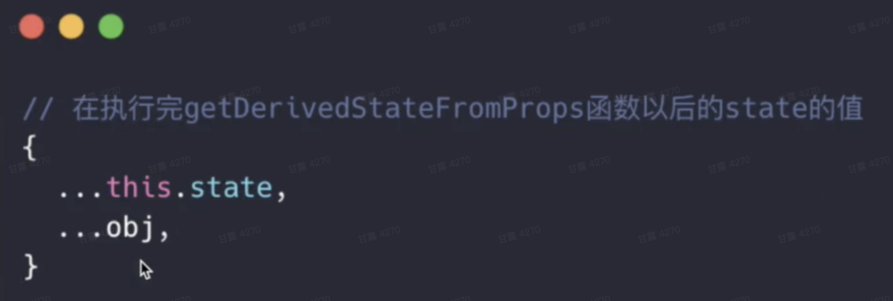

### 一、state

`state`是在`constructor`中被初始化的。

`state`是组件私有的，它可以向下流动。`state`中数据的更新会被检测到，触发组件的`render`。

在class中添加一个如下的构造函数，就可以使用state了

```jsx
constructor(props) {
    super(props);//将 props 传递到父类的构造函数中
    this.state = {date: new Date()};//给state赋初值
}
```

直接修改`this.state.date`是不会触发render的，要想更新`state`中的数据，需要调用`this.setState`进行更新

### 二、setState

当你调用 `setState()` 的时候，React 会把你提供的对象**浅合并**到当前的 state。

`setState`有两种调用方式

- 传入对象，第一个参数是传入的对象，第二个是可选参数，可以传入一个回调，因为state的更新是异步的，所以回调中可以通过读取`this.state`获取到最新的`state`的值

```jsx
this.setState({counter: 1},()=>{
  console.log(this.state)
});
```

- 传入函数

⚠️**State 的更新可能是异步的**，出于性能考虑，React 可能会把多个 `setState()` 调用合并成一个调用。

因为 `this.props` 和 `this.state` 可能会异步更新，所以你不要依赖他们的值来更新下一个状态。

要解决这个问题，可以让 `setState()` 接收一个函数而不是一个对象。这个函数用上一个 state 作为第一个参数，将此次更新被应用时的 props 做为第二个参数，返回值就是要更新的state对象：

```jsx
this.setState((state, props) => ({
  counter: state.counter + props.increment
}));
```

⚠️注意：不能在`constructor`中使用`this.setState`，因为此时`state` 还没有进行初始化完毕。

### 三、生命周期

旧的生命周期



新的生命周期



- 挂载过程

`constructor`=>`getDerivedStateFromProps`=>`render`=>`React更新DOM和refs`=>`componentDidMount`

- 更新过程(当组件的`props`或`state`改变时会触发更新)

`getDerivedStateFromProps`=>`shouldComponentUpdate`=>`render`=>`getSnapshotBeforeUpdate`=>`React更新DOM和refs`=>`componentDidUpdate`

 更新是被动行为，当传入新的`props`，调用`setState`或`forceUpdate`方法时才会触发更新。

- 卸载过程

`componentWillUnmount`

- 错误处理

当渲染过程，声明周期，或子组件的构造函数中抛出错误时，会调用如下方法

- `getDerivedStateFromError`
- `componentDidCatch`

### 四、常用的生命周期方法

##### `render`

`render()` 方法是 class 组件中唯一必须实现的方法。

当 `render` 被调用时，它会检查 `this.props` 和 `this.state` 的变化并返回以下类型之一：

- **React 元素**。通常通过 `JSX` 创建。例如，`<div />` 会被 React 渲染为 DOM 节点，`<MyComponent />` 会被 React 渲染为自定义组件，无论是 `<div />` 还是 `<MyComponent />` 均为 React 元素。
- **数组或 fragments**。 使得 render 方法可以返回多个元素。欲了解更多详细信息，请参阅 [fragments](https://zh-hans.reactjs.org/docs/fragments.html) 文档。
- **Portals**。可以渲染子节点到不同的 DOM 子树中。欲了解更多详细信息，请参阅有关 [portals](https://zh-hans.reactjs.org/docs/portals.html) 的文档
- **字符串或数值类型**。它们在 DOM 中会被渲染为文本节点
- **布尔类型或 null**。什么都不渲染。（主要用于支持返回 `test && <Child />` 的模式，其中 test 为布尔类型。)

##### `constructor()`

**如果不初始化 state 或不进行方法绑定，则不需要为 React 组件实现构造函数。**

在 React 组件挂载之前，会调用它的构造函数。在为 `React.Component` 子类实现构造函数时，应在其他语句之前前调用 `super(props)`。否则，`this.props` 在构造函数中可能会出现未定义的 `bug`。

在 `constructor()` 函数中**不要调用 `setState()` 方法**。如果你的组件需要使用内部 state，请直接在构造函数中为 **this.state 赋值初始 state**

##### `componentDidMount()`

`componentDidMount()` 会在组件挂载后（插入 DOM 树中）立即调用。依赖于 DOM 节点的初始化应该放在这里。如需通过网络请求获取数据，此处是实例化请求的好地方。

你可以在 `componentDidMount()` 里**直接调用 setState()**。它将触发额外渲染，但此渲染会发生在浏览器更新屏幕之前。如此保证了即使在 `render()` 两次调用的情况下，用户也不会看到中间状态。请谨慎使用该模式，因为它会导致性能问题。通常，你应该在 `constructor()` 中初始化 state。如果你的渲染依赖于 DOM 节点的大小或位置，比如实现 modals 和 tooltips 等情况下，你可以使用此方式处理

##### `componentDidUpdate(prevProps, prevState, snapshot)`

`componentDidUpdate()` 会在更新后会被立即调用。首次渲染不会执行此方法。
如果组件实现了 `getSnapshotBeforeUpdate()` 生命周期（不常用），则它的返回值将作为 `componentDidUpdate()` 的第三个参数 “snapshot” 参数传递。否则此参数将为 undefined。

##### `componentWillUnmount()`

`componentWillUnmount()` 会在组件卸载及销毁之前直接调用。在此方法中执行必要的清理操作，例如，清除 timer，取消网络请求或清除在 `componentDidMount()` 中创建的订阅等。

`componentWillUnmount()` 中**不应调用 setState()**，因为该组件将永远不会重新渲染。组件实例卸载后，将永远不会再挂载它。  

### 五、不常用的生命周期方法


### 六、 React新增加的生命周期

##### `getDerivedStateFromProps`

**含义**

`getDerivedStateFromProps`生命周期的意思就是从`props`中获取`state`，其功能实际上就是将传入的`props`映射到`state`上面。这个函数会**在每次`re-rendering`之前被调用**，意味着即使你的`props`没有任何变化，而是父`state`发生了变化，导致子组件发生了`re-render`，这个生命周期函数依然会被调用。

**基本使用**

`getDerivedStateFromProps`是一个静态函数，不能通过`this`访问到`class`的属性，而是应该通过参数提供的`nextProps`以及`prevState`来进行判断，根据新传入的`props`来映射到`state`。

**需要注意的是：**

- 如果使用了这个方法并且返回值不是null，此时的`state`的值就有两个来源(`props`的更新，`this.setState`)
- 如果返回了一个对象，它是以追加的方式，追加到当前的state对象上面的，如果有重名的就覆盖掉。



```javascript
// 在getDerivedStateFromProps中进行state的改变
static getDerivedStateFromProps(nextProps, prevState) {
    if (nextProps.type !== prevState.type) {
        return {
            type: nextProps.type,
        };
    }
    return null;
}

```

##### getSnapshotBeforeUpdate（谨慎使用）

`getSnapshotBeforeUpdate`在最近一次渲染输出（提交到`DOM`节点）之前调用，执行该方法的时候`DOM`节点还未更新，接收两个参数（`prevProps，prevState`)，它返回的值是某个时刻的快照值`snapshot`(在更新DOM前所需要保存的结果值，比如说在更`新DOM`前保存上一个`DOM`状态的高度或者尺寸)/null，实际开发中不常用，可能使用在一些UI的处理当中，比如需要用特殊方式处理滚动位置的一个聊天限制的时候，可能需要记录聊天上一次的一个滚动位置。**该方法的结果会作为一个参数传给`componentDidUpdate`。**

```javascript
class ScrollingList extends React.Component {
  constructor(props) {
    super(props)
    this.listRef = React.createRef()
  }

  getSnapshotBeforeUpdate(prevProps, prevState) {
    // 我们是否在list中添加新的items
    // 捕获滚动位置以便我们稍后调整滚动位置
    if (prevProps.list.length < this.props.list.length) {
      const list = this.listRef.current;
      return list.scrollHeight - list.scrollTop
    }
    return null
  }

  componentDidUpdate(prevProps, prevState, snapshot) {
    // 如果我们snapshot有值，说明我们刚刚添加了新的items
    // 调整滚动位置使得这些新items不会将旧的items推出视图
    // (这里的snapshot是getSnapshotBeforeUpdate的返回值)
    if (snapshot !== null) {
      const list = this.listRef.current
      list.scrollTop = list.scrollHeight - snapshot
    }
  }

  render() {
    return (
      <div ref={this.listRef}>{/* ...contents... */}</div>
    )
  }
}
```

##### shouldComponentUpdate（谨慎使用）

决定组件是否继续执行更新过程，如果返回值为`false` ，组件更新阶段的后续方法将会停止执行。

shouldComponentUpdate(nextProps,nextState)=>bool

参数：nextProps,nextState是最新的props和state值，通过把它们和`this.state`， `this.props` 进行比较，如果发现没有值更新，就返回false，跳过更新阶段。

目的：性能优化

⚠️注意：

- 不建议深层比较或用`JSON.stringify`方法去操作，否则会影响性能。
- <font color='red'>在之后的版本中</font>，react会把返回值当作一种提示，而不是一种严格的指令。也就是说<font color='red'>即使返回了false，也有可能会继续执行之后的方法，所以建议谨慎使用。</font>

举个🌰：如果你的组件只有当 `props.color` 或者 `state.count` 的值改变才需要更新时，你可以使用 `shouldComponentUpdate` 来进行检查：

```javascript
class CounterButton extends React.Component {
  constructor(props) {
    super(props);
    this.state = {count: 1};
  }

  shouldComponentUpdate(nextProps, nextState) {
    if (this.props.color !== nextProps.color) {
      return true;
    }
    if (this.state.count !== nextState.count) {
      return true;
    }
    return false;
  }

  render() {
    return (
      <button
        color={this.props.color}
        onClick={() => this.setState(state => ({count: state.count + 1}))}>
        Count: {this.state.count}
      </button>
    );
  }
}
```

当数据类型为基本数据类型的时候，你可以使用 `React.PureComponent` 来代替手写 `shouldComponentUpdate`。

```javascript
class CounterButton extends React.PureComponent {
  constructor(props) {
    super(props);
    this.state = {count: 1};
  }

  render() {
    return (
      <button
        color={this.props.color}
        onClick={() => this.setState(state => ({count: state.count + 1}))}>
        Count: {this.state.count}
      </button>
    );
  }
}
```

由于`React.PureComponent`只能进行浅比较，当` props `或者 `state` 某种程度是可变的情况下，浅比较会有遗漏避免该问题最简单的方式是避免更改你正用于` props `或` state` 的值。

例如，把数组利用 `concat` 重写：

```javascript
handleClick() {
  this.setState(state => ({
    words: state.words.concat(['marklar'])
  }));
}
```

再比如，利用扩展运算符进行更新

```javascript
handleClick() {
  this.setState(state => ({
    words: [...state.words, 'marklar'],
  }));
};
```

在比如，在更新对象时使用 [Object.assign](https://developer.mozilla.org/en-US/docs/Web/JavaScript/Reference/Global_Objects/Object/assign) 方法：

```javascript
function updateColorMap(colormap) {
  return Object.assign({}, colormap, {right: 'blue'});
}
```

