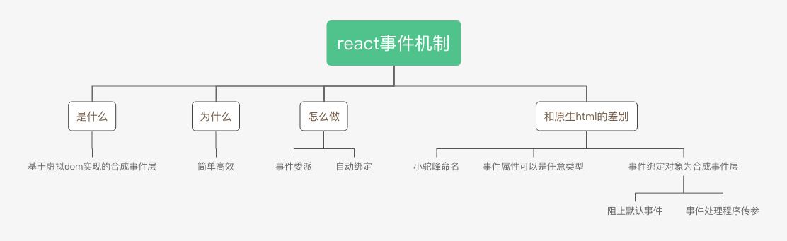

### 

### react合成事件是什么

在`document`上注册了一个合成事件层，代理了组件树上的所有事件，它监听的是`document`的冒泡阶段。

### React为什么要使用合成事件

简单高效。把所有事件绑定到结构的最外层，使用一个统一的事件监听器，这个事件监听器上维持了一个组件内部的事件监听和处理函数的映射。当组件挂载或卸载时，只是在这个统一的事件监听器上插入或删除一些对象;当事件发生时，首先被这个统一的事件监听器处理，然后在映射里找到真正的事件处理函数并调用。这样做简化了事件处理和回收机制，提升了销量。

### React中的合成事件是怎么实现的

#### 事件委派

把所有事件绑定到结构的最外层，使用一个统一的事件监听器，这个事件监听器上维持了一个组件内部的事件监听和处理函数的映射。当组件挂载或卸载时，只是在这个统一的事件监听器上插入或删除一些对象;当事件发生时，首先被这个统一的事件监听器处理，然后在映射里找到真正的事件处理函数并调用。

#### 自动绑定

在` React `组件中，每个方法的上下文都会指向该组件的实例，即自动绑定 `this` 为当前组件。 而且` React `还会对这种引用进行缓存，以达到` CPU` 和内存的最优化。在使用 `ES6 classes`或者纯 函数时，这种自动绑定就不复存在了，我们需要手动实现` this` 的绑定。

绑定有以下方法

- 构造器内声明

```jsx
constructor(props) {
    super(props);
    this.state = {isToggleOn: true};
    // 这个绑定是必不可少的，否则回调函数handleClick中会获取不到this
    this.handleClick = this.handleClick.bind(this);
}
handleClick(){
  	console.log(this)//在render中调用能正常输出this
}
```

- create react app 默认启用的`class fields` 语法（🔥现在主要都在用这种方法）

```jsx
class LoggingButton extends React.Component {
  handleClick = () => console.log('this is:', this);
  render() {
    return <button onClick={this.handleClick}>Click me</button>
  }
}
```

- 箭头函数，利用的是箭头函数总是指向函数定义的时候的对象，因此箭头函数指向函数当前的实例对象。不推荐，因为每次执行`render`方法，都会创建新的回调函数，导致浅比较结果不同，每次都会重新渲染。

```jsx
class LoggingButton extends React.Component {
  handleClick() {
    console.log('this is:', this);
  }
  render() {
    return <button onClick={(e) => this.handleClick(e)}>Click me</button>
  }
}
```

### 和html原生事件的区别

```jsx
<button onClick={this.handleClick}>Test</button>
<button onclick="handleClick()">Test</button>
```

观察以上两行代码，我们可以看到react合成事件和html原生事件的区别。

|              | react合成事件                               | html原生事件                         |
| ------------ | ------------------------------------------- | ------------------------------------ |
| 事件命名     | 小驼峰式（camelCase）命名，🌰onClick         | 全小写命名，🌰onclick                 |
| 事件属性类型 | 任意类型，可以是函数指针，🌰this.handleClick | js原生字符串，🌰"handleClick()"       |
| 事件绑定对象 | 把所有的事件绑定在最外层的合成事件层        | 将事件处理器直接绑定到 HTML 元素之上 |

#### 阻止默认事件

我们来看一个🌰

考虑下面的示例代码并思考**点击按钮后**的输出。

```jsx
import React, { useEffect } from "react";
import ReactDOM from "react-dom";
window.addEventListener("click", event => {
	console.log("window");
});


document.addEventListener("click", event => {
	console.log("document:bedore react mount");
});


document.body.addEventListener("click", event => {
	console.log("body");
});


function App() {
  function documentHandler() {
  	console.log("document within react");
  }


  useEffect(() => {
    document.addEventListener("click", documentHandler);
      return () => {
      document.removeEventListener("click", documentHandler);
      };
  }, []);


  return (
  <div
    onClick={() => {
    console.log("react:container");
  }}
  >
    <button
    onClick={event => {
    console.log("react:button");
    }}
    >
      CLICK ME
    </button>
  </div>
);
}

ReactDOM.render(<App />, document.getElementById("root"));

document.addEventListener("click", event => {
	console.log("document:after react mount");
});
export default App;
```

答案为

```javascript
body
document:bedore react mount
react:button
react:container
document within react
document:after react mount
```

解析

- 点击按钮后，由于合成事件事件统一绑定在document的事件处理器上，所以事件会冒泡到body，输出"body"
- 接着事件冒泡到document，document上有三个处理器。分别是在`render`前绑定的，`render`中绑定的`react`用来代理事件的处理器和在`render`后绑定的事件处理器。
  - 同一元素上如果对同一类型的事件绑定了多个处理器，会按照绑定的顺序来执行。
  - 所以 `ReactDOM.render` 之前的那个处理器先执行，输出 `document:before react mount`。
  - 然后是 `React` 的事件处理器。此时，流程才真正进入` React`，走进我们的组件。组件里面就好理解了，从 `button `冒泡到 `container`，依次输出。
  - 最后 `ReactDOM.render` 之后的那个处理器先执行，输出 `document:after react mount`。
- 事件完成了在 document 上的冒泡，往上到了 window，执行相应的处理器并输出 `window`。

现在对代码做一些变动，在 body 的事件处理器中把冒泡阻止，再思考其输出。

```jsx
document.body.addEventListener("click", event => {
  event.stopPropagation();
  console.log("body");
});
```

答案

```
body
```

如果你看懂上面的代码就可以知道，**body上的防止冒泡让事件无法冒泡到`document`上，所以绑定在`document`上的`react`合成事件一个都不会执行**。

#### 向事件处理程序传递参数的两种方式

- 通过箭头函数的方式，事件对象**必须显式的进行传递**
- 而通过 `bind` 的方式，事件对象以及更多的参数将会被隐式的进行传递。即e虽然没有写出来，但是在最后隐式的传递了。

```jsx
render(){
  return (
    <div>
      <button onClick={(e) => this.deleteRow(id, e)}>Delete Row</button>
			<button onClick={this.deleteRow.bind(this, id)}>Delete Row</button>
    </div>
  )
}


deleteRow(id,e) {
  //console.log(id,e)
}
```

### 文章参考

[React 中阻止事件冒泡的问题](https://www.cnblogs.com/Wayou/p/react_event_issue.html)

