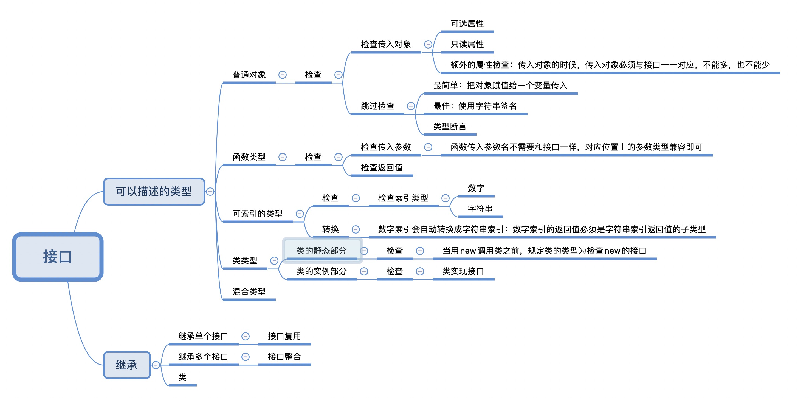

# 接口

接口的作用就是为这些类型命名和为你的代码或第三方代码定义契约，当给接口传入的值不满足契约，接口就会抛出错误。

下面通过一个简单示例来观察接口是如何工作的：

```typescript
interface LabelledValue {
  label: string;
}

function printLabel(labelledObj: LabelledValue) {
  console.log(labelledObj.label);
}

let myObj = {size: 10, label: "Size 10 Object"};
printLabel(myObj);
```

`LabelledValue`接口就好比一个名字，用来描述上面例子里的要求。 它代表了有一个 `label`属性且类型为`string`的对象。

# 可选属性

接口里的属性不全都是必需的。 有些是只在某些条件下存在，或者根本不存在。

```typescript
interface SquareConfig {
  color?: string;
  width?: number;
}

// (config: SquareConfig) 是对函数接受的参数的类型定义
// : {color: string; area: number} 是对函数返回的参数的类型的定义
function createSquare(config: SquareConfig): {color: string; area: number} {
  let newSquare = {color: "white", area: 100};
  if (config.color) {
    newSquare.color = config.color;
  }
  if (config.width) {
    newSquare.area = config.width * config.width;
  }
  return newSquare;
}

let mySquare = createSquare({color: "black"});
```

带有可选属性的接口与普通的接口定义差不多，只是在可选属性名字定义的后面加一个`?`符号。

# 只读属性

一些对象属性只能在对象刚刚创建的时候修改其值。 你可以在属性名前用 `readonly`来指定只读属性:

```typescript
interface Point {
    readonly x: number;
    readonly y: number;
}
```
你可以通过赋值一个对象字面量来构造一个`Point`。 赋值后，` x`和`y`再也不能被改变了。
```typescript
let p1: Point = { x: 10, y: 20 };
p1.x = 5; // error!
```

`ReadonlyArray<T>`类型，它与`Array<T>`相似，只是把所有可变方法去掉了，因此可以确保数组创建后再也不能被修改

```ts
let a: number[] = [1, 2, 3, 4];
let ro: ReadonlyArray<number> = a;
ro[0] = 12; // error!
ro.push(5); // error!
ro.length = 100; // error!
a = ro; // error!
```

上面代码的最后一行，可以看到就算把整个`ReadonlyArray`赋值到一个普通数组也是不可以的。 但是你可以用类型断言重写：

```ts
a = ro as number[];
```

## `readonly` vs `const`

最简单判断该用`readonly`还是`const`的方法是看要把它做为变量使用还是做为一个属性。 做为变量使用的话用 `const`，若做为属性则使用`readonly`。

# 额外的属性检查

```ts
interface SquareConfig {
    color?: string;
    width?: number;
}

function createSquare(config: SquareConfig): { color: string; area: number } {
    // ...
}

let mySquare = createSquare({ colour: "red", width: 100 });
```

对象字面量会被特殊对待而且会经过 *额外属性检查*，当将它们赋值给变量或作为参数传递的时候。 如果一个对象字面量存在任何“目标类型”不包含的属性时，你会得到一个错误。

```ts
// error: 'colour' not expected in type 'SquareConfig'
let mySquare = createSquare({ colour: "red", width: 100 });
```

绕开这些检查非常简单。 最简便的方法是使用类型断言：

```ts
let mySquare = createSquare({ width: 100, opacity: 0.5 } as SquareConfig);
```

最佳的方式是能够添加一个字符串索引签名，前提是你能够确定这个对象可能具有某些做为特殊用途使用的额外属性。

```ts
interface SquareConfig {
    color?: string;
    width?: number;
    [propName: string]: any;
}
```

还有最后一种跳过这些检查的方式，这可能会让你感到惊讶，它就是将这个对象赋值给一个另一个变量： 因为 `squareOptions`不会经过额外属性检查，所以编译器不会报错。

```ts
let squareOptions = { colour: "red", width: 100 };
let mySquare = createSquare(squareOptions);
```

