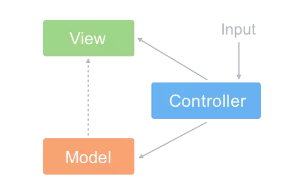
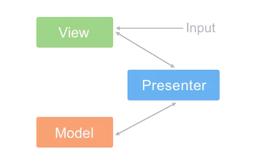

[浅析前端开发中的 MVC/MVP/MVVM 模式](<https://juejin.im/post/593021272f301e0058273468#heading-3>)

### 什么是`MVC`

早期的 Web 开发主要基于` MVC `模式，`MVC` 即` Model-View-Controller `的缩写，表示模型 - 视图 - 控制器


如图，实线代表方法调用，虚线代表事件通知。

`MVC`允许在不改变视图的情况下改变视图对用户输入的响应方式，用户对`View`的操作交给了`Controller`处理，在`Controller`中响应`View`的事件，调用`Model`的接口对数据进行操作，一旦`Model`发生变化便通知相关视图进行更新。

### `Model`

`Model`层用来存储业务的数据，一旦数据发生变化，模型将通知有关的视图。

```js
myapp.Model = function() {
    var val = 0;
    this.add = function(v) {
        if (val < 100) val += v;
    };
    this.sub = function(v) {
        if (val > 0) val -= v;
    };
    this.getVal = function() {
        return val;
    };
    ／* 观察者模式 *／
    var self = this, 
        views = [];
    this.register = function(view) {
        views.push(view);
    };
    this.notify = function() {
        for(var i = 0; i < views.length; i++) {
            views[i].render(self);
        }
    };
```

Model和View之间使用了**观察者模式**，View事先在此Model上注册，进而观察Model，以便更新在Model上发生改变的数据。

### View

`view`和`controller`之间使用了**策略模式**，这里`View`引入了`Controller`的实例来实现特定的响应策略，比如这个栗子中按钮的 `click` 事件：

```js
myapp.View = function(controller) {
    var $num = $('#num'),
        $incBtn = $('#increase'),
        $decBtn = $('#decrease');

    this.render = function(model) {
        $num.text(model.getVal() + 'rmb');
    };

    /*  绑定事件  */
    $incBtn.click(controller.increase);
    $decBtn.click(controller.decrease);
};
```

如果要实现不同的响应的策略只要用不同的`Controller`实例替换即可。

### Controller

控制器是模型和视图之间的纽带，`MVC`将响应机制封装在`controller`对象中，当用户和你的应用产生交互时，控制器中的事件触发器就开始工作了。

```js
myapp.Controller = function() {
    var model = null,
        view = null;

    this.init = function() {
        /* 初始化Model和View */
        model = new myapp.Model();
        view = new myapp.View(this);

        /* View向Model注册，当Model更新就会去通知View啦 */
        model.register(view);
        model.notify();
    };

    /* 让Model更新数值并通知View更新视图 */
    this.increase = function() {
        model.add(1);
        model.notify();
    };

    this.decrease = function() {
        model.sub(1);
        model.notify();
    };
};
```

这里我们实例化`View`并向对应的`Model`实例注册，当`Model`发生变化时就去通知`View`做更新，这里用到了观察者模式。

当我们执行应用的时候，使用`Controller`做初始化：

```js
(function() {
    var controller = new myapp.Controller();
    controller.init();
})();
```

### `MVC`的缺点

- 大量的`dom`操作，处理繁琐，使代码难以维护
- `model`频繁变化时，需要主动更新到`view`，很难维护复杂多变的数据状态

### 什么是`MVP`




### 什么是`MVVM`

`MVVM` 模式，顾名思义即` Model-View-ViewModel `模式。

- **Model**：数据层。因为它仅仅关注数据本身，不关心任何行为

```javascript
var data = {
    val: 0
};
```

- **`View`**：视图层，通过使用模板语法来声明式的将数据渲染进`DOM`。当`ViewModel`对`Model`进行更新的时候，会通过数据绑定更新到`View`。

```html
<div id="myapp">
    <div>
        <span>{{ val }}rmb</span>
    </div>
    <div>
        <button v-on:click="sub(1)">-</button>
        <button v-on:click="add(1)">+</button>
    </div>
</div>
```

- **`ViewModel`**：视图模型层，提供`View`需要的数据，用来处理`View`层的具体业务逻辑。`ViewModel`底层会做好绑定属性的监听。当`ViewModel`中数据发生变化，`View`层也会得到更新；而当`View`中声明了数据的双向绑定，一旦`View`层中数据发生变化，`ViewModel`中的数据也会得到更新。

```javascript
new Vue({
    el: '#myapp',
    data: data,
    methods: {
        add(v) {
            if(this.val < 100) {
                this.val += v;
            }
        },
        sub(v) {
            if(this.val > 0) {
                this.val -= v;
            }
        }
    }
});
```


### `MVVM`的优缺点？（`MVVM`和`MVC`的区别）

优点：

1. 低耦合：视图和模型分离
2. 重用性：可以把一些视图逻辑放在一个`ViewModel`里面，让很多`view`重用这段视图逻辑。
3. 可测试性: `viewModel`帮助开发者更好地编写调试代码
4. 自动更新`DOM`：利用双向绑定，数据更新后视图自动更新，减少了繁琐的`DOM`操作
5. 独立开发：开发人员可以专注于业务逻辑和数据的开发，设计人员可以专注于页面设计。

区别：

1. 耦合度：`mvvm`的视图的模型分离，耦合度低，`mvc`视图需要在模型中注册，耦合度高
2. 重用性：`mvvm`可以把一些视图逻辑放在一个`viewModel`里面，让很多`view`重用这段视图逻辑，`mvc`中`view`和`controller`一般是一一对应的，它们捆绑起来表示为一个组件。
3. 可测试性：`mvvm`可以利用
4. `dom`操作：`mvvm`可以利用数据双向绑定，在数据更新后自动更新视图，减少了繁琐的`DOM`操作
5. 独立开发：`mvvm`中数据和逻辑分离，开发人员可以专注于业务逻辑和数据的开发。

