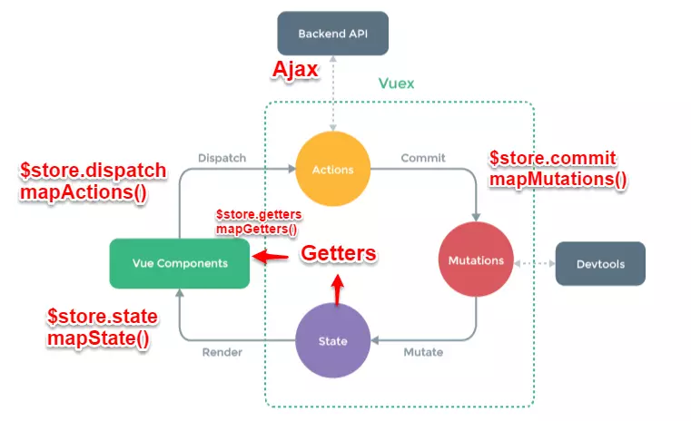

 



###  1.`Vuex`原理

`vuex`是`vue`的状态管理器，它实现了一个单向数据流，在全局拥有一个`State`存放数据，当组件必须通过`Mutation`更改`State`中的数据，`Mutation`同时提供了订阅者模式供外部插件调用获取`State`数据的更新。而当**所有异步操作或批量的同步操作**需要走`Action`，但`Action`也是无法直接修改`State`的，还是需要通过`Mutation`来修改`State`的数据。最后，根据`State`的变化，渲染到视图上。

### 2.各模块在流程中的功能：

#### actions：

**操作行为处理模块,由组件中的<font color='red'>$store.dispatch('action 名称', data1)</font>来触发。然后由commit()来触发mutation的调用 , 间接更新 state**。负责处理组件的所有交互行为。包含**同步/异步操作**，支持多个同名方法，按照注册的顺序依次触发。向后台`API`请求的操作就在这个模块中进行，包括触发其他`action`以及提交`mutation`的操作。该模块提供了`Promise`的封装，以支持`action`的链式触发。

#### mutations：

**状态改变操作方法，由actions中的<font color='red'>commit('mutation 名称',data1)</font>来触发**。是`Vuex`修改`state`的唯一推荐方法。该方法只能进行同步操作，且方法名只能全局唯一。操作之中会有一些`hook`暴露出来，以进行`state`的监控等。

#### state：

页面状态管理容器对象。集中存储组件中data对象的零散数据，全局唯一，以进行统一的状态管理。页面显示所需的数据从该对象中进行读取，利用`Vue`的细粒度数据响应机制来进行高效的状态更新。

#### getters：

state对象读取方法。图中没有单独列出该模块，应该被包含在了`render`中，组件通过该方法读取全局state对象。

### 3.Vuex与localStorage

`vuex` 是 `vue` 的状态管理器，存储的数据是响应式的。但是并不会保存起来，刷新之后就回到了初始状态，**具体做法应该在`vuex`里数据改变的时候把数据拷贝一份保存到`localStorage`里面，刷新之后，如果`localStorage`里有保存的数据，取出来再替换`store`里的`state`。**

```JavaScript
let defaultCity = "上海"
try {   // 用户关闭了本地存储功能，此时在外层加个try...catch
  if (!defaultCity){
    defaultCity = JSON.parse(window.localStorage.getItem('defaultCity'))
  }
}catch(e){}
export default new Vuex.Store({
  state: {
    city: defaultCity
  },
  mutations: {
    changeCity(state, city) {
      state.city = city
      try {
      window.localStorage.setItem('defaultCity', JSON.stringify(state.city));
      // 数据改变的时候把数据拷贝一份保存到localStorage里面
      } catch (e) {}
    }
  }
})
```