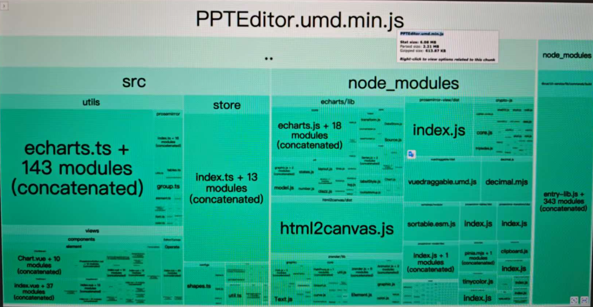
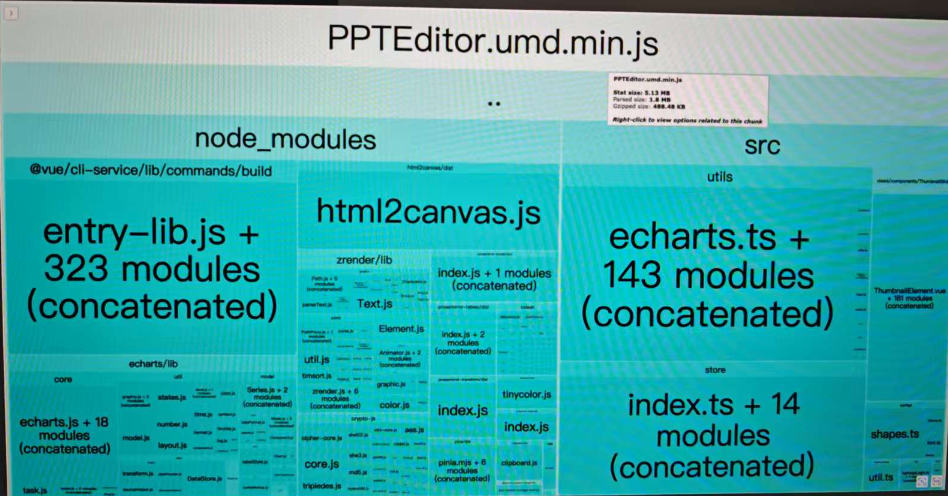

## 背景

由于目前编辑器通过SDK包的形式存在，但未针对不同平台场景区分，只存在一个完整包。在自由画布内会存在多个PPT实例共存的场景，且需支持各实例能够独立使用。当编辑器SDK包体积过大时，随着实例的增加，很容易造成卡顿等问题。

## 平台模块

|          | 模块         | sdk包              |
| -------- | ------------ | ------------------ |
| pc       | 编辑+预览    | ppt-editor         |
| app      | app编辑+预览 | ppt-editor-render  |
| 小程序   | 预览         | ppt-editor-preview |
| 自由画布 | 预览         | ppt-editor-preview |

## 实现方案

**a. 设计方案**
从入口处区分，拆分成三个包：

* **完整包 (ppt-editor)** ：与现有SDK包一致，包含所有模块内容
* **渲染包 (ppt-editor-render)** ：包含app编辑、预览部分
* **预览包 (ppt-editor-preview)** ：只包含预览能力，无编辑

引入pnpm进行依赖管理，拆分现有目录结构，将三个子包统一放在modules目录下管理。每个包各自维护自己的package.json配置及入口文件。其余代码不变，统一从完整包modules/core内引入使用。

**b. 目录结构**

```
modules/
├── core/
│   ├── node_modules/
│   ├── src/
│   ├── babel.config.js
│   ├── package.json
│   ├── tsconfig.json
│   └── vue.config.js
├── preview/
│   ├── node_modules/
│   ├── src/
│   ├── package.json
│   ├── testUmd.js
│   ├── tsconfig.json
│   └── vue.config.js
└── render/
    ├── node_modules/
    ├── src/
    ├── package.json
    ├── tsconfig.json
    └── vue.config.js
```

**c. 流水线配置修改**

## 拆包流程

1. 使用webpack-bundle-analyzer插件分析包大小和每个模块占比。
   这样就能通过报告分析看出某个模块有没有被打进去。比如antd模块占比1.8mb。那么如果包少了1.8mb就说明antd模块没有被打进去。
2. 拆包分析体积
3. pnpm控制版本

## 项目难点

1. 支持多实例，且不互相干扰
   由于未指定Pinia实例时，会导致共用一个Store，导致多个PPT数据相互影响。在代码内组件外使用时，需指定对应的Pinia实例来解决。
2. 修改目录结构，新增pnpm管理
   由于需要新增渲染及预览包，且尽可能不修改/新增代码，需要配置代码引用以适配。
   为了防止依赖重复，优化开发体验，通过pnpm统一管理子包。
   降低不同场景下接入包的体积，支持多实例，优化性能

## 收益

降低不同场景下接入包的体积，优化性能

|                    | 优化后 |                                              |
| ------------------ | ------ | -------------------------------------------- |
| ppt-editor         | 3.78M  |                                              |
| ppt-editor-render  | 2.21M  |  |
| ppt-editor-preview | 1.8M   |  |

## 碰到的问题

### vue发生版本冲突

问题：sdk是vue2，业务是vue3，vue版本发生冲突。

解法：

因为 Vue 2 和 Vue 3 的内部实现差异较大，Vue 3 无法兼容 Vue 2，所以如果你的 SDK 依赖 Vue 2 的话，业务环境中的 Vue 3 将无法直接用于 SDK。

- 为了避免冲突，SDK 中应该独立打包自己的 Vue 2，而不依赖业务环境中的 Vue 3。
- 在 SDK 的 `package.json` 中设置 `peerDependencies`，声明 Vue 2 是 SDK 的依赖，这样 Vue 2 会在使用 SDK 的项目中自动安装。

1. 当包发生冲突的时候，sdk打包的时候需要带上自己版本的vue，和业务
2. babel编译问题
3. peer版本问题
