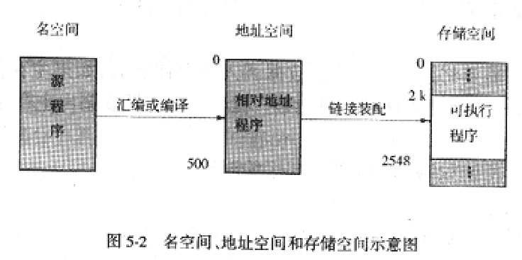
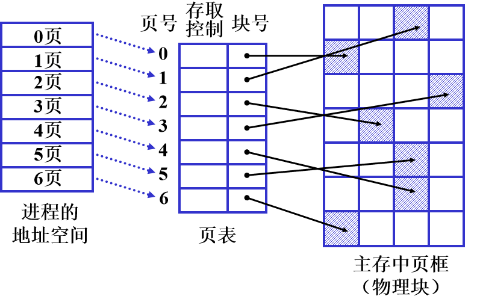

### 存储体系结构

- cache：数百`KB`，非常高速，昂贵，断电消失
- 主存（内存）：数`M`到数百`MB`，中速，中等价格，断电消失。
- 磁盘：数`M`到数百`GB`、低速、廉价，断电仍保存。

### 地址空间相关术语

- 逻辑地址（相对地址，虚地址）

  用户程序经过汇编形成目标代码，目标代码使用相对地址，首地址为0，指令中的地址相对于首地址编址。

- 物理地址（绝对地址，实地址）

  内存中存储单元的地址，可直接寻址。

**物理地址 = 逻辑地址 + 基地址**

- 地址映射

  将**逻辑地址转换为物理地址**的过程。`CPU`在执行指令时为了正确访问存储单元，需要把用户程序中的逻辑地转换为运行时由机器直接寻址的物理地址。
  
- 名空间：程序中由符号名组成的空间。提供给程序员使用的
  
- 地址空间(逻辑地址空间)：由程序中逻辑地址组成的地址范围
  
- 存储空间(物理地址空间)：由内存中一系列存储单元所限定的地址范围。内存空间用来存放当前正在运行程序的代码及数据, 是程序中指令本身地址所指的、亦即程序计数器所指的存储器。
  
  - 系统区：用于存放操作系统
  - 用户区：用于装入并存放用户程序和数据
  
  

### 程序的装入方式

- 绝对装入

编译程序产生<font color='red'>绝对地址</font>的目标代码

- 可重定位装入

目标模块的起始地址从0开始。将装入模块**装入到内存进行地址映射**，不再改变，称<font color='red'>静态重定位</font>。

特点：目标程序载入时，装入程序根据目标程序在内存中的基地址直接修改目标程序代码，将其中所有的逻辑地址转变为物理地址。

- 动态运行时装入 

当**程序执行时进行地址映射**。程序在内存中的位置可以改变, 因此边运行, 边装入,称<font color='red'>动态重定位</font>。

特点：在程序运行时，使用一个基址寄存器存储基地址，根据基地址和逻辑地址动态计算出物理地址。避免了修改程序，具有更大的灵活性。

### 程序的链接方式

- 静态链接

装入前进行链接, 将所有模块的相对地址链接起来, 形成整个程序的<font color='red'>连续的</font>逻辑地址。

- 装入时动态链接

对编译形成的一组模块边装入、边链接, <font color='red'>各模块独立分开</font>装入内存的不同位置,  便于修改, 便于共享。

- 运行时动态链接

边运行、边链接，有些模块往往不会运行到(如错误处理), 不必装入，效率高节省内存。

### 存储管理技术

- 单一用户（连续区）存储管理

只有一个进程在内存。内存分为两个区域，一个供操作系统使用，一个供用户使用。 管理简单，内存利用率低。

- 固定分区存储管理

把内存用户区划分为相等或不相等的若干分区。一个进程占一个分区。

特点：利用内存分配表进行内存分配与管理，回收简单，但是内存利用率不高。

#### 可变分区存储管理

当程序装入时，根据进程需求和内存空间的使用情况来决定是否分配。若有足够空间，则分割一部分分区给该进程。否则令其等待。有**可变分区说明表**和**空闲区链表**两种管理方式。

- 可变分区说明表：由**已分配区表**和**未分配区表**两张表格组成。

- 空闲区链：分区首尾包含分区分配信息，进行自行管理。


##### 可变分区的内存分配算法

**首次适配算法**

查空闲块表（按地址递增有序）, 找到第一个不小于请求的空块, 将其分割并分配。

特点:简单、快速

**循环首次适配算法**

从上一次分配的空闲块后面，找到第一个不小于请求的空块, 将其分割并分配。

特点:简单、空闲块分布均匀

**最佳适配算法** 

在空闲块表（按容量递增有序）中，找到第一个不小于请求的最小空块, 将其分割并分配。

特点:用最小空间满足要求，但是会产生较多的内存碎片

**最坏适配算法**：

在空闲块表（按容量递减有序）中，找到第一个不小于请求的最大空块, 将其分割并分配。

特点:分割后空闲块仍较大

##### 可变分区回收内存

系统根据回收区的首址，从空闲区中找到相应的插入点

- 回收区与插入点的前一个空闲分区`F1`相邻接，（下临界）将回收区和`F1`合并，不给回收区分配新表项，仅修改`F1`大小
- 回收区与插入点的后一个空闲分区`F2`相邻接，（上临界）将回收区与`F2`合并，用回收区首址作为新空闲区的首址，大小为两分区之和。

> 上临界和下临界，其中的上和下指的是回收区的位置。

- 回收区同时与插入点的前后分区邻接，此时将三个分区合并，取消`F2`，把`F1`的大小修改为三者之和。
- 回收区与插入点的前后分区不邻接，为回收区单独建立一个表项，填写回收区的首址和大小。

#### 可重定位分区存储管理

经过一段时间的分配回收，内存中存在很多内存碎片。造成存储资源的浪费。可以用紧凑技术把小的空闲区与合并为大的空闲区域，缺点是开销大。

### 页式存储管理

**页：**是系统把目标程序按**逻辑地址**分成的大小相等的部分，大小为2的幂。从0开始编制页号，页内相对于0编址。

逻辑地址结构为：

```
23__________12 11___________0		
|___页号p_____|___页内地址W___|
```

**块：**按页的大小划分为大小相等的区域，也称为页框（物理页面）。

内存以页为单位进行分配，并按进程的页数来分配。逻辑上相邻的页，物理上不一定相邻。

所以需要建立**页表**，对页号和块号进行地址映射。<font color='red'>每个进程</font>都有一个页表。



##### 地址变换结构

- 基本地址变换机构：页表和一对页表寄存器（页表始址寄存器，页表长度寄存器）

- 具有快表的地址变换机构：快表是介于内存与寄存器之间的存储机制，为加快地址变换速度而设置，它的访问速度比页表快一个数量级，存放被频繁访问的页表项。快表和页表检索是同时进行的，快表查到则终止检索页表。

**块号b的地址 = 页表始址+页号*页表项长度**

**物理地址P = 物理块号*页的大小+页内地址**

优点: 解决了碎片问题、便于管理
缺点: 不易实现共享、不便于动态连接

##### 问题

假设某虚存的用户空间为`1024KB`，页面大小为`4KB`，内存空间为`512KB`。已知用户的虚页10、11、12、13分得内存物理块号32、10、25、36，请用表格的形式表示出页表中这些虚页号与物理块号的对应关系，并据此给出，将虚地址`BEBC`(16进制)转换为实际物理地址的计算过程，并最终得出实际的物理地址是多少。

1`KB` = 1024`B`	1`MB`  = 1024`KB`	1`TB` = 1024`MB`

页面大小为`4KB`，`4KB` =  `2^12B`

| 逻辑地址 | 页号 | 页内位移量     |
| -------- | ---- | -------------- |
| BEBC     | 1011 | 1110 1011 1100 |

(1011)2 = 11，11对应的块号为10，10对应的十六进制为`A`

##### 两级和多级页表

对于`32`位逻辑地址1空间，当页面大小为`4KB`(2^12)，则页表项个数可达`1M`(2^20)，若一个页表项占`4B`（4*8 = 32），则整个页表最多可占`4M`(页表项个数`1M` * 页表项大小`4B` )连续空间，可采用两级或多级页表来解决这一问题。

每页(`4KB`)可容纳`1KB`(`4KB/4B`)个页表项，将`1M`(`2^20`)个页表项分为`1KB`(`2^10`)个子表，每个子表有`1KB`个页表项。建立一个外层页表，它的每个页表项存储各子表的物理块号。
```
31___________22	21_________12 11___________0		
|__外部页号p1___|___内层页号p2__|___页内地址d___|
```


### 段式存储管理

段：程序的地址空间按**自身的逻辑关系**划分为若干个段, 每个段定义了一组逻辑信息。每个段有自己的名字，可用段号代替段名。段号从0开始编号，段内从0开始编址。段内地址空间连续。各段长度不等。

程序逻辑地址为

```
 ________________________
|___段号____|___段内地址___|
```

内存空间被动态划分为若干不等长物理段，物理段由始址和长度确定。以段为单位分配内存，每个段在内存中占据连续空间，但是各段之间可不连续存放。通过**段表**记录各段的始址和长度。每个<font color='red'>程序</font>管理一个段表。

优点：便于动态申请内存、易于保护、便于共享、可动态链接、可动态增长
缺点：产生碎片

### 段页式存储管理

结合了二者优点、克服了二者的缺点，提高利用率，满足用户要求

用户程序按段划分，内存按页划分


### 分页和分段的主要区别

页是**物理单位**，分页是为了消减内存的外零头以**提高内存的利用率**, 是**系统需要**。
段是**逻辑单位**, 分段是**用户需要**。
页的**大小固定**且由系统确定, 分页由硬件实现。
段的**大小不固定**, 由编译时根据程序信息来划分。
分页的**作业地址空间是一维的线性空间**。标识地址时, 只需给出一个**逻辑地址**。
分段的**作业地址空间是二维**的, 标识地址时, 必须给出**段名和段内地址**。

### 虚拟存储器

当**程序大于内存**，如，多道程序运行时，运行内存只能容纳部分作业

虚拟存储器：具有**请求调入功能**和**置换功能**，能仅把作业的一部分装入内存变可运行作业的存储器系统，它是能**从逻辑上对内存容量进行扩充**的一种虚拟的存储器系统。

逻辑地址结构为：

```
23__________12 11___________0		
|___页号p_____|___页内地址W___|
```

- 离散性: 是实现虚拟存储器的基础

- 多次性: 多次将部分调入内存, 每当运行到不在内存那部分程序时,再将它调入

- 交换性: 暂时不执行允许换出, 需要时再换入

- 虚拟性: 逻辑(虚)上扩充了内存物理(实)容量

  虚存的大小 = 内存 + 外存


状态位P：表示该页是在内存还是在外存
访问位：记录该页在一段时间内被访问的次数
修改位：查看此页是否在内存中被修改过

状态位供**程序访问**时参考,修改位供**置换算法**时参考,访问位供**换出页面**时参考,外存始址供**调入页面**时参考

**缺页中断：**当所要访问的页不在内存，则产生缺页中断。缺页中断处理程序会根据页表的外存地址，将该页从外存调入内存，若内存中有空闲块，修改页表中相应页表项目的驻留位及相应的内存块号。若无空闲块，则淘汰某页，若该页被修改过则写入外存，然后再把所缺页调入内存并修改相应页表项。

#### 页面置换算法

页面置换算法好，缺页率低

- **最佳置换算法**

淘汰永不使用或最长时间内不再被访问的页，<font color='red'>无法实现, 只能用它做评价标准。</font>

- **先进先出算法**

- **最近最久未使用算法**`LRU`

淘汰在最近未使用的页面

实现方法：

**移位寄存器：**为每个在内存的页面配置移位寄存器，当被访问时移位寄存器最高位置1，隔一段时间寄存器右移一位。最小值的寄存器对应的页就是最久未访问的

**特殊栈：**栈的大小等于分配的物理块数，把当前访问页保持在栈顶，栈底就是最久未访问页号。缺页中断时若栈未满，将新页号压栈，若栈满淘汰栈底元素，所有元素下移，把新页号压栈。

- **`CLOCK`算法——`LRU`近似算法**

简单的`CLOCK`置换，每页设置访问位`A`，当被访问`A`置为1。将内存中所有页面连成循环链表进行检测，当A = 0,淘汰，A = 1置为0。

改进的`CLOCK`置换，页面换出时，如果被修改需要重新写入磁盘。优先淘汰未被修改的页面。

淘汰顺序为: ①A=0,M=0  ②A=0,M=1  ③A=1,M=0  ④A=1,M=1

- **页面缓冲算法**

  内存中一部分作为页面缓冲区, **将缓冲区的物理块链接为空闲链表和已修改链表**。采用先进先出算法。

- **最少使用算法**

给页表项设置移位寄存器，页面被访问，最高位置一，隔一段时间右移，却也是，淘汰寄存器相加之和最小的页面。

