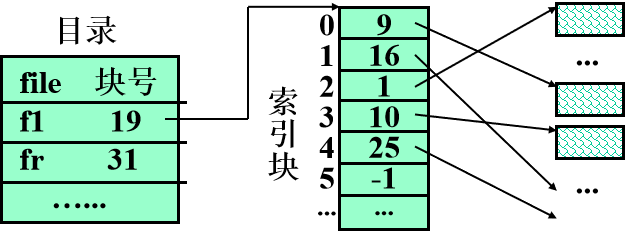

文件系统是统一管理外存中文件资源的系统软件。**文件**是文件系统中的**最大数据单位**

### 索引分配

##### 单级索引分配

每个文件都有索引表，该表实质就是磁盘块地址数组，其中第`i`项存放指向文件的第`i`块盘块号

##### 多级索引分配

对于大文件, 当分配的盘块号已装满一个索引块时, 必须另分配索引块, 各索引块通过指针连结起来,文件太大索引块太多时, 检索索引块将是低效的, 此时应为这些索引块再建立一级索引, 形成了两级索引, 必要时还可建立更多级的索引分配方式。

##### 混合索引分配

每个文件的索引结点含13个地址项 `i.addr(0)~ i.addr(12)`, 每项`4b`; 前`10`项存放直接地址(物理块号),  若文件大于`40kB`，则用`i.addr(10)`指向单级索引块进行一次间接寻址,该块中最多可放`1k`个物理块号,文件可长达`4MB`; 还可用` i.addr(11)` 和` i.addr(12) `作为二次和三次间接寻址, 文件最大长度分别可达`4GB`和`4TB`。

解析：前`10`项存放直接地址，若文件小于等于`40kb`,每项指向的物理块号大小为`4kb`

`i.addr(10)`的大小为`1000*4kb` ,`1000`约等于`2^10*2^2*2^10`等于`4*2^20`为`4MB`为一次间接寻址

可推得，二级索引为`4GB`，三级索引为`4TB`

