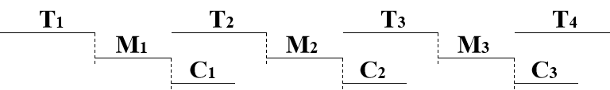
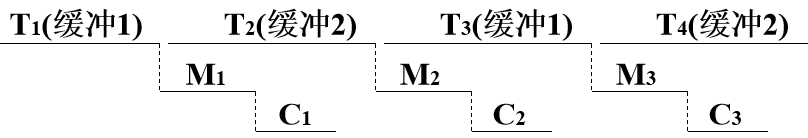

#### 设备

块设备:读写的基本单位是数据块,如磁盘

字符设备:读写的基本单位是字符,如键盘

#### 设备控制器

`CPU`和`I/O`设备的接口,接受`CPU`命令控制`I/O`工作,可编址

- 地址识别:识别`I/O`地址,使`I/O`操作与设备对应
- 接受和识别命令指挥设备执行:接受`CPU`指令,通过控制器与设备接口,指挥设备执行特定的操作
- 接受和记录设备的状态:接受从设备发来的电信号进行转换,将设备状态信息记录,供`CPU`了解
- 数据交换,数据缓冲,差错控制:实现`CPU<->控制器<->设备`的数据交换

#### `I/O`通道

是一种特殊的处理机,具有处理`I/O`指令的能力,通过执行通道程序来控制`I/O`操作,指令类型单一,没有自己的内存

- 建立独立的`I/O`操作
- 把`CPU`从繁杂的`I/O`任务中解脱出来
- 减轻单总线负担,增加`I/O`通道

#### 系统总线

- 地址总线
- 控制总线
- 数据总线

当总线连接的是`CPU`和`I/O`设备时,就称他为`I/O`总线

#### 缓冲方式

为了缓和`CPU`与`I/O`设备速度不匹配的矛盾,引入了缓冲,减少了`CPU`的中断频率,提高了`CPU`和`I/O`设备的并行性

- ##### 单缓冲

块设备输入时,输入到缓冲区的时间为T,`OS`将缓冲区中的数据传送到用户区的时间为`M`,`CPU`处理这块数据的时间为`C`,`T`和`C`可以并行

- ##### 双缓冲(缓冲对换)

为了加快`I/O`速度,提高设备利用率,引入双缓冲,如果`C<T`(`CPU`处理数据时间够快),块设备可连续输入

若两台设备要实现双向通信,必须在两台机器中都设置两个缓冲区,一个接受一个发送

- ##### 循环缓冲

当两者之间速度匹配时,双缓冲能取得较好的效果,但当两者之间速度相差很远时效果不理想,可将多个缓冲组成循环形式

#### 缓冲池的组成

- 空缓冲链队列emp:由空缓冲区组成
- 输入缓冲链队列inq:由装满输入数据的缓冲区组成
- 输出缓冲链队列out:由装满输出数据的缓冲区组成
- 四种工作缓冲区:(收容house,seek取)
  - 收容输入hin
  - 提取输出sout
  - 提取输入sin
  - 收容输出hout

缓冲池中的队列是临界资源要考虑互斥与同步

缓冲池的工作原理:

- 收容输入的工作方式
  1. 调用`Getbuf(emp,hin)`,从`emp`队列队首取一个缓冲区作为收容输入缓冲区`hin`
  2. 把数据输入到`hin`
  3. 调用`Putbuf(inq,hin)`把`hin`放到`inq`队尾

- 提取输入的工作方式
  1. 调用`Getbuf(inq,sin)`,从`inq`队列队列提取一个缓冲区作为提取输入缓冲区`sin`
  2. 提取`sin`的输入
  3. 调用`Putbuf(emp,sin)`,把sin放到`emp`队尾

#### 磁盘访问时间

- 寻道时间`Ts`: 磁头移动到指定磁道的时间, 启动时间`s`与移动`n`条磁道时间之和
         Ts=m*n+s   一般为`5~30ms`
- 旋转时间`Tr`:指定扇区旋转到磁头下的时间
      `5400r/min=90r/second`的硬盘:平均`Tr=1/2r=1/2*1/90 = 5.55ms`
- 传输时间`Tt`:
    	从磁盘到内存读写数据时间:` Tt=b/rN  `其中`b`为读写字节数，`N`为一条磁道总字节数,`r`为绕磁道一圈所需的时间
   **访问时间:Ta= Ts+Tr+Tr**    主要与**Ts**有关 

#### 磁盘调度算法

- ##### 先来先服务

按访问请求到达的先后次序服务

特点:简单公平,效率低

- ##### 最短寻道时间优先

选择**距当前磁头最近**的访问请求进行服务

特点:平均寻道时间最小,但是会产生饥饿现象,不公平

- ##### 扫描算法

当设备无访问请求时, 磁头不动;当有访问请求时, 磁头按一个方向移动, 在移动过程中对遇到的访问请求进行服务, 然后, 判断该方向上是否还有访问请求,如果有则继续扫描; 否则改变移动方向,并为经过的访问请求服务, 如此反复。

特点:对两端磁道请求不利

- ##### 循环扫描算法

扫描算法对磁道两端不利,循环扫描的磁头单向移动,移动到最外层磁道后立即返回最里面要访问的磁道

- ##### `N-Step-SCAN `和`FSCAN`算法

为了防止磁臂黏着现象:进程对某一磁道反复访问,从而垄断了整个磁盘,引起磁臂黏着

将磁盘请求队列**按请求顺序**分为多个长度为`N`的子队列,子队列内部使用扫描算法,子队列之间使用先来先服务算法,当N很大时接近`SCAN`算法,当`N=1`时蜕化为先来先服务算法

`FSCAN`是两个子队列的`N-Step-SCAN`算法,一个是由当前所有磁盘请求形成的队列,按`SCAN`算法进行处理;扫描期间新的磁盘请求放入另一个等待队列,前一个队列处理完后,再处理新队列