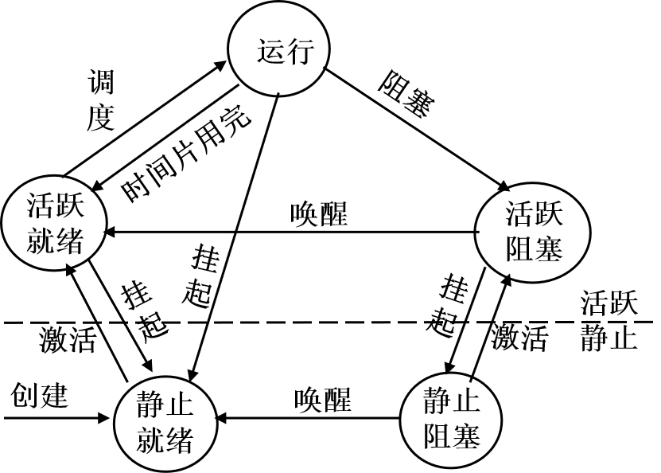
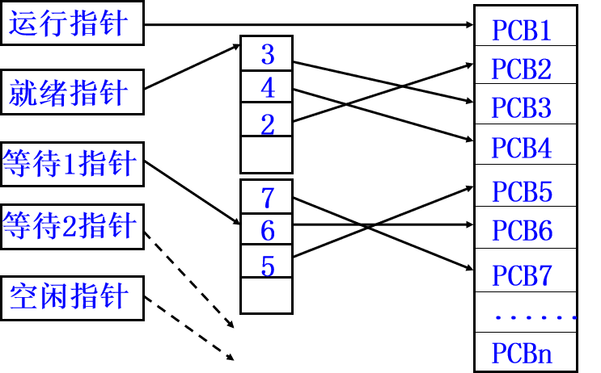
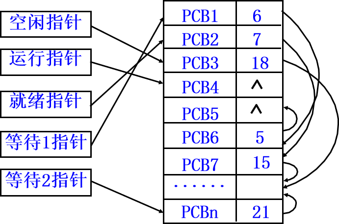
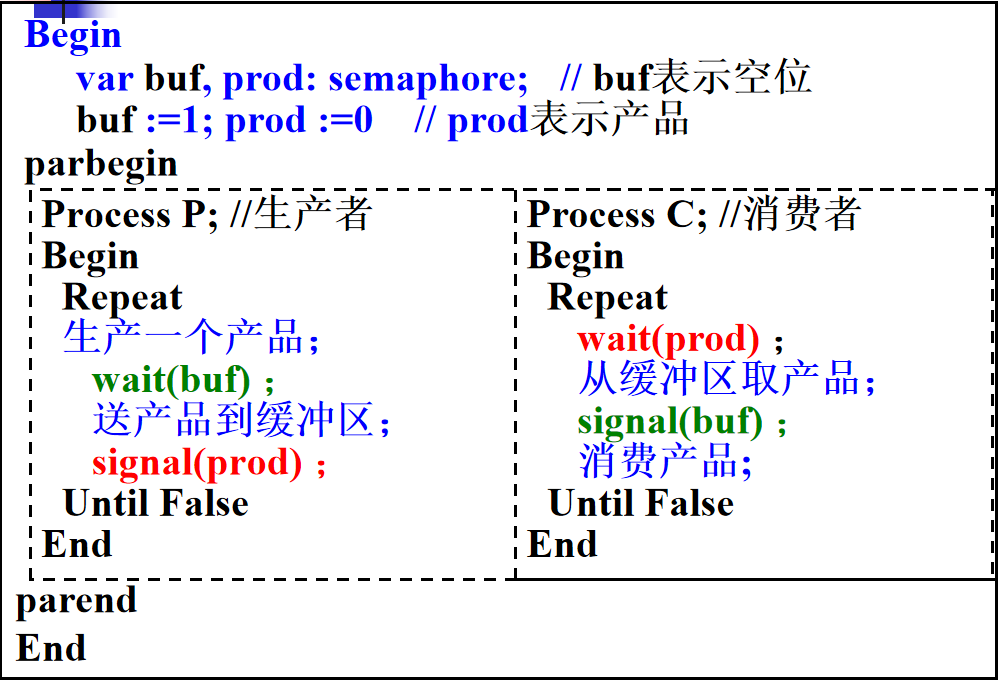
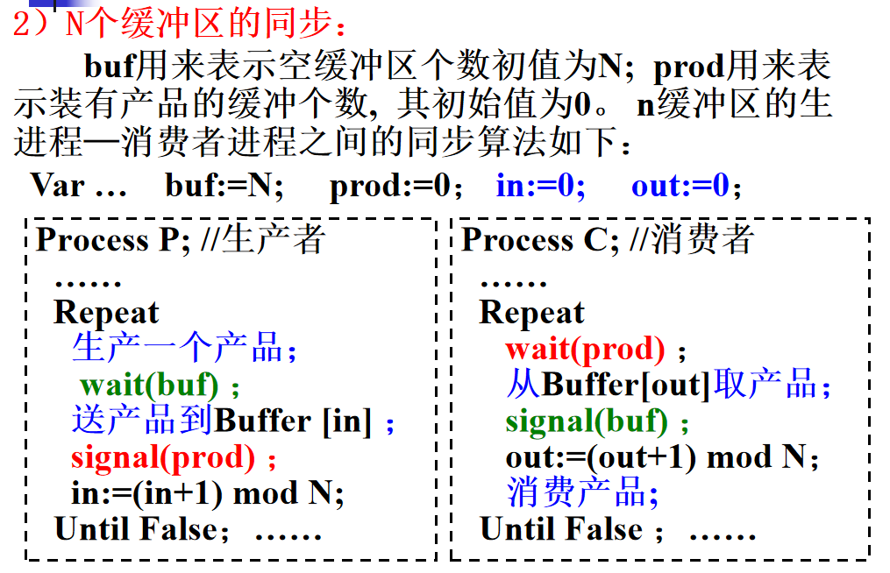
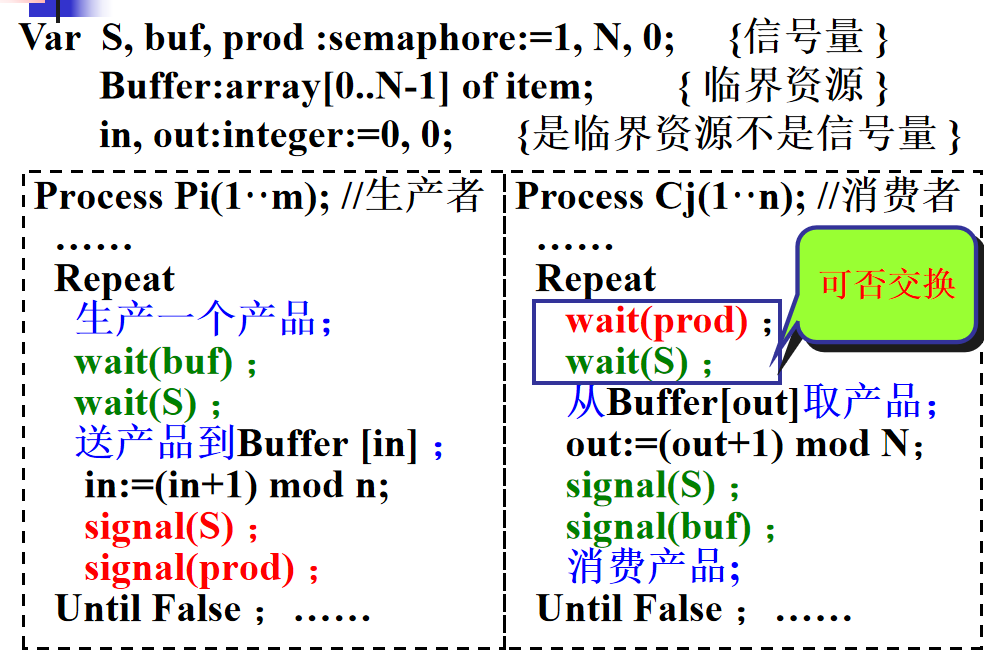

### 程序的两种执行方式

##### 顺序执行

**单道批处理系统**的执行方式

- 顺序性，按照程序结构所指定的次序（可能有分支或循环）
- 封闭性，独占全部资源，计算机的状态只由于该程序的控制逻辑所决定
- 可再现性，初始条件相同则结果相同。

##### 并发执行

提高了**资源利用率**

###### 间断性

一个程序可能走到中途停下来，失去原有的时序关系

###### 失去封闭性

共享资源，受其他程序的控制逻辑的影响。

###### 失去可再现性：

程序与CPU执行的活动之间不再一一对应，程序经过多次运行，虽然其各次的环境和初始条件相同，但得到的结果却各不相同。

###### 相互作用和制约性：

系统中并发执行的每个程序为用户提供特定的功能（独立性），但是有时也会直接或间接的发生相互依赖和相互制约。

### 进程是什么

可以并发执行的程序在某个数据集合上的运行过程，是**系统进行资源分配的最小单位**。通常由三部分组成

#### 程序

描述了进程所要完成的功能，是进程执行时不可修改的部分。

#### 数据集合

程序执行时所需要的数据和工作区，为一个进程专用，可修改。

#### PCB(Process Control Block)

为了对进程进行**有效的控制和管理**，系统为**每一进程设置一个进程控制块**，PCB是**进程存在的唯一标志**。通常包含以下信息

##### 1）进程描述信息

- 进程标识符(`Process ID`)：进程的**内部标识**，用来唯一标识一个进程，通常是一个**整数**。
- 进程名：进程的**外部标识**，通常基于**可执行文件名**（不唯一）；

##### 2）处理器状态信息（现场信息）

进程走走停停必须保存处理器的状态信息, 它由处理器寄存器内容组成。

- 通用寄存器
- 指令计数器(下一条指令的地址)
- 状态寄存器
- 用户栈指针(过程和系统调用参数及地址)

##### 3）进程调度信息

- 当前状态：进程当前所处状态，为进程调度之用。
- 优先级：进程需要处理的缓急程度标识。
- 调度所需其它信息：如等待总时间, 执行总时间
- 事件：阻塞原因

##### 4）进程控制信息

- 程序和数据的地址： 程序和数据所在的内、外存的地址
- 进程间同步和通信机制：需要的消息队列指针和信号量等
- 所需的和已分配到的资源清单及使用情况：除CPU外的资源: 文件，I/O设备...它们的时间使用史
- 数据结构信息：进程可能需要有指向其他PCB的指针, 父-子进程关系及其它结构

### 进程的基本特征

##### 结构性

由程序+数据+进程控制块组成

##### 动态性

进程是进程实体的执行过程, 它由创建而产生, 由调度而执行,因某事件而暂停, 由撤销而消亡。

##### 并发性

多个进程同时存于内存中，并发执行。

##### 独立性

进程是独立获得资源和独立调度的基本单位。

##### 异步性

各进程都独立的以不可预知的速度向前推进，会造成结果的不可再现性。

### 进程的三个基本状态

##### 运行态

进程在处理机上运行时的状态。

##### 就绪态

一个进程获得了除处理机外的一切所需资源的状态。

##### 阻塞态

当一个进程正在等待某一事件发生（例如请求 `I／O`，等待 `I／O`完成等）而暂时停止运行，**这时即使把处理机分配给进程也无法运行**，故称该进程处于阻塞状态。



### PCB表的组织方式

系统把所有 `PCB`组织在一起，并把它们放在内存固定区域，就构成了 `PCB`表。
`PCB`表的大小决定了系统中最多可同时存在的进程个数，称为系统的并发度。

PCB表组织方式有以下两种：

##### 索引方式

把具有相同状态的进程放在一张索引表中



##### 链接方式

把具有相同状态的进程各自链接起来



### 处理机的执行状态

##### 系统态(核心态、管态)：

有特权，能执行所有指令，能访问所有寄存器和存储区。

`OS`内核运行在系统态。进程控制包含在OS的内核中，它常驻内存，执行效率高。

##### 用户态(目态、算态)：

无特权，只能执行规定指令，只能访问指定的寄存器和存储区。

用户程序运行在用户态，它不能执行 `OS`指令不能访问 `OS`区域，防止对 `OS`的破坏。

### 原语

操作系统内核通过执行各种原语操作来实现对进程的控制功能，原语**不可中断**

##### 1）进程创建原语

- 用户登陆时（分时系统调用）
- 作业调度时（多道批处理系统调用）
- 提供服务时（系统调用）
- 应用请求时（用户进程调用）

##### 2）进程撤消原语

- 正常结束。批处理系统中,进程已运行完成遇到 `Halt`指令；分时系统中, 用户退出登录
- 异常结束。
  本进程发生出错和故障事件
- 外界干预。
  操作系统干预、父进程请求、父进程终止

##### 3）阻塞原语、唤醒原语

当被等待的事件未发生时, 由进程调用阻塞原语将自己阻塞

当被阻塞进程期待的事件到来时, 由中断处理进程或其它产生该事件的进程调用唤醒原语将期待该事件的进程唤醒。

##### 4）挂起原语、激活(解挂)原语

当进程请求将自己挂起或父进程请求将子进程挂起时，调用挂起原语， 将指定进程挂起。

要激活指定进程，调用激活原语将它激活

### 进程的制约关系

##### 直接相互制约关系(功能合作关系、同步关系、进程-进程)

一个用户作业要涉及一组并发进程，, 这些进程必须相互协作共同完成这项任务。

##### 间接相互制约关系(资源共享关系、互斥关系、进程-资源-进程)

由于共享资源, 使得系统中本来没有逻辑关系的进程, 因相互竞争资源而产生了制约关系。

### 临界资源和临界区

临界资源：系统中一次只允许一个进程访问的资源

临界区：并发执行的进程中, 访问临界资源的必须互斥执行的程序段叫临界区。

### 进程同步机制

- 空闲让进：当无进程进入临界区时，允许一个请求进入临界区的进程立即进入自己的临界区。
- 忙则等待：当已有进程进入临界区时，其它试图进入临界区的进程必须等待，以保证进程互斥地访问临界资源。
- 有限等待：对要求访问临界资源的进程，应保证进程能在有限时间进入临界区，以免陷入“饥饿”状态。
- 让权等待：当进程不能进入自己的临界区时，应立即释放处理机，以免进程陷入忙等。

### 信号量机制

临界区访问有三种方法

软件方法：出现两个进程都进入临界区，违反忙则等待

硬件指令：出现不断测试，违反让权等待

信号量机制：`OS`提供的管理公有资源的有效手段。

##### 整形信号量

将信号量定义为一个整型量 `S`，`  S<=0`表示该资源已被占用， `S>0`表示资源可用。

```
wait(S):	while S<=0 do;
			S:=S-1
		
signal(S):	S:=S+1;
```

进入区执行 `wait(S)`操作，退出区执行 `signal(S)`。`wait(S)`操作，` S<=0`会使进程处于“忙等”状态。

##### 记录型信号量

为了消除“忙等”现象，若资源被占用应自我阻塞，记录型信号量用记录结构，增加等待队列头指针域

```
type semaphore = record
            value:integer; //系统中该类资源的数目             
            L:list of process；//等待链头指针
          end；
s: semaphore;
```

`S.value>0`：该资源可用的数目

`S.value<0`的绝对值：在该资源的等待链表中已阻塞进程的数目

```
procedure wait(s:semaphore); 
begin
    s.value:=s.value-1;//先减1再判断
    if  s.value<0 then block(s.L)
end;
```

将来被唤醒后, 运行应从 `wait`之后开始

```
procedure signal(s:semaphore); 
begin
   s.value : = s.value + 1;
   if  s.value <=0  then  wakeup(s.L)
end;                  {s.value <=0 表示有等待s的进程}
```

唤醒信号量等待队列 `s.L`中的第一个进程，等待队列中的进程都已执行过 `wait`操作

##### `AND`型信号量

当某进程要先获得多种临界资源后才能执行时, 容易造成死锁，要么把多种临界资源全部分配到进程, 要么一种也不分配，则可避免死锁的发生。

##### 信号量集

当一次需要 `n`种资源且资源 `Si`申请 `di`个资源，该类资源的可用数低于某下限值 `ti`时不予分配

```
Swait(S1, t1, d1, … Sn, tn, dn)
     if S1≥t1 and … and Sn≥ tn then
           for i:=1 to n do  Si:= Si –di
     else  自我阻塞, 插到第一个Si<ti的队列Si.L, 
             并将程序计数定位到Swait操作的起点; 
Ssignal(S1, d1, … Sn, dn)
      for i:=1 to n do  
            [ Si:= Si + di;  唤醒Si.L的所有进程 ]
```

#### 区别：

一般记录型信号量 :一种资源，每次申请一个，少于1个不分配，先减后判断，自我阻塞后程序计数定位到wait()操作之后，signal唤醒第一个进程

信号量集：多种资源，每次每种申请 `di`个，少于 `ti`个不分配，先判断后减，自我阻塞后程序计数定位到 `Swait()`操作的起点，`Ssignal`唤醒各种-所有

### 同步问题

##### 单缓冲区

一个生产者一个消费者，单缓冲区



##### N个缓冲区

一个生产者，一个消费者，N个缓冲区



##### 多个生产者和消费者

当有多个生产者进程(`P1…Pm`)和多个消费者进程(`C1…Cn`) 并发执行时, 由于缓冲区 `Buffer[0…N-1]`以及 `in`和 `out`都是临界资源，可利用互斥信号量 `S`实现进程对缓冲区的互斥访问。



##### 实例

###### 桔子-苹果

桌上有一个空盘子，只允许放一个水果。爸爸专向盘中放苹果，妈妈专向盘中放桔子，儿子专等吃盘中的桔子，女儿专等吃盘中的苹果。规定当盘空时，一次只能放一个水果。试用信号量机制解决他们之间的同步问题。

```
begin
	Sp,So,Sa :semaphore;
	Sp := 1; So := 0 Sa := 0;
	cobegin
	Father(); Mother(); Son(); Daughter();
	coend;
end;
process Father()//爸爸进程
	begin
	L1：P(Sp);
		将苹果放入盘中;
		V(Sa);
		goto L1;
	end;
process Mother()//妈妈进程
	begin
		L2:P(Sp)
		将桔子放入盘中
		V(So);
		goto L2；
	end;
process Son() //儿子进程
	begin
		L3:P(So);
		从盘子中取出桔子
		V(Sp);
		吃桔子；
		goto L3;
	end;
process Daughter() //女儿进程
	begin
		L4:P(Sa);
		从盘子中取出苹果
		V（Sp);
		吃苹果
		goto L4;
	end;
```

###### 哲学家就餐

- `AND`型信号量，必须确保两边有筷子才能拿
- 给哲学家编号，偶数号的哲学家和奇数号的哲学家拿不同的边，这样就保证能有一个哲学家满足，不会发生哲学家饿死的问题

### 管程是什么

指关于共享资源的**数据及在其上操作的一组过程**。

### 进程通讯

- 低级通讯：只能传递状态和整数值（控制信息），如进程互斥和同步所采用的信号量。
  优点是速度快，缺点是传输信息量少，效率低，编程复杂容易出错。
- 高级通讯：能够传输任意数量的数据，包括共享存储器系统，管道通讯，消息传递通讯。

##### 共享存储器系统

相互通信的进程间共享某些数据结构或共享存储区，进程之间通过它们进行通信。

##### 管道通信方式

也称共享文件方式，基于文件系统，利用打开的共享文件连接两个相互通信的进程，**用于连接都进程和写进程的共享文件，写进程向管道发送字节流，都进程从管道中接受字符流**。

管道机制需要具备**互斥、同步、确认对方存在**等特性。

##### 消息传递通讯

以格式化的消息为通信单位，利用 `send`和 `receive`进行通信，对用户是`<font color='red'>`透明`</font>`的。

- 直接通信方式（如：消息缓冲通讯）
- 间接通信方式(信箱通信)

### 线程是什么

线程是 **cpu调度 的基本单位**。一个进程可以有多个线程，它们可以并发执行，共享所在进程的代码段，数据段和系统资源。线程可以撤销、创建本进程中的另一个线程，并且同样拥有就绪，执行，阻塞状态。

##### 用户级线程

存在用户级中，由应用程序通过线程库完成对线程的管理，`<font color='red'>`内核管理含线程的进程，不管理线程`</font>`，当用户级线程调用系统调用时，整个进程阻塞

##### 内核级线程

所有线程管理由内核完成，内核维护进程和线程的上下文，线程之间的切换需要内核的支持，以线程为基础进行调度。
