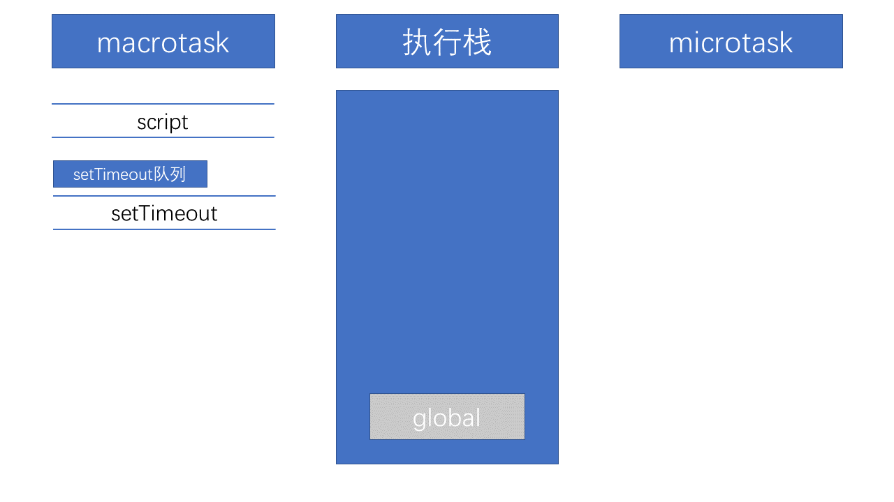
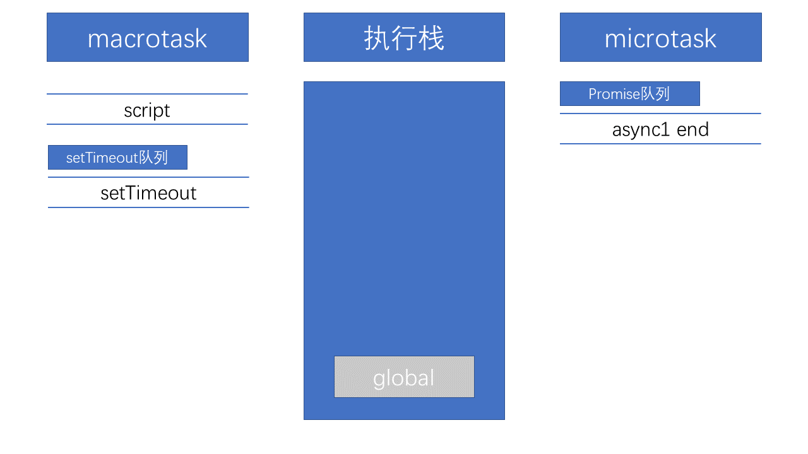

# 背景

根据浏览器架构，我们知道，在渲染进程中

- 主线程：运行JavaScrip和页面的渲染（布局和绘制）是互斥的，这里会用到事件循环机制进行调度。
- 事件处理线程：监听各种事件（如用户输入、定时器、网络请求等），并根据事件类型将回调函数放入合适的任务队列中（宏任务队列或微任务队列）
- 定时器触发线程：
  - `setInterval`和 `setTimeout`所在线程，对定时器计时并触发定时，计时完毕，会被事件处理线程添加到任务队列的队尾。
  - 为什么要单独的定时器线程？因为JavaScript引擎是单线程的, 如果处于阻塞线程状态就会影响记计时的准确，因此很有必要单独开一个线程用来计时。

## 任务队列

`JS`分为同步任务和异步任务。

### 同步任务

都在主线程上执行，形成一个**执行栈。**

### 异步任务

异步任务包含宏任务队列和微任务队列，现在我们将他们对比

#### 任务管理：

宏任务队列由事件触发线程管理。微任务队列由 `JS`引擎管理。

在新的浏览器中，“JavaScript引擎”指的是浏览器内部负责解析和执行JavaScript代码的组件，它是浏览器功能的一部分，在浏览器的主线程上运行。

#### 任务队列数量：

宏任务队列可以有多个，这些队列可以包含不同类型的任务。例如定时器（由 `setTimeout`, `setInterval` 添加的任务）、I/O操作任务、`UI`渲染任务等。

微任务队列通常只有一个，在ES6规范中，只定义了一个微任务队列。该队列中的任务包括 `Promise`的回调等。

#### 包含哪些任务

宏任务包含 `script(整体代码)`、`setTimeout`、`setInterval`、`I/O`、`UI交互事件`、`postMessage`、`MessageChannel`、`setImmediate(Node.js 环境)`

`microtask`主要包含：`Promise.then`、`MutaionObserver`、`process.nextTick`(`Node.js` 环境)

## 任务的执行顺序 ：

事件循环机制就是宏任务执行和微任务队列清空，接着ui渲染的一个循环。

主线程会协同其他的线程或者进程对任务进行处理。

- 根据浏览器的优先级，主线程从宏任务队列中取一个宏任务，执行宏任务的同步代码，当碰到异步任务就交给别的进程或者线程去执行，比如碰到定时器任务就交给定时器线程，碰到网络请求就交给网络进程。等别的线程或者进程执行完毕，再把响应返回给渲染进程的主线程。主线程会根据任务的类型把**任务的回调事件根据任务源进行分类**，塞到相应的宏任务队列或是微任务队列中。
- 当宏任务完成后，主线程会先清空微任务队列的所有回调，如果微任务在此期间产生了其他的微任务，也会被一并清空。
- 接着进行一次渲染（不一定发生，按需）。
- 然后再根据浏览器的调度机制，从某一个宏任务队列取一个任务执行，循环往复。

对于node而言，微任务的执行顺序会有一些差别

一个是微任务队列数量的区别。

node处理微任务有两个队列，一个是 `nextTickQueue`，一个是微任务队列。

- 当前宏任务执行完成后，首先会检查 `nextTickQueue`，执行其中的微任务（`process.nextTick` 所注册的回调）。无论这些回调是否又添加了更多的 `process.nextTick` 微任务，Node.js 会持续执行 `nextTickQueue` 直到队列被清空。
- Node.js 会处理其他的微任务。这一环节包括 `microtaskQueue`，其中包含了 `Promise` 的回调和其他微任务API。就像在浏览器中一样，如果在执行这些微任务的过程中，又产生了新的微任务，Node.js 会继续执行，直到 `microtaskQueue` 也被清空。
- process.nextTick如果产生了微任务，可以在本阶段被执行，因为顺序是先清空 `nextTickQueue`后清空其他微任务，但是microtaskQueue产生的process.nextTick回调则会在下个任务阶段执行。

一个是执行时机的区别。

 `Node`端，微任务在事件循环的各个阶段之间执行。

Node.js 的事件循环包含几个不同的阶段，每个阶段负责特定类型的任务或操作，这些阶段的顺序和功能在 Node.js 的不同版本中保持一致。在这些阶段之间，Node.js 总会优先执行完所有的微任务，然后再继续进入下一个阶段的宏任务。

这是 Node.js 事件循环的大致工作方式：

1. **timers** 阶段执行 `setTimeout()` 和 `setInterval()` 的回调。
2. **I/O callbacks** 阶段主要处理系统操作的回调。
3. **poll** 阶段主要是负责处理大多数的 I/O 回调，包括网络、文件等，并且在 I/O 事件发生后，执行相应的回调函数。
4. **check** 阶段用于处理 `setImmediate()` 的回调。
5. **close callbacks** 阶段主要用于处理诸如 `socket.on('close', ...)` 这样的关闭事件的回调。

### QA

Q：栈不是先进后出吗，但是同步任务应该是先推入的先执行，为什么叫执行栈呢

A：因为栈关注的是**函数调用的顺序**。

假设我们有这样的代码：

```js
function first() {
    second();
    // 更多代码
}

function second() {
}

first();

```

执行流程如下：

1. `first` 函数被调用，`first` 的执行上下文被推入执行栈。
2. 在 `first` 函数中，`second` 被调用，`second` 的执行上下文被推入栈顶。
3. `second` 函数执行完毕，其上下文从栈中弹出，返回到了 `first` 里面 `second`的调用之后继续执行。
4. 最后是 `first`函数执行完毕并从栈顶弹出，这时栈为空。

所以，尽管函数是按照它们被写入代码的顺序一一调用的，但执行栈确实是以“后进先出”的方式操作的，这就是为什么这么称呼的原因。当提及 JavaScript 的“执行栈”，我们更关注的是函数调用的顺序以及它们如何在内存中被管理。

## `setTimeout`和 `setInterval`的区别

- `setTimeout` 是在计时结束后将回调函数推入宏任务队列，等待执行。如果前一个 `setTimeout` 的回调函数执行时间较长，那么下一个 `setTimeout` 的调用可能会延迟，从而导致累积误差。
- 而 `setInterval` 则不考虑回调函数的执行时间，它会按照设定的时间间隔持续推入新的回调函数到事件队列中。但如果事件队列中已经有待执行的 `setInterval` 的回调，它不会再推入新的回调。这有可能导致间隔时间短于预期，因为两个回调之间可能没有足够的时间间隔。

🌟注意：`W3C`在 `HTML`标准中规定，`setTimeout` 和 `setInterval` 用于 4ms 以下的延迟时，实际将使用 4ms 作为延迟时间。

## `Promise`和 `async`中的立即执行

我们知道 `Promise`中的异步体现在 `then`和 `catch`中，所以 `Promise`中的代码是立即执行的。而在 `async/await`中，在出现*`await`出现之前，其中的代码也是立即执行的。那么出现了 `await`时候发生了什么呢？

## `await`做了什么

从字面意思上看 `await`就是等待，`await` 等待的是一个表达式，这个表达式的返回值可以是一个 `promise`对象也可以是其他值。


由于因为 `async await` 是 `generator`的语法糖。所以 `await`后面的代码是微任务。所以对于本题中的

```javascript
async function async1() {
	console.log('async1 start');
	await async2();
	console.log('async1 end');
}
```

等价于

```javascript
async function async1() {
	console.log('async1 start');
	Promise.resolve(async2()).then(() =>{
                console.log('async1 end');
    })
}
```

## 回到本题

```javascript
//请写出输出内容
async function async1() {
    console.log('async1 start');
    await async2();// await后面的表达式会先执行一遍，将await后面的代码加入到microtask中
    console.log('async1 end');
}
async function async2() {
	console.log('async2');
}

console.log('script start'); 

setTimeout(function() {
    console.log('setTimeout');
}, 0)

async1();

new Promise(function(resolve) {
    console.log('promise1');
}).then(function() {
    console.log('promise2');
});
console.log('script end');

/*
script start
async1 start
async2
promise1
script end
async1 end
promise2
setTimeout
*/
```

这道题主要考察的是事件循环中函数执行顺序的问题，其中包括 `async` ，`await`，`setTimeout`，`Promise`函数。下面来说一下本题中涉及到的知识点。

以上就本道题涉及到的所有相关知识点了，下面我们再回到这道题来一步一步看看怎么回事儿。

1. 首先，事件循环从宏任务队列开始，这个时候，宏任务队列中，只有一个script(整体代码)任务；当遇到任务源(task source)时，则会先分发任务到对应的任务队列中去。所以，上面例子的第一步执行如下图所示：

   [](https://camo.githubusercontent.com/15b3ae9733b0b5b6a144f519396ff88eaeca40fb/68747470733a2f2f692e6c6f6c692e6e65742f323031392f30322f30382f356335643639623432316166332e706e67)
2. 然后我们看到首先定义了两个 `async`函数，接着往下看，然后遇到了 `console` 语句，直接输出 `script start`。输出之后，script 任务继续往下执行，遇到 `setTimeout`，其作为一个宏任务源，则会先将其任务分发到对应的队列中：
   [](https://camo.githubusercontent.com/0a6e6cd2cc52d18a0f97ec01659058e830305a45/68747470733a2f2f692e6c6f6c692e6e65742f323031392f30322f30382f356335643639623432353530612e706e67)
3. `script` 任务继续往下执行，执行了 `async1()`函数，前面讲过 `async`函数中在 `await`之前的代码是立即执行的，所以会立即输出 `async1 start`。
   遇到了 `await`时，会将 `await`后面的表达式执行一遍，所以就紧接着输出 `async2`，然后将await后面的代码也就是 `console.log('async1 end')`加入到 `microtask`中的 `Promise`队列中，接着跳出 `async1`函数来执行后面的代码。

[](https://camo.githubusercontent.com/93ec5469b0846f0f161641fc718005dbe994d190/68747470733a2f2f692e6c6f6c692e6e65742f323031392f30322f31382f356336616435383333376165642e706e67)

4. `script`任务继续往下执行，遇到 `Promise`实例。由于 `Promise`中的函数是立即执行的，而后续的 `.then` 则会被分发到 `microtask` 的 `Promise` 队列中去。所以会先输出 `promise1`，然后执行 `resolve`，将 `promise2` 分配到对应队列。
   [](https://camo.githubusercontent.com/6f617a237607ce7a71fabcab61d2952a8b412205/68747470733a2f2f692e6c6f6c692e6e65742f323031392f30322f31382f356336616435383334376135652e706e67)
5. `script`任务继续往下执行，最后只有一句输出了 `script end`，至此，全局任务就执行完毕了。
   根据上述，每次执行完一个宏任务之后，会去检查是否存在微任务；如果有，则执行微任务直至清空微任务队列。
   因而在 `script`任务执行完毕之后，开始查找清空微任务队列。此时，微任务中， `Promise` 队列有的两个任务 `async1 end`和 `promise2`，因此按先后顺序输出 `async1 end，promise2`。当所有的微任务执行完毕之后，表示第一轮的循环就结束了。
6. 第二轮循环开始，这个时候就会跳回 `async1`函数中执行后面的代码，然后遇到了同步任务 `console` 语句，直接输出 `async1 end`。这样第二轮的循环就结束了。（也可以理解为被加入到 `script`任务队列中，所以会先与 `setTimeout`队列执行）
7. 第二轮循环依旧从宏任务队列开始。此时宏任务中只有一个 `setTimeout`，取出直接输出即可，至此整个流程结束。

下面我会改变一下代码来加深印象。

## 变式一

在第一个变式中我将 `async2`中的函数也变成了 `Promise`函数，代码如下：

```javascript
async function async1() {
    console.log('async1 start');
    await async2();
    console.log('async1 end');
}
async function async2() {
    new Promise(function(resolve) {
        console.log('promise1');
        resolve();
    }).then(function() {
        console.log('promise2');
    });
}
console.log('script start');
setTimeout(function() {
    console.log('setTimeout');
}, 0)
async1();

new Promise(function(resolve) {
    console.log('promise3');
    resolve();
}).then(function() {
    console.log('promise4');
});

console.log('script end');
```

可以先自己看看输出顺序会是什么，下面来公布结果：

```
script start
async1 start
promise1
promise3
script end
promise2
async1 end
promise4
setTimeout
```

## 变式二

在第二个变式中，我将async1中await后面的代码和async2的代码都改为异步的，代码如下：

```javascript
async function async1() {
    console.log('async1 start');
    await async2();
    //更改如下： 
    setTimeout(function() {
        console.log('setTimeout1')
    },0)
}
async function async2() {
    //更改如下：
	setTimeout(function() {
		console.log('setTimeout2')
	},0)
}
console.log('script start');

setTimeout(function() {
    console.log('setTimeout3');
}, 0)
async1();

new Promise(function(resolve) {
    console.log('promise1');
    resolve();
}).then(function() {
    console.log('promise2');
});
console.log('script end');
```

可以先自己看看输出顺序会是什么，下面来公布结果：

```
script start
async1 start
promise1
script end
promise2
setTimeout3
setTimeout2
setTimeout1
```

## 变式三

变式三是我在一篇面经中看到的原题，整体来说大同小异，代码如下：

```javascript
async function a1 () {
    console.log('a1 start')
    await a2()
    console.log('a1 end')
}
async function a2 () {
    console.log('a2')
}

console.log('script start')

setTimeout(() =>{
    console.log('setTimeout')
}, 0)

Promise.resolve().then(() =>{
    console.log('promise1')
})

a1()

let promise2 = new Promise((resolve) =>{
    resolve('promise2.then')
    console.log('promise2')
})

promise2.then((res) =>{
    console.log(res)
    Promise.resolve().then(() =>{
        console.log('promise3')
    })
})
console.log('script end')
```

无非是在微任务那块儿做点文章，前面的内容如果你都看懂了的话这道题一定没问题的，结果如下：

```
script start
a1 start
a2
promise2
script end
promise1
a1 end
promise2.then
promise3
setTimeout
```

### 总结

事件循环机制要点：

- 宏任务：`script`、`setTimeout`、`setTimeInterval`、`I/O`、`postMessage`、`setImmediate(node)`
- 微任务：`promise.then`、`process.nextTick`、`await`后面的代码
- `promise`和 `async`后的表达式立即执行
- `await`机制：让出线程，执行关键字后面的表达式，而 `await`后面的代码加入微任务队列。

### 参考文献

[https://github.com/Advanced-Frontend/Daily-Interview-Question/issues/7](https://github.com/Advanced-Frontend/Daily-Interview-Question/issues/7)

[从浏览器多进程到JS单线程，JS运行机制最全面的一次梳理](https://juejin.im/post/5a6547d0f265da3e283a1df7#heading-8)
