## 一、英寸

一般用英寸描述屏幕的物理大小，如电脑显示器的`17`、`22`，手机显示器的`4.8`、`5.7`等使用的单位都是英寸。

需要注意，上面的尺寸都是屏幕对角线的长度：

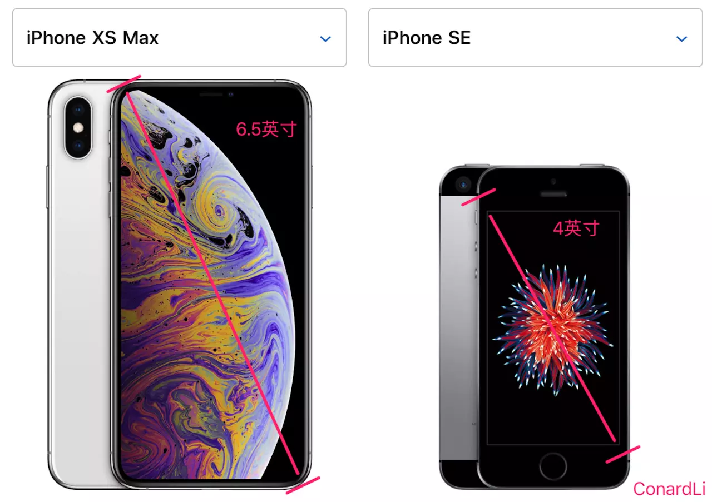


英寸(`inch`,缩写为`in`)在荷兰语中的本意是大拇指，一英寸就是指甲底部普通人拇指的宽度。

英寸和厘米的换算：`1英寸 = 2.54 厘米`

## 二、分辨率

### 2.1 像素

像素即一个小方块，它具有特定的位置和颜色。

图片、电子屏幕（手机、电脑）就是由无数个具有特定颜色和特定位置的小方块拼接而成。

像素可以作为图片或电子屏幕的最小组成单位。

下面我们使用`sketch`打开一张图片：


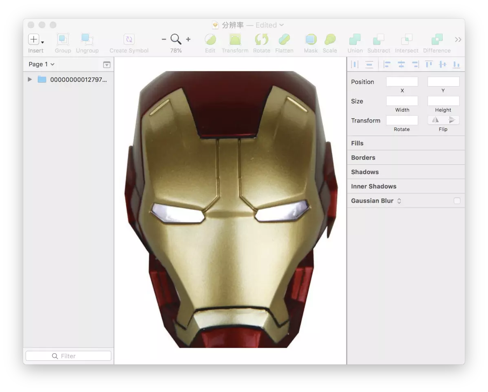


将这些图片放大即可看到这些像素点：


通常我们所说的分辨率有两种，屏幕分辨率和图像分辨率。

### 2.2 屏幕分辨率

屏幕分辨率指一个屏幕具体由多少个像素点组成。

下面是`apple`的官网上对手机分辨率的描述：


`iPhone XS Max` 和 `iPhone SE`的分辨率分别为`2688 x 1242`和`1136 x 640`。这表示手机分别在垂直和水平上所具有的像素点数。

当然分辨率高不代表屏幕就清晰，屏幕的清晰程度还与尺寸有关。

### 2.3 图像分辨率

我们通常说的`图片分辨率`其实是指图片含有的`像素数`，比如一张图片的分辨率为`800 x 400`。这表示图片分别在垂直和水平上所具有的像素点数为`800`和`400`。

同一尺寸的图片，分辨率越高，图片越清晰。


### 2.4 PPI

`PPI(Pixel Per Inch)`：每英寸包括的像素数。

`PPI`可以用于描述屏幕的清晰度以及一张图片的质量。

使用`PPI`描述图片时，`PPI`越高，图片质量越高，使用`PPI`描述屏幕时，`PPI`越高，屏幕越清晰。

在上面描述手机分辨率的图片中，我们可以看到：`iPhone XS Max` 和 `iPhone SE`的`PPI`分别为`458`和`326`，这足以证明前者的屏幕更清晰。

由于手机尺寸为手机对角线的长度，我们通常使用如下的方法计算`PPI`:


`iPhone 6`的`PPI`为 ，那它每英寸约含有`326`个物理像素点。

### 2.5 DPI

`DPI(Dot Per Inch)`：即每英寸包括的点数。

这里的点是一个抽象的单位，它可以是屏幕像素点、图片像素点也可以是打印机的墨点。

平时你可能会看到使用`DPI`来描述图片和屏幕，这时的`DPI`应该和`PPI`是等价的，`DPI`最常用的是用于描述打印机，表示打印机每英寸可以打印的点数。

一张图片在屏幕上显示时，它的像素点数是规则排列的，每个像素点都有特定的位置和颜色。

当使用打印机进行打印时，打印机可能不会规则的将这些点打印出来，而是使用一个个打印点来呈现这张图像，这些打印点之间会有一定的空隙，这就是`DPI`所描述的：打印点的密度。


在上面的图像中我们可以清晰的看到，打印机是如何使用墨点来打印一张图像。

所以，打印机的`DPI`越高，打印图像的精细程度就越高，同时这也会消耗更多的墨点和时间。

## 三、设备独立像素

实际上，上面我们描述的像素都是`物理像素`，即设备上真实的物理单元。

下面我们来看看`设备独立像素`究竟是如何产生的：

智能手机发展非常之快，在几年之前，我们还用着分辨率非常低的手机，比如下面左侧的白色手机，它的分辨率是`320x480`，我们可以在上面浏览正常的文字、图片等等。

但是，随着科技的发展，低分辨率的手机已经不能满足我们的需求了。很快，更高分辨率的屏幕诞生了，比如下面的黑色手机，它的分辨率是`640x940`，正好是白色手机的两倍。

理论上来讲，在白色手机上相同大小的图片和文字，在黑色手机上会被缩放一倍，因为它的分辨率提高了一倍。这样，岂不是后面出现更高分辨率的手机，页面元素会变得越来越小吗？


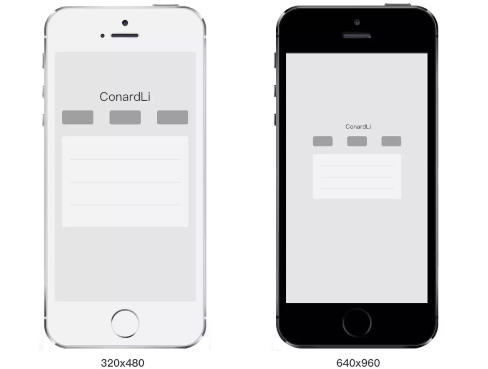


然而，事实并不是这样的，我们现在使用的智能手机，不管分辨率多高，他们所展示的界面比例都是基本类似的。乔布斯在`iPhone4`的发布会上首次提出了`Retina Display`(视网膜屏幕)的概念，它正是解决了上面的问题，这也使它成为一款跨时代的手机。


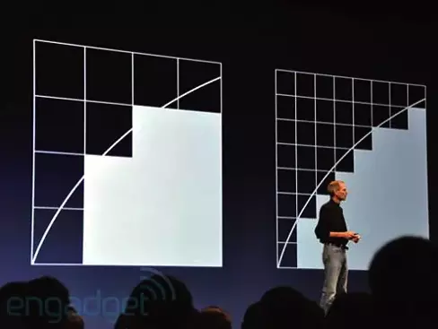


在`iPhone4`使用的视网膜屏幕中，把`2x2`个像素当`1`个像素使用，这样让屏幕看起来更精致，但是元素的大小却不会改变。


如果黑色手机使用了视网膜屏幕的技术，那么显示结果应该是下面的情况，比如列表的宽度为`300`个像素，那么在一条水平线上，白色手机会用`300`个物理像素去渲染它，而黑色手机实际上会用`600`个物理像素去渲染它。

我们必须用一种单位来同时告诉不同分辨率的手机，它们在界面上显示元素的大小是多少，这个单位就是设备独立像素(`Device Independent Pixels`)简称`DIP`或`DP`。上面我们说，列表的宽度为`300`个像素，实际上我们可以说：列表的宽度为`300`个设备独立像素。


打开`chrome`的开发者工具，我们可以模拟各个手机型号的显示情况，每种型号上面会显示一个尺寸，比如`iPhone X`显示的尺寸是`375x812`，实际`iPhone X`的分辨率会比这高很多，这里显示的就是设备独立像素。


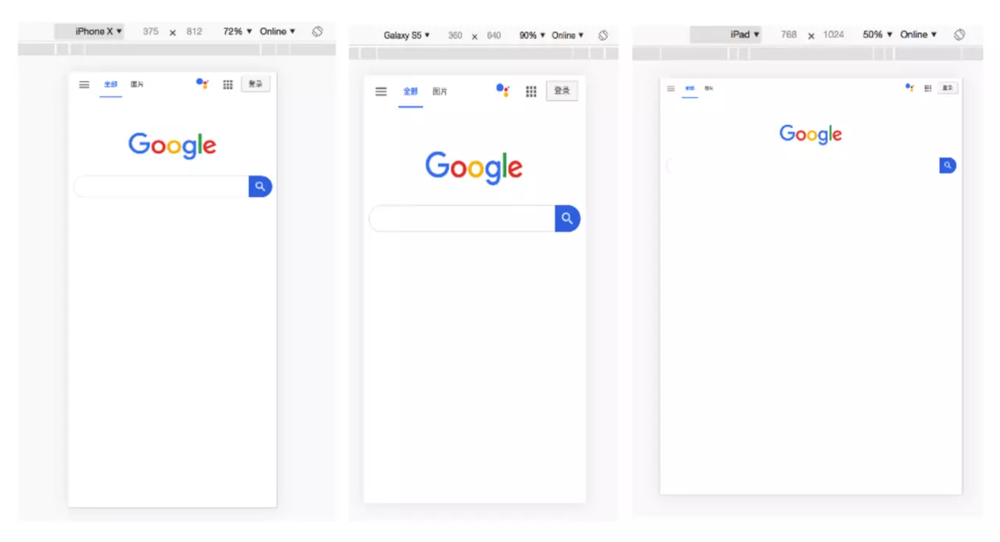


### 3.1 设备像素比

设备像素比`device pixel ratio`简称`dpr`，即物理像素和设备独立像素的比值。

在`web`中，浏览器为我们提供了`window.devicePixelRatio`来帮助我们获取`dpr`。

在`css`中，可以使用媒体查询`min-device-pixel-ratio`，区分`dpr`：

```css
@media (-webkit-min-device-pixel-ratio: 2),(min-device-pixel-ratio: 2){ }
```

在`React Native`中，我们也可以使用`PixelRatio.get()`来获取`DPR`。

当然，上面的规则也有例外，`iPhone 6、7、8 Plus`的实际物理像素是`1080 x 1920`，在开发者工具中我们可以看到：它的设备独立像素是`414 x 736`，设备像素比为`3`，设备独立像素和设备像素比的乘积并不等于`1080 x 1920`，而是等于`1242 x 2208`。

实际上，手机会自动把`1242 x 2208`个像素点塞进`1080 * 1920`个物理像素点来渲染，我们不用关心这个过程，而`1242 x 2208`被称为屏幕的`设计像素`。我们开发过程中也是以这个`设计像素`为准。

实际上，从苹果提出视网膜屏幕开始，才出现设备像素比这个概念，因为在这之前，移动设备都是直接使用物理像素来进行展示。

紧接着，`Android`同样使用了其他的技术方案来实现`DPR`大于`1`的屏幕，不过原理是类似的。由于`Android`屏幕尺寸非常多、分辨率高低跨度非常大，不像苹果只有它自己的几款固定设备、尺寸。所以，为了保证各种设备的显示效果，`Android`按照设备的像素密度将设备分成了几个区间：


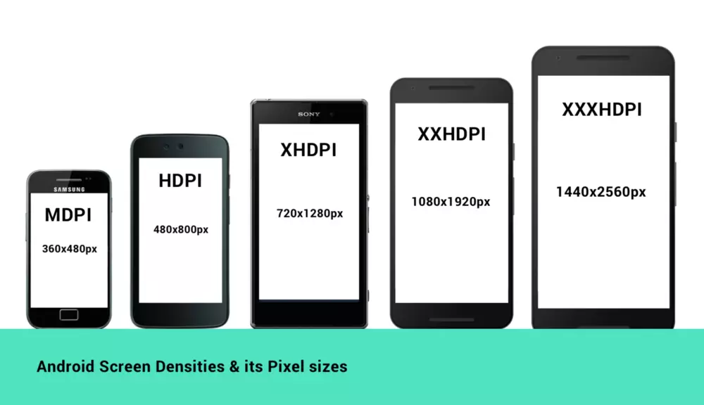


当然，所有的`Android`设备不一定严格按照上面的分辨率，每个类型可能对应几种不同分辨率，所以，每个`Android`手机都能根据给定的区间范围，确定自己的`DPR`，从而拥有类似的显示。当然，仅仅是类似，由于各个设备的尺寸、分辨率上的差异，设备独立像素也不会完全相等，所以各种`Android`设备仍然不能做到在展示上完全相等。

### 3.2 移动端开发

在`iOS`、`Android`和`React Native`开发中样式单位其实都使用的是设备独立像素。

`iOS`的尺寸单位为`pt`，`Android`的尺寸单位为`dp`，`React Native`中没有指定明确的单位，它们其实都是设备独立像素`dp`。

在使用`React Native`开发`App`时，`UI`给我们的原型图一般是基于`iphone6`的像素给定的。

为了适配所有机型，我们在写样式时需要把物理像素转换为设备独立像素：例如：如果给定一个元素的高度为`200px`(这里的`px`指物理像素，非`CSS`像素)，`iphone6`的设备像素比为`2`，我们给定的`height`应为`200px/2=100dp`。

当然，最好的是，你可以和设计沟通好，所有的`UI`图都按照设备独立像素来出。

我们还可以在代码(`React Native`)中进行`px`和`dp`的转换：

```css
import {PixelRatio } from 'react-native';

const dpr = PixelRatio.get();

/**
 * px转换为dp
 */
export function pxConvertTodp(px) {
  return px / dpr;
}

/**
 * dp转换为px
 */
export function dpConvertTopx(dp) {
  return PixelRatio.getPixelSizeForLayoutSize(dp);
}
```

### 3.3 WEB端开发

在写`CSS`时，我们用到最多的单位是`px`，即`CSS像素`，当页面缩放比例为`100%`时，一个`CSS像素`等于一个设备独立像素。

但是`CSS像素`是很容易被改变的，当用户对浏览器进行了放大，`CSS像素`会被放大，这时一个`CSS像素`会跨越更多的物理像素。

`页面的缩放系数 = CSS像素 / 设备独立像素`。

### 3.4 关于屏幕

这里多说两句`Retina`屏幕，因为我在很多文章中看到对`Retina`屏幕的误解。

`Retina`屏幕只是苹果提出的一个营销术语：

> 在普通的使用距离下，人的肉眼无法分辨单个的像素点。

为什么强调`普通的使用距离下`呢？我们来看一下它的计算公式：

)

`a`代表人眼视角，`h`代表像素间距，`d`代表肉眼与屏幕的距离，符合以上条件的屏幕可以使肉眼看不见单个物理像素点。

它不能单纯的表达分辨率和`PPI`，只能一种表达视觉效果。

让多个物理像素渲染一个独立像素只是`Retina`屏幕为了达到效果而使用的一种技术。而不是所有`DPR > 1`的屏幕就是`Retina`屏幕。

比如：给你一块超大尺寸的屏幕，即使它的`PPI`很高，`DPR`也很高，在近距离你也能看清它的像素点，这就不算`Retina`屏幕。


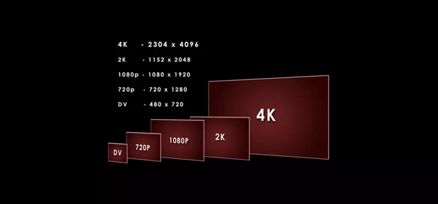


我们经常见到用`K`和`P`这个单位来形容屏幕：

`P`代表的就是屏幕纵向的像素个数，`1080P`即纵向有`1080`个像素，分辨率为`1920X1080`的屏幕就属于`1080P`屏幕。

我们平时所说的高清屏其实就是屏幕的物理分辨率达到或超过`1920X1080`的屏幕。

`K`代表屏幕横向有几个`1024`个像素，一般来讲横向像素超过`2048`就属于`2K`屏，横向像素超过`4096`就属于`4K`屏。

## 四、视口

视口(`viewport`)代表当前可见的计算机图形区域。在`Web`浏览器术语中，通常与浏览器窗口相同，但不包括浏览器的`UI`， 菜单栏等——即指你正在浏览的文档的那一部分。

一般我们所说的视口共包括三种：布局视口、视觉视口和理想视口，它们在屏幕适配中起着非常重要的作用。

### 4.1 布局视口


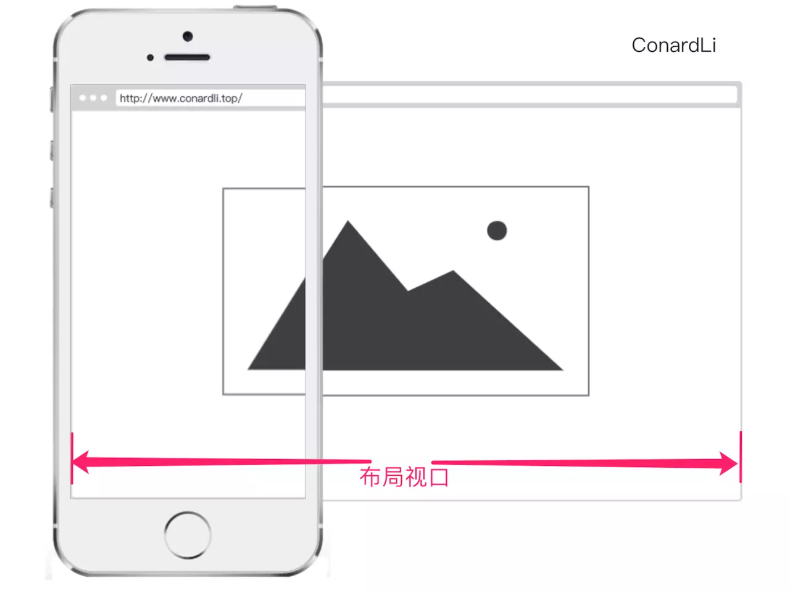


布局视口(`layout viewport`)：当我们以百分比来指定一个元素的大小时，它的计算值是由这个元素的包含块计算而来的。当这个元素是最顶级的元素时，它就是基于布局视口来计算的。

所以，布局视口是网页布局的基准窗口，在`PC`浏览器上，布局视口就等于当前浏览器的窗口大小（不包括`borders` 、`margins`、滚动条）。

在移动端，布局视口被赋予一个默认值，大部分为`980px`，这保证`PC`的网页可以在手机浏览器上呈现，但是非常小，用户可以手动对网页进行放大。

我们可以通过调用`document.documentElement.clientWidth / clientHeight`来获取布局视口大小。

### 4.2 视觉视口


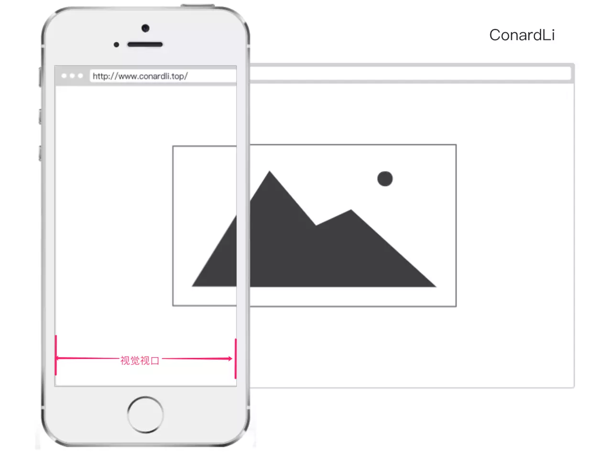


视觉视口(`visual viewport`)：用户通过屏幕真实看到的区域。

视觉视口默认等于当前浏览器的窗口大小（包括滚动条宽度）。

当用户对浏览器进行缩放时，不会改变布局视口的大小，所以页面布局是不变的，但是缩放会改变视觉视口的大小。

例如：用户将浏览器窗口放大了`200%`，这时浏览器窗口中的`CSS像素`会随着视觉视口的放大而放大，这时一个`CSS`像素会跨越更多的物理像素。

所以，布局视口会限制你的`CSS`布局而视觉视口决定用户具体能看到什么。

我们可以通过调用`window.innerWidth / innerHeight`来获取视觉视口大小。

### 4.3 理想视口


布局视口在移动端展示的效果并不是一个理想的效果，所以理想视口(`ideal viewport`)就诞生了：网站页面在移动端展示的理想大小。

如上图，我们在描述设备独立像素时曾使用过这张图，在浏览器调试移动端时页面上给定的像素大小就是理想视口大小，它的单位正是设备独立像素。

上面在介绍`CSS像素时`曾经提到`页面的缩放系数 = CSS像素 / 设备独立像素`，实际上说`页面的缩放系数 = 理想视口宽度 / 视觉视口宽度`更为准确。

所以，当页面缩放比例为`100%`时，`CSS像素 = 设备独立像素`，`理想视口 = 视觉视口`。

我们可以通过调用`screen.width / height`来获取理想视口大小。

### 4.4 Meta viewport

<meta> 元素表示那些不能由其它HTML元相关元素之一表示的任何元数据信息，它可以告诉浏览器如何解析页面。

我们可以借助``元素的`viewport`来帮助我们设置视口、缩放等，从而让移动端得到更好的展示效果。

```html
<meta name="viewport" content="width=device-width; initial-scale=1; maximum-scale=1; minimum-scale=1; user-scalable=no;">
```

上面是`viewport`的一个配置，我们来看看它们的具体含义：

| `Value`         | 可能值                      | 描述                                                      |
| --------------- | --------------------------- | --------------------------------------------------------- |
| `width`         | 正整数或`device-width`      | 以`pixels`（像素）为单位， 定义布局视口的宽度。           |
| `height`        | 正整数或`device-height`     | 以`pixels`（像素）为单位， 定义布局视口的高度。           |
| `initial-scale` | `0.0 - 10.0`                | 定义页面初始缩放比率。                                    |
| `minimum-scale` | `0.0 - 10.0`                | 定义缩放的最小值；必须小于或等于`maximum-scale`的值。     |
| `maximum-scale` | `0.0 - 10.0`                | 定义缩放的最大值；必须大于或等于`minimum-scale`的值。     |
| `user-scalable` | 一个布尔值（`yes`或者`no`） | 如果设置为 `no`，用户将不能放大或缩小网页。默认值为 yes。 |

### 4.5 移动端适配

为了在移动端让页面获得更好的显示效果，我们必须让布局视口、视觉视口都尽可能等于理想视口。

`device-width`就等于理想视口的宽度，所以设置`width=device-width`就相当于让布局视口等于理想视口。

由于`initial-scale = 理想视口宽度 / 视觉视口宽度`，所以我们设置`initial-scale=1;`就相当于让视觉视口等于理想视口。

这时，1个`CSS`像素就等于1个设备独立像素，而且我们也是基于理想视口来进行布局的，所以呈现出来的页面布局在各种设备上都能大致相似。

### 4.6 缩放

上面提到`width`可以决定布局视口的宽度，实际上它并不是布局视口的唯一决定性因素，设置`initial-scale`也有肯能影响到布局视口，因为布局视口宽度取的是`width`和视觉视口宽度的最大值。

例如：若手机的理想视口宽度为`400px`，设置`width=device-width`，`initial-scale=2`，此时`视觉视口宽度 = 理想视口宽度 / initial-scale`即`200px`，布局视口取两者最大值即`device-width` `400px`。

若设置`width=device-width`，`initial-scale=0.5`，此时`视觉视口宽度 = 理想视口宽度 / initial-scale`即`800px`，布局视口取两者最大值即`800px`。

### 4.7 获取浏览器大小

浏览器为我们提供的获取窗口大小的`API`有很多，下面我们再来对比一下：


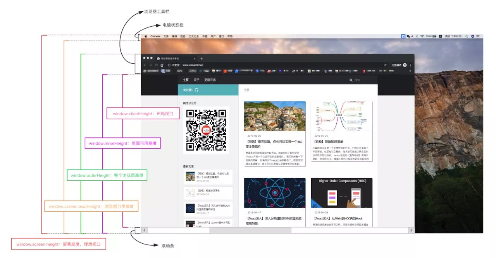


- `window.innerHeight`：获取浏览器视觉视口高度（包括垂直滚动条）。
- `window.outerHeight`：获取浏览器窗口外部的高度。表示整个浏览器窗口的高度，包括侧边栏、窗口镶边和调正窗口大小的边框。
- `window.screen.Height`：获取获屏幕取理想视口高度，这个数值是固定的，`设备的分辨率/设备像素比`
- `window.screen.availHeight`：浏览器窗口可用的高度。
- `document.documentElement.clientHeight`：获取浏览器布局视口高度，包括内边距，但不包括垂直滚动条、边框和外边距。
- `document.documentElement.offsetHeight`：包括内边距、滚动条、边框和外边距。
- `document.documentElement.scrollHeight`：在不使用滚动条的情况下适合视口中的所有内容所需的最小宽度。测量方式与`clientHeight`相同：它包含元素的内边距，但不包括边框，外边距或垂直滚动条。

## 五、1px问题

为了适配各种屏幕，我们写代码时一般使用设备独立像素来对页面进行布局。

而在设备像素比大于`1`的屏幕上，我们写的`1px`实际上是被多个物理像素渲染，这就会出现`1px`在有些屏幕上看起来很粗的现象。

### 5.1 border-image

基于`media`查询判断不同的设备像素比给定不同的`border-image`：

```css
       .border_1px{
          border-bottom: 1px solid #000;
        }
        @media only screen and (-webkit-min-device-pixel-ratio:2){
            .border_1px{
                border-bottom: none;
                border-width: 0 0 1px 0;
                border-image: url(../img/1pxline.png) 0 0 2 0 stretch;
            }
        }
```

### 5.2 background-image

和`border-image`类似，准备一张符合条件的边框背景图，模拟在背景上。

```css
       .border_1px{
          border-bottom: 1px solid #000;
        }
        @media only screen and (-webkit-min-device-pixel-ratio:2){
            .border_1px{
                background: url(../img/1pxline.png) repeat-x left bottom;
                background-size: 100% 1px;
            }
        }
```

上面两种都需要单独准备图片，而且圆角不是很好处理，但是可以应对大部分场景。

### 5.3 伪类 + transform

基于`media`查询判断不同的设备像素比对线条进行缩放：

```css
       .border_1px:before{
          content: '';
          position: absolute;
          top: 0;
          height: 1px;
          width: 100%;
          background-color: #000;
          transform-origin: 50% 0%;
        }
        @media only screen and (-webkit-min-device-pixel-ratio:2){
            .border_1px:before{
                transform: scaleY(0.5);
            }
        }
        @media only screen and (-webkit-min-device-pixel-ratio:3){
            .border_1px:before{
                transform: scaleY(0.33);
            }
        }
```

这种方式可以满足各种场景，如果需要满足圆角，只需要给伪类也加上`border-radius`即可。

### 5.4 svg

上面我们`border-image`和`background-image`都可以模拟`1px`边框，但是使用的都是位图，还需要外部引入。

借助`PostCSS`的`postcss-write-svg`我们能直接使用`border-image`和`background-image`创建`svg`的`1px`边框：

```css
@svg border_1px { 
  height: 2px; 
  @rect { 
    fill: var(--color, black); 
    width: 100%; 
    height: 50%; 
    } 
  } 
.example { border: 1px solid transparent; border-image: svg(border_1px param(--color #00b1ff)) 2 2 stretch; }
```

编译后：

```css
.example { border: 1px solid transparent; border-image: url("data:image/svg+xml;charset=utf-8,%3Csvg xmlns='http://www.w3.org/2000/svg' height='2px'%3E%3Crect fill='%2300b1ff' width='100%25' height='50%25'/%3E%3C/svg%3E") 2 2 stretch; }
```

上面的方案是大漠在他的文章中推荐使用的，基本可以满足所有场景，而且不需要外部引入，这是我个人比较喜欢的一种方案。

### 5.5 设置viewport

通过设置缩放，让`CSS`像素等于真正的物理像素。

例如：当设备像素比为`3`时，我们将页面缩放`1/3`倍，这时`1px`等于一个真正的屏幕像素。

```css
    const scale = 1 / window.devicePixelRatio;
    const viewport = document.querySelector('meta[name="viewport"]');
    if (!viewport) {
        viewport = document.createElement('meta');
        viewport.setAttribute('name', 'viewport');
        window.document.head.appendChild(viewport);
    }
    viewport.setAttribute('content', 'width=device-width,user-scalable=no,initial-scale=' + scale + ',maximum-scale=' + scale + ',minimum-scale=' + scale);
```

实际上，上面这种方案是早先`flexible`采用的方案。

当然，这样做是要付出代价的，这意味着你页面上所有的布局都要按照物理像素来写。这显然是不现实的，这时，我们可以借助`flexible`或`vw、vh`来帮助我们进行适配。

## 六、移动端适配方案

尽管我们可以使用设备独立像素来保证各个设备在不同手机上显示的效果类似，但这并不能保证它们显示完全一致，我们需要一种方案来让设计稿得到更完美的适配。

### 6.1 flexible方案

`flexible`方案是阿里早期开源的一个移动端适配解决方案，引用`flexible`后，我们在页面上统一使用`rem`来布局。

它的核心代码非常简单：

```css
// set 1rem = viewWidth / 10
function setRemUnit () {
    var rem = docEl.clientWidth / 10
    docEl.style.fontSize = rem + 'px'
}
setRemUnit();
```

`rem` 是相对于`html`节点的`font-size`来做计算的。

我们通过设置`document.documentElement.style.fontSize`就可以统一整个页面的布局标准。

上面的代码中，将`html`节点的`font-size`设置为页面`clientWidth`(布局视口)的`1/10`，即`1rem`就等于页面布局视口的`1/10`，这就意味着我们后面使用的`rem`都是按照页面比例来计算的。

这时，我们只需要将`UI`出的图转换为`rem`即可。

以`iPhone6`为例：布局视口为`375px`，则`1rem = 37.5px`，这时`UI`给定一个元素的宽为`75px`（设备独立像素），我们只需要将它设置为`75 / 37.5 = 2rem`。

当然，每个布局都要计算非常繁琐，我们可以借助`PostCSS`的`px2rem`插件来帮助我们完成这个过程。

下面的代码可以保证在页面大小变化时，布局可以自适应，当触发了`window`的`resize`和`pageShow`事件之后自动调整`html`的`fontSize`大小。

```css
  // reset rem unit on page resize
window.addEventListener('resize', setRemUnit)window.addEventListener('pageshow', function (e) {
    if (e.persisted) {
      setRemUnit()
    }
})
```

由于`viewport`单位得到众多浏览器的兼容，上面这种方案现在已经被官方弃用：

> lib-flexible这个过渡方案已经可以放弃使用，不管是现在的版本还是以前的版本，都存有一定的问题。建议大家开始使用viewport来替代此方案。

下面我们来看看现在最流行的`vh、vw`方案。

### 6.2 vh、vw方案

`vh、vw`方案即将视觉视口宽度 `window.innerWidth`和视觉视口高度 `window.innerHeight` 等分为 100 份。

上面的`flexible`方案就是模仿这种方案，因为早些时候`vw`还没有得到很好的兼容。

- `vw(Viewport's width)`：`1vw`等于视觉视口的`1%`
- `vh(Viewport's height)` :`1vh` 为视觉视口高度的`1%`
- `vmin` : `vw` 和 `vh` 中的较小值
- `vmax` : 选取 `vw` 和 `vh` 中的较大值


如果视觉视口为`375px`，那么`1vw = 3.75px`，这时`UI`给定一个元素的宽为`75px`（设备独立像素），我们只需要将它设置为`75 / 3.75 = 20vw`。

这里的比例关系我们也不用自己换算，我们可以使用`PostCSS`的 `postcss-px-to-viewport` 插件帮我们完成这个过程。写代码时，我们只需要根据`UI`给的设计图写`px`单位即可。

当然，没有一种方案是十全十美的，`vw`同样有一定的缺陷：

- `px`转换成`vw`不一定能完全整除，因此有一定的像素差。
- 比如当容器使用`vw`，`margin`采用`px`时，很容易造成整体宽度超过`100vw`，从而影响布局效果。当然我们也是可以避免的，例如使用`padding`代替`margin`，结合`calc()`函数使用等等...

## 七、适配iPhoneX

`iPhoneX`的出现将手机的颜值带上了一个新的高度，它取消了物理按键，改成了底部的小黑条，但是这样的改动给开发者适配移动端又增加了难度。

### 7.1 安全区域

在`iPhoneX`发布后，许多厂商相继推出了具有边缘屏幕的手机。


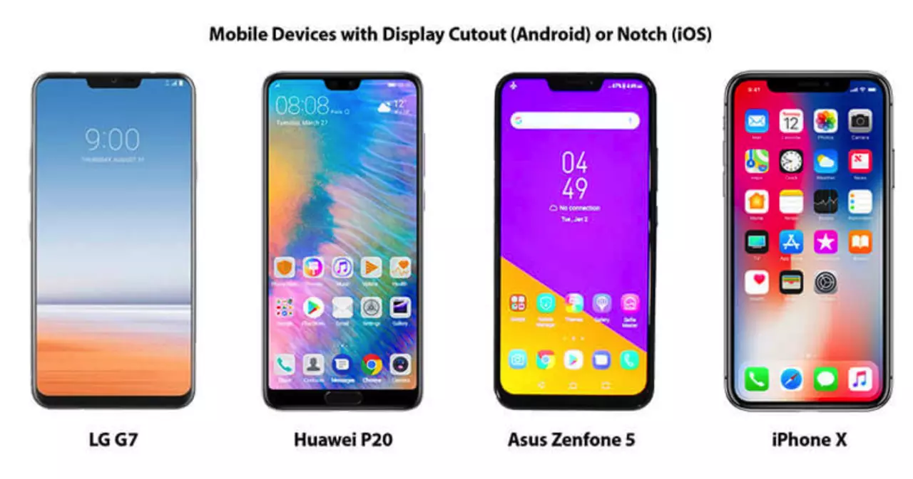


这些手机和普通手机在外观上无外乎做了三个改动：圆角（`corners`）、刘海（`sensor housing`）和小黑条（`Home Indicator`）。为了适配这些手机，安全区域这个概念变诞生了：安全区域就是一个不受上面三个效果的可视窗口范围。

为了保证页面的显示效果，我们必须把页面限制在安全范围内，但是不影响整体效果。

### 7.2 viewport-fit

`viewport-fit`是专门为了适配`iPhoneX`而诞生的一个属性，它用于限制网页如何在安全区域内进行展示。


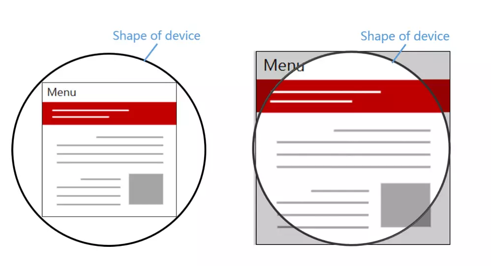


`contain`: 可视窗口完全包含网页内容

`cover`：网页内容完全覆盖可视窗口

默认情况下或者设置为`auto`和`contain`效果相同。

### 7.3 env、constant


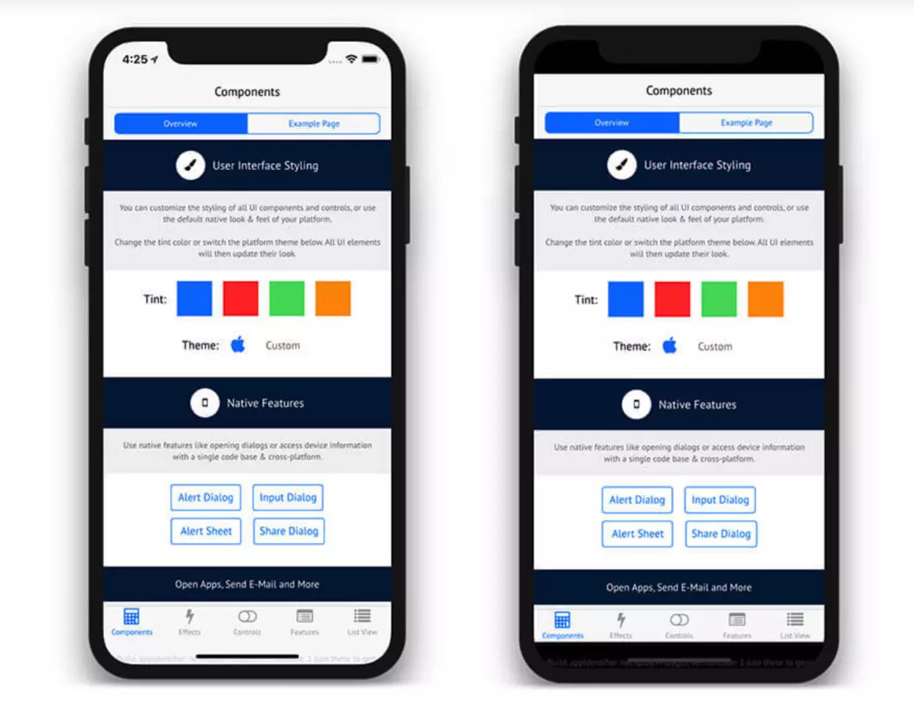


我们需要将顶部和底部合理的摆放在安全区域内，`iOS11`新增了两个`CSS`函数`env、constant`，用于设定安全区域与边界的距离。

函数内部可以是四个常量：

- `safe-area-inset-left`：安全区域距离左边边界距离
- `safe-area-inset-right`：安全区域距离右边边界距离
- `safe-area-inset-top`：安全区域距离顶部边界距离
- `safe-area-inset-bottom`：安全区域距离底部边界距离

注意：我们必须指定`viweport-fit`后才能使用这两个函数：

```css
<meta name="viewport" content="viewport-fit=cover">
```

`constant`在`iOS < 11.2`的版本中生效，`env`在`iOS >= 11.2`的版本中生效，这意味着我们往往要同时设置他们，将页面限制在安全区域内：

```css
body {
  padding-bottom: constant(safe-area-inset-bottom);
  padding-bottom: env(safe-area-inset-bottom);
}
```

当使用底部固定导航栏时，我们要为他们设置`padding`值：

```css
{
  padding-bottom: constant(safe-area-inset-bottom);
  padding-bottom: env(safe-area-inset-bottom);
}
```

## 八、横屏适配


很多视口我们要对横屏和竖屏显示不同的布局，所以我们需要检测在不同的场景下给定不同的样式：

### 8.1 JavaScript检测横屏

`window.orientation`:获取屏幕旋转方向

```css
window.addEventListener("resize", ()=>{
    if (window.orientation === 180 || window.orientation === 0) { 
      // 正常方向或屏幕旋转180度
        console.log('竖屏');
    };
    if (window.orientation === 90 || window.orientation === -90 ){ 
       // 屏幕顺时钟旋转90度或屏幕逆时针旋转90度
        console.log('横屏');
    }  
}); 
```

### 8.2 CSS检测横屏

```css
@media screen and (orientation: portrait) {
  /*竖屏...*/
} 
@media screen and (orientation: landscape) {
  /*横屏...*/
}
```

## 九、图片模糊问题

### 9.1 产生原因

我们平时使用的图片大多数都属于位图（`png、jpg...`），位图由一个个像素点构成的，每个像素都具有特定的位置和颜色值：

理论上，位图的每个像素对应在屏幕上使用一个物理像素来渲染，才能达到最佳的显示效果。

而在`dpr > 1`的屏幕上，位图的一个像素可能由多个物理像素来渲染，然而这些物理像素点并不能被准确的分配上对应位图像素的颜色，只能取近似值，所以相同的图片在`dpr > 1`的屏幕上就会模糊:

### 9.2 解决方案

为了保证图片质量，我们应该尽可能让一个屏幕像素来渲染一个图片像素，所以，针对不同`DPR`的屏幕，我们需要展示不同分辨率的图片。

如：在`dpr=2`的屏幕上展示两倍图`(@2x)`，在`dpr=3`的屏幕上展示三倍图`(@3x)`。


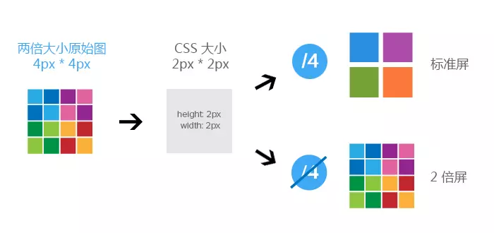


### 9.3 media查询

使用`media`查询判断不同的设备像素比来显示不同精度的图片：

```css
       .avatar{
            background-image: url(conardLi_1x.png);
        }
        @media only screen and (-webkit-min-device-pixel-ratio:2){
            .avatar{
                background-image: url(conardLi_2x.png);
            }
        }
        @media only screen and (-webkit-min-device-pixel-ratio:3){
            .avatar{
                background-image: url(conardLi_3x.png);
            }
        }
```

> 只适用于背景图

### 9.4 image-set

使用`image-set`：

```css
.avatar {
    background-image: -webkit-image-set( "conardLi_1x.png" 1x, "conardLi_2x.png" 2x );
}
```

> 只适用于背景图

### 9.5 srcset

使用`img`标签的`srcset`属性，浏览器会自动根据像素密度匹配最佳显示图片：

```html


```

### 9.6 JavaScript拼接图片url

使用`window.devicePixelRatio`获取设备像素比，遍历所有图片，替换图片地址：

```js
const dpr = window.devicePixelRatio;
const images =  document.querySelectorAll('img');
images.forEach((img)=>{
  img.src.replace(".", `@${dpr}x.`);
})
```

### 9.7 使用svg

`SVG`的全称是可缩放矢量图（`Scalable Vector Graphics`）。不同于位图的基于像素，`SVG` 则是属于对图像的形状描述，所以它本质上是文本文件，体积较小，且不管放大多少倍都不会失真。


除了我们手动在代码中绘制`svg`，我们还可以像使用位图一样使用`svg`图片：

```html


.avatar {
  background: url(conardLi.svg);
}
```