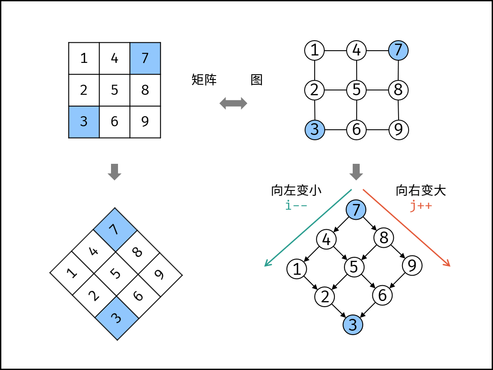
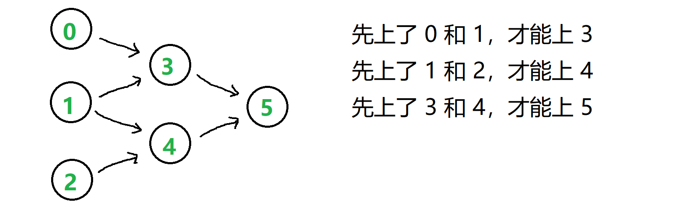

# 哈希

[两数之和](https://leetcode.cn/problems/two-sum/)

[字母异位词分组](https://leetcode.cn/problems/group-anagrams/)

[128. 最长连续序列](https://leetcode.cn/problems/longest-consecutive-sequence/)

思路：

所有的最长连续序列都有一个开始值。

遍历哈希集合。找到开始值。（没有前一位数存在的就是开始值）

再在hash中从开始值往后找连续数直到结束，就是连续队列。

这样遍历完哈希就可以找到最长的连续队列。

# 滑动窗口

滑动窗口主要解决的是 **"连续子序列/子串"** 类问题。需要满足单调性。

[438. 找到字符串中所有字母异位词](https://leetcode.cn/problems/find-all-anagrams-in-a-string/)

思路：固定滑动窗口。

charCodeAt：用来和'a'.charCodeAt进行比较，构建26个字母的数组序列，

[76. 最小覆盖子串](https://leetcode.cn/problems/minimum-window-substring/)

给定两个字符串 `s` 和 `t`，长度分别是 `m` 和 `n`，返回 s 中的  **最短窗口 子串** ，使得该子串包含 `t` 中的每一个字符（ **包括重复字符** ）。

思路：缩量滑动窗口。

left和right双指针。一开始right的下标指向t.length-1。然后进行比较有没有包含，如果没有包含，那么right++，否则left++。

主要用的js方法：

1. 对于大小写，需要通过区分大小写构建52个字母的序列

```js
// 区分大小写
const isUpperCase = (ch)=> {
        return ch >= 'A' && ch <= 'Z';
}

// 构建字母index
const getCharIndex = (char)=>{
        if(isUpperCase(char)) {
            return char.charCodeAt() - 'A'.charCodeAt()
        }
        return char.charCodeAt() - 'a'.charCodeAt() + 26
}
 

```

# 前缀和

[303. 区域和检索 - 数组不可变](https://leetcode.cn/problems/range-sum-query-immutable/)

通过这题理解前缀和

[560. 和为 K 的子数组](https://leetcode.cn/problems/subarray-sum-equals-k/)

解法：

和为k的字数组，可通过前缀和，找到s[j] - s[i] = k，那么前缀和的区间就是子数组。

但是如果找前缀和的区间，又是需要暴力两层枚举。

所以需要用hash将两层枚举进行优化成单层。

即在从前往后遍历前缀和数组的s[j]的时候，需要看看s[j]之前有没有s[i] === s[j] - k

那么这个hash集合要怎么构建呢？**[枚举右，维护左。](https://leetcode.cn/discuss/post/3579480/ti-dan-dan-diao-zhan-ju-xing-xi-lie-zi-d-u4hk/)**

如果直接把前缀和数组格式化为hash，就无法保证s[i]出现在s[j]之前。所以需要边遍历边构建map。

```
const map = {};

for(let i = 0;i<sumArr.length;i++) {
        const sumItem = sumArr[i];

	// 这里通过hash来找s[i] === s[j] - k 
        count += map[sumItem - k] ?? 0

	// 这里是存每次出现的sumItem作为s[i], 这样保证s[i] 一定是在s[j]之前出现的
        if(map[sumItem]!==undefined) {
            map[sumItem]++
        }else {
            map[sumItem] = 1
        }
}
```

# 子串

```js
// 决策树：如何选择子串问题的解法？
function chooseSolution(problem) {
    if (problem.type === "字母异位词") {
        if (字符集有限) return "滑动窗口+数组计数";
        else return "滑动窗口+哈希表";
    }
    else if (problem.type === "精确匹配") {
        return "KMP或Rabin-Karp";
    }
    else if (problem.type === "最大/最小窗口") {
        return "滑动窗口+双指针";
    }
    else if (problem.type === "所有子串") {
        return "暴力枚举或DP";
    }
}
```

# 普通数组

## [56. 合并区间](https://leetcode.cn/problems/merge-intervals/)

思路：排序+合并


# 矩阵

## [73. 矩阵置零](https://leetcode.cn/problems/set-matrix-zeroes/)

思路：

对原数组记录colSet和rowSet。

在遍历的时候满足就修改。

## [48. 旋转图像](https://leetcode.cn/problems/rotate-image/)

思路：

两次翻转等于一次旋转。

当n为偶数时，可把图形分为这样的四块。


当n为奇数时，可以把图形分为这样的四块。


已知这四块区域都是对称的。并且奇数块能满足的，偶数块一定能满足。因为偶数块比技术块更对称。对于这两种情况，我们拿左上角的蓝色块举例子。

1	2	3	x	x

6	7	8	x	x

x	x	x	x	x

x	x	x	x	x

x	x	x	x	x

我们可以发现，当蓝色块沿着右上-左下对角线进行翻转，就会变成

x	x	x	x	x

x	x	x	x	x

x	x	x	8	3

x	x	x	7	2

x	x	x	6	1

再沿着水平线进行翻转，就会变成

x	x	x	6	1

x	x	x	7	2

x	x	x	8	3

x	x	x	x	x

x	x	x	x	x

其他颜色也是同理。

因此我们可以先把对角线进行翻转，再沿着水平线翻转，即可成功。

但是，你会发现，水平翻转的时候，是在不同行的同一列进行翻转。这太麻烦了。

因此我们需要用主对角线，即左上，右下对角线进行翻转。

还是拿之前的初始块举例：

1	2	3	x	x

6	7	8	x	x

x	x	x	x	x

x	x	x	x	x

x	x	x	x	x

主对角线翻转后

1	6	x	x	x

2	7	x	x	x

3	8	x	x	x

x	x	x	x	x

x	x	x	x	x

垂直翻转后

x	x	x	6	1

x	x	x	7	2

x	x	x	8	3

x	x	x	x	x

x	x	x	x	x

这里的垂直翻转，因为翻转的是同一行的，就可以直接用reverse方法。

## [240. 搜索二维矩阵 II](https://leetcode.cn/problems/search-a-2d-matrix-ii/)

思路：把矩阵逆时针旋转45度，以右上角为顶点，会变为二叉搜索树。

但是这个图有点问题，因为一般是i作为行，j作为列。但是懂思路就行。



[搜索二维矩阵 II（贪心，清晰图解）](https://leetcode.cn/problems/search-a-2d-matrix-ii/solutions/2361487/240-sou-suo-er-wei-ju-zhen-iitan-xin-qin-7mtf)

# 二叉树

## [98. 验证二叉搜索树](https://leetcode.cn/problems/validate-binary-search-tree/)

思路：用值为边界做递归

## [199. 二叉树的右视图](https://leetcode.cn/problems/binary-tree-right-side-view/)

思路：层级遍历

## [437. 路径总和 III](https://leetcode.cn/problems/path-sum-iii/)

思路：递归，用数组做递增

## [114. 二叉树展开为链表](https://leetcode.cn/problems/flatten-binary-tree-to-linked-list/)

思路：递归之后重新构建

# 图论

## [200. 岛屿数量](https://leetcode.cn/problems/number-of-islands/)

思路：当遍历到陆地时，把遍历过的陆地极其相连陆地标为水，并把陆地数量+1。

## [994. 腐烂的橘子](https://leetcode.cn/problems/rotting-oranges/)

思路：BFS，[详细题解](https://leetcode.cn/problems/rotting-oranges/solutions/129831/li-qing-si-lu-wei-shi-yao-yong-bfsyi-ji-ru-he-xie-)

一开始，我们找出所有腐烂的橘子，将它们放入队列，作为第 0 层的结点。
然后进行 BFS 遍历，每个结点的相邻结点可能是上、下、左、右四个方向的结点，注意判断结点位于网格边界的特殊情况。
由于可能存在无法被污染的橘子，我们需要记录新鲜橘子的数量。在 BFS 中，每遍历到一个橘子（污染了一个橘子），就将新鲜橘子的数量减一。如果 BFS 结束后这个数量仍未减为零，说明存在无法被污染的橘子。

## [207. 课程表](https://leetcode.cn/problems/course-schedule/)

思路：有向无环图，[详细题解](https://leetcode.cn/problems/course-schedule/solutions/250377/bao-mu-shi-ti-jie-shou-ba-shou-da-tong-tuo-bu-pai-)

示例：n = 6，先决条件表：[[3, 0], [3, 1], [4, 1], [4, 2], [5, 3], [5, 4]]
课 0, 1, 2 没有先修课，可以直接选。其余的课，都有两门先修课。
我们用有向图来展现这种依赖关系（做事情的先后关系）：



这种叫 有向无环图，把一个 有向无环图 转成 线性的排序 就叫 拓扑排序。
有向图有 入度 和 出度 的概念：
如果存在一条有向边 A --> B，则这条边给 A 增加了 1 个出度，给 B 增加了 1 个入度。
所以，顶点 0、1、2 的入度为 0。顶点 3、4、5 的入度为 2。

每次只能选入度为 0 的课，因为它不依赖别的课，是当下你能上的课。
假设选了 0，课 3 的先修课少了一门，入度由 2 变 1。
接着选 1，导致课 3 的入度变 0，课 4 的入度由 2 变 1。
接着选 2，导致课 4 的入度变 0。
现在，课 3 和课 4 的入度为 0。继续选入度为 0 的课……直到选不到入度为 0 的课。

让入度为 0 的课入列，它们是能直接选的课。
然后逐个出列，出列代表着课被选，需要减小相关课的入度。
如果相关课的入度新变为 0，安排它入列、再出列……直到没有入度为 0 的课可入列。

最后判断所有的课程入度都为0即可。


# 回溯

## [17. 电话号码的字母组合](https://leetcode.cn/problems/letter-combinations-of-a-phone-number/)

这个穷举就行了

## [39. 组合总和](https://leetcode.cn/problems/combination-sum/)

这个必须要用回溯+减支。

回溯的算法适合用递归。

```js
var combinationSum = function(candidates, target) {
    const result = [];

    const findNextNum = (travelIndex, arr, target)=>{
        for(let j = travelIndex;j>=0;j--){
            if(candidates[j] === target) {
                const _arr = [...arr]
                _arr.push(candidates[j])
                result.push(_arr)
            }
            else if(candidates[j] < target) {
                const _arr = [...arr, candidates[j]]; 
                findNextNum(j, _arr, target-candidates[j])
            }
        }
    }

    findNextNum(candidates.length-1,[],target)

    return result
};
```

# 二分查找

## [35. 搜索插入位置](https://leetcode.cn/problems/search-insert-position/)

思路：二分

## [74. 搜索二维矩阵](https://leetcode.cn/problems/search-a-2d-matrix/)

思路：先对列进行二分，再对行进行二分

## [34. 在排序数组中查找元素的第一个和最后一个位置](https://leetcode.cn/problems/find-first-and-last-position-of-element-in-sorted-array/)

思路：先找到值，再往两边找边界。

## [153. 寻找旋转排序数组中的最小值](https://leetcode.cn/problems/find-minimum-in-rotated-sorted-array/)

思路：和最后一位数比大小，缩小不连续空间范围，同时记录出现的连续空间的最小值。

其中ans用来记录连续空间中的最小值，确保所有出现的连续空间的最小值都能被记录。

```js
var findMin = function(nums) {
    let left = 0
    let right = nums.length-1
    let ans = 100000
    // 和最后一个值对比，看看是不是连续区间
    while(left<=right) {
        const centerIdx = Math.floor((left+right)/2)
        // 说明centerIdx左边是连续递增，右边是不连续的
        if(nums[centerIdx] > nums[right]) {
            ans = Math.min(nums[left], ans);
            left = centerIdx + 1
        }else{
            // num[centerIdx] <= nums[right]
            // 说明右边边是连续递增，要去左边找不连续的
            ans = Math.min(nums[centerIdx], ans);
            right = centerIdx - 1;
        }
    }
    return ans
};
```

# 栈

## [394. 字符串解码](https://leetcode.cn/problems/decode-string/)

思路：

为了保持栈的顺序制定以下规则

1. 字母入栈
2. 数字按十进制递增
3. 碰到[统计一次，数字和字符串通过[数字，字符串]这种双栈的形式入队
4. 碰到]清算一次，字符串

## [739. 每日温度](https://leetcode.cn/problems/daily-temperatures/)

思路：递减栈。

栈内存储[value,index]，用一个result数组存储下一个更高温度出现在几天后。

1. 因为是往后找比当前天高的温度，因此用一个队列存储温度数组。
2. 遍历温度队列。把当前天和队列中的值进行对比，如果比队列的值大，把队列内的温度删除，修改result数组。
3. 接着把新的温度入队列。
4. 但是存在一个情况，就是当每天温度都一样的时候，队列只进不出，遍历就会变成（O2)的时间复杂度。
5. 所以需要通过递减栈来解决这个问题。
   1. 对于递减栈而言，如果栈顶元素小于当前天，那么就可以一直遍历栈顶元素，直到清空栈或条件不符合。
   2. 这样就规避了需要顺序遍历队列的问题。
6. 接着按上面的把新的温度入队列。循环计算即可。

## [84. 柱状图中最大的矩形](https://leetcode.cn/problems/largest-rectangle-in-histogram/)

思路：

1. 求最大矩形，因为最大矩形的高度必然在矩形队列中，是可以进行枚举的，所以我们需要做的是计算出对应的宽度。
2. 那么可以利用类似于接雨水的思路去计算宽度。
3. 对于一个列。我们可以往左找到最近的小于这个列高度的墙。小于是因为，如果是大于，那么宽度就还可以再++。最近是因为，要保证宽度范围内所有的高度都是大于等于列高的。
4. 通过单调栈我们可以计算出左墙index数组和右墙index数组。
5. 通过(rightIndex[i] - leftIndex[i] - 1) * height[i] 的方式，我们可以获取当列最大矩形
6. 收集所有的当列最大矩形，我们就可以计算出全局最大矩形。

# 动态规划

## [70. 爬楼梯](https://leetcode.cn/problems/climbing-stairs/)

## [198. 打家劫舍](https://leetcode.cn/problems/house-robber/)

思路：可以相隔一个，也可以相隔两个房屋，不可以相隔三个房屋（因为中间可以插一个）

## [42. 接雨水](https://leetcode.cn/problems/trapping-rain-water/)

方法：

1. 我们可以把计算所有的雨水拆分为计算每一列的雨水
2. 对于每一列，只要有左墙和右墙，那么这一列就有能存储雨水的可能。因此第一列和最后一列可以不计算。
3. 对于当前列，如果想存雨水。根据木桶效应。列底部，左边最高墙，和右边最高墙会形成三个边的桶。所以有以下公式

   ```
   curWater = Math.min(left[maxHeight] - right[maxHeight]) - height[i];
   if(curWater > 0) totalWater += curWater
   ```
4. 因此会有一个双重循环可以解决这个问题

   - 对于外层循环，控制每一列
   - 对于内层循环，在列的左边和右边寻找最高墙
5. 这个双重循环怎么优化呢？使用动态优化的方式，提前计算好从左到右的最高墙，和从右到左的最高墙

   ```js
   // 这个数组记录，当前列的 左边的墙的最高
   const maxHeightLeftArr = new Array(height.length).fill(0);
   // 从1开始是因为最左列左边没有墙
   for(let i = 1;i<height.length-1;i++) {
   	maxHeightLeftArr[i] = height[i-1]+maxHeightLeftArr[i-1]
   }
   ```
6. 同理，可以构建右边数组。

   ```js
   const rightMaxArr = new Array(height.length).fill(0);
       // 右边最大墙数组
   for(let i = height.length-2;i>=0;i--){
           rightMaxArr[i] = Math.max(height[i+1],rightMaxArr[i+1])
   }
   ```
7. 接着就可以计算总量

   ```js
   for(let i = 1;i<height.length-1;i++) {
           const minH = Math.min(leftMaxArr[i], rightMaxArr[i])
           if(minH > height[i]) {
               totalWater +=minH- height[i]
           }
   }
   ```

## [22. 括号生成](https://leetcode.cn/problems/generate-parentheses/)

这题其实也可以用回溯，但是用动态规划解决，会更好理解一点

思路：一开始我是用这种递归的方式

```js
createFn("()" + base, level+1)
createFn("(" + base + ")", level+1)
createFn(base + "()", level+1)
```

但是会遗漏 `(())(())`，因为这种方式是在括号内加括号。

这个公式可以攘括在括号内加括号的情况

```
(p) + q
```

所以有四层循环

```js
const dp = [[''], ['()']]
    // p + q = n - 1;
    // 这一层用来定义有n对括号时的表现
    for(let i = 2;i<=n;i++) {
        const newDpItem = [];
        // 这一层主要用来定p项有几对括号
        for(let j = 0;j<i;j++) {
            // p = j
            const leftArr = dp[j];
	    // q = n - p -1 = i - j - 1
            const rightArr = dp[i-j-1];
            for(let lItem of leftArr) {
                for(let rItem of rightArr) {
                    const str = '('+lItem+')'+rItem
                    newDpItem.push(str)
                }
            }
        }
        dp.push(newDpItem)
    }
    return dp[n]
```


# 位运算

[136. 只出现一次的数字](https://leetcode.cn/problems/single-number/)

方法：异或运算。

a ^ 0 = a

a ^ a = 0

# 枚举

[169. 多数元素](https://leetcode.cn/problems/majority-element/)

# 计数排序

[75. 颜色分类](https://leetcode.cn/problems/sort-colors/)

今日目标：
