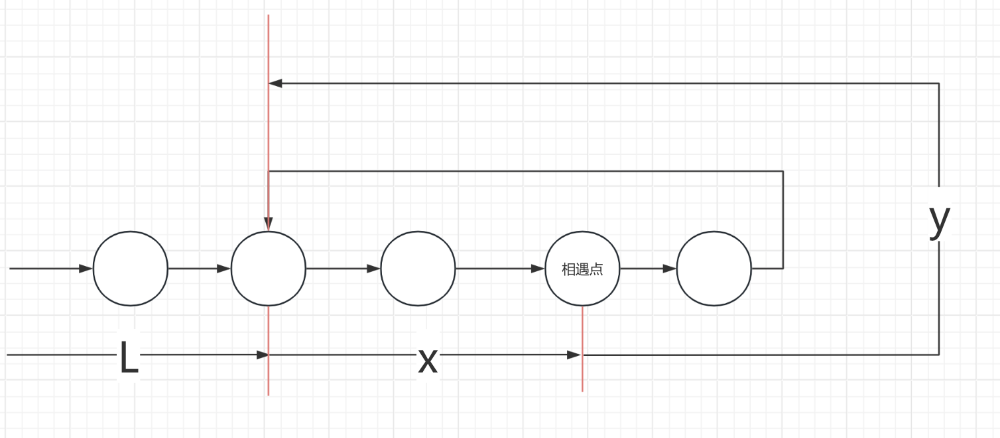

# 快慢指针是怎么相遇的

## **1. 如果链表没有环**

* 快指针会先到达尾部（null），结束
* 时间复杂度：O(n)

## **2. 如果链表有环**

**环的结构参数**

* 设环外部分长度为  **L** （从头节点到环入口）
* 设环的长度为 **C**
* 环入口点记为 **E**

```js
头节点 → ... → E → (环内节点) → ... → E
    L步        C步
```

**进入环的时间**

* 慢指针需要走 **L** 步到达环入口 E
* 快指针需要走 **L** 步到达环入口 E（但因为快指针速度是2倍，它可能已经在环内绕圈了）

#### **关键：快慢指针在环内的相对速度**

* 慢指针速度：1 节点/步
* 快指针速度：2 节点/步
* **相对速度** ：快指针相对于慢指针的速度 = 2 - 1 = **1 节点/步**

假设在某个时刻，两个指针都进入了环内：

* 设此时快慢指针在环内的距离为  **d** （0 ≤ d < C）
* 由于相对速度为1，**每经过1步，它们的距离减少1**
* 经过 **d** 步后，距离变为0 → **相遇！**
* 最坏情况下：初始距离 d = C-1，需要 C-1 步相遇

 **最大相遇时间** ：进入环后最多需要 **C-1** 步相遇

# **常见应用场景**

## **1. 链表环检测** （相遇检测）

## **2. 寻找环入口** （LeetCode 142）

当链表相遇之后。

将一个指针放回起点（索引 0）

两个指针都以每次一步的速度前进，再次相遇的点就是环入口。

推导过程：



* 设链表头到环入口的距离为 **L**
* 设环的周长为 **C = X + Y**
* 逆时针方向，设环入口到第一次相遇点的距离为 **x**
* 逆时针方向，设第一次相遇点到环入口的距离为  **y**

第一次相遇时：

* 慢指针走了 `s` 步
* 快指针走了 `2s` 步（因为速度是2倍）
* 快指针比慢指针多走了 `n` 圈环（n ≥ 1）

```
2s = s + nC
s = nC
```

慢指针从起点到相遇点的路程可以分解为：

1. 从头到环入口：L 步
2. 从环入口到相遇点：x 步

因为在第一步推断出：x最多为C-1，因此：

```
s = L + x
```

由上面两个 `s` 的表达式：

```
L + x = nC
L = nC - x
```

因为 `x + y = C`，所以 `y = C - x`

```
L = nC - x
  = (n-1)C + (C - x)
  = (n-1)C + y
```

因为从起点走到环入口需要走L = (n-1)C + y步。从相遇点走到环入口需要走mC + y步。其中n为原地绕圈。那么我们就可以得知，当慢指针回到起点，快指针一次走一步，就可以在入口相遇。

## **3.链表中点查找** （LeetCode 876）

* **无需链表有环** ，快指针走两步，慢指针走一步，快指针到终点时，慢指针正好在中点

## 4.**链表是否为回文结构** （LeetCode 234）

先找到中点，然后反转后半部分进行比较
