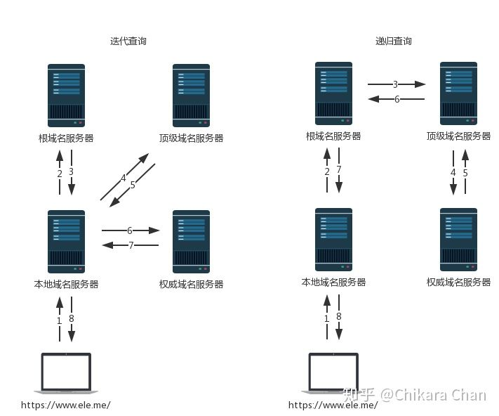

[DNS原理入门-阮一峰](http://www.ruanyifeng.com/blog/2016/06/dns.html)

### DNS（Domain **N**ame System）是什么

**域名系统**，是一个将[域名](https://zh.wikipedia.org/wiki/域名)和[IP地址](https://zh.wikipedia.org/wiki/IP地址)相互[映射](https://zh.wikipedia.org/wiki/映射)的一个[分布式数据库](https://zh.wikipedia.org/wiki/分布式数据库)。DNS由一系列的服务器组成，这些服务器遍布全球各地，并由不同的组织和个人维护。

### DNS的常见用法

将服务器名称和 IP 地址进行关联，将邮件地址和邮件服务器进行关联,以及为各种信息关联相应的名称。

### 为什么要转换成IP地址

`TCP/IP` 网络通过 `IP` 地址来确定通信对象，不知道 `IP`地址无法发送信息。

### 域名和 IP 地址并用的理由

- 可以不用IP 地址，而是用域名来确定通信对象吗?
  不行，IP 地址的长度 为 32 比特（ 4 字节），使用域名最少也要几十个字节，最长可达到255字节，**增加了路由器的负担**，传送数据也会花费更长的时间 ，运行效率较低。（路由转发包传输数据）
- 浏览器网址中不写服务器的名字，直接写IP 地址？
  用IP地址来代替服务器名称也是能够正常工作的 。然而，要**记住 IP 地址非常困难**
- 让人来使用名称,让路由器来使用IP地址。
  为了填补两者之间的障碍,需要有一个机制能够通过名称来查询IP地址,或者通过IP 地址来查询名称,这个机制就是DNS

### 域名的层级

 DNS服务器怎么会知道每个域名的IP地址呢？答案是分级查询。

举例来说，`www.example.com`真正的域名是 `www.example.com.root`，简写为 `www.example.com.`。因为，根域名 `.root`对于所有域名都是一样的，所以平时是省略的。

根域名的下一级，叫做"顶级域名"·，比如 `.com`、`.net`；再下一级叫做"次级域名"（second-level domain），比如 `www.example.com`里面的 `.example`，这一级域名是用户可以注册的；再下一级是主机名（host），比如 `www.example.com`里面的 `www`，又称为"三级域名"，这是用户在自己的域里面为服务器分配的名称，是用户可以任意分配的。

总结一下，域名的层级结构如下。

> ```bash
> 主机名.次级域名.顶级域名.根域名
> # 即
> host.sld.tld.root
> ```

### DNS解析（递归解析和迭代解析）

寻找ip的顺序

- 缓存中：浏览器缓存=>操作系统缓存=>路由器缓存，如果没有缓存或已过期
- 本机的 hosts文件
- DNS服务器：如果**本地 DNS 服务器**没有缓存，需要采用递归或者迭代查询的方式依次向**根域名服务器**、**顶级域名服务器**、**权威域名服务器**发起查询请求，如下图所示：

  

在获取IP域名的路径中，只要是从他处获取到IP，必然能获取到IP+TTL的组合，此时无论是服务器还是本地，在路径上拿到过这个值的都会进行缓存。这个TTL值会随着时间递减，如果TTL值为0，那么缓存会把对应的IP值删除。

### QA：

权威域名服务器和次级域名服务器有什么差别？

不存在专门的“次级域名服务器”。对于一个特定的次级域名的查询，权威服务器才是最终权威地回答关于该次级域名（或下层子域名）的查询请求的服务器。

递归查询和迭代查询分别用在什么场景，它的优缺点是什么？

**递归查询** ：

* **使用时机** ：递归查询通常发生在客户端向本地DNS服务器请求解析一个域名时。
* **过程** ：在递归查询中，客户端请求本地DNS服务器提供解析结果，本地DNS服务器若未能在本地缓存中找到答案，它将代表客户端进行一系列查询，直至从根服务器到权威服务器获取到解析的结果，然后再将这个结果返回给客户端。
* **优点** ：递归查询简化了客户端需要做的工作，只需要发出一个请求，剩余的查询工作由DNS服务器完成。
* **缺点** ：递归查询可能会给DNS服务器带来较大压力，尤其是当同时处理大量客户端查询时。

**迭代查询** ：

* **使用时机** ：迭代查询通常发生在DNS服务器之间，如当本地DNS服务器请求根服务器、顶级域名服务器或权威服务器来解析一个域名时。
* **过程** ：在迭代查询中，DNS服务器不负责替客户端获取最终的答案，而是向请求的服务器查询信息。如果该服务器不能提供最终答案，它会提供其他能进一步回答该查询的服务器的地址列表。DNS服务器接着向下一个服务器发送请求，直到找到可以提供最终答案的权威DNS服务器为止。
* **优点** ：迭代查询将服务器之间获取信息的负担放在请求的服务器上，不需要返回服务器持续跟踪状态，能够更好地分布负载。
* **缺点** ：比起递归查询结果可以直接返回给客户端，迭代查询需要更多步骤和时间来获得最终结果。

递归查询和迭代查询在DNS解析过程中经常一起出现。例如，当客户端向本地DNS服务器发起递归查询请求时，该服务器可能需要对其他服务器（如根服务器、TLD服务器、权威服务器）进行一系列的迭代查询来获得所需的解析结果。这种组合使用的方式利用了两种查询各自的优势来解析域名，同时减轻了单个服务器的负担。
