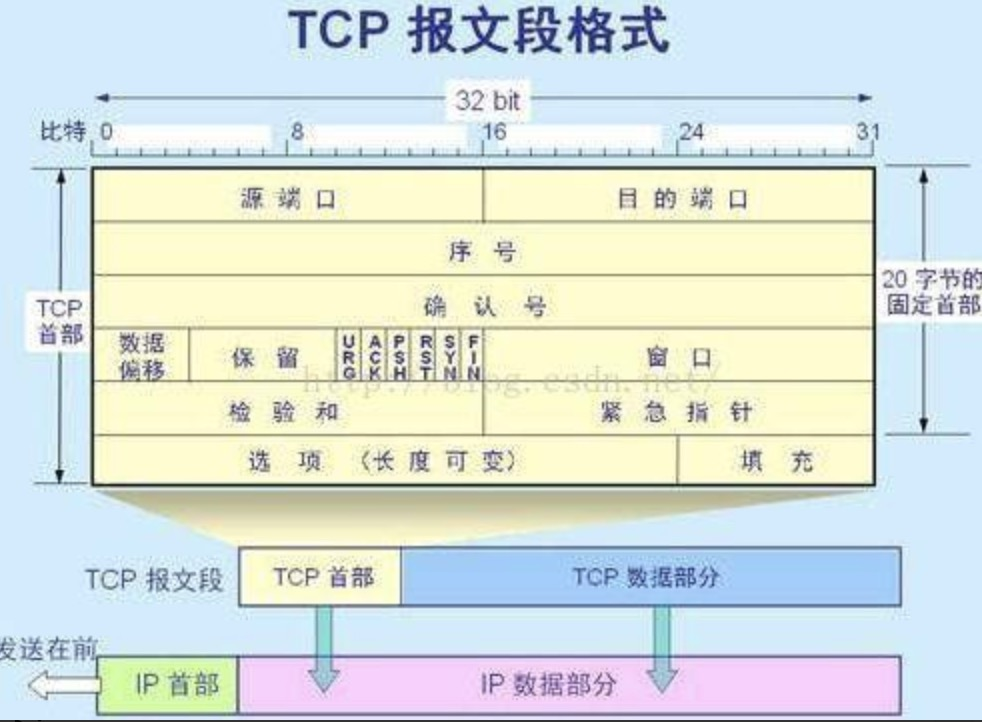
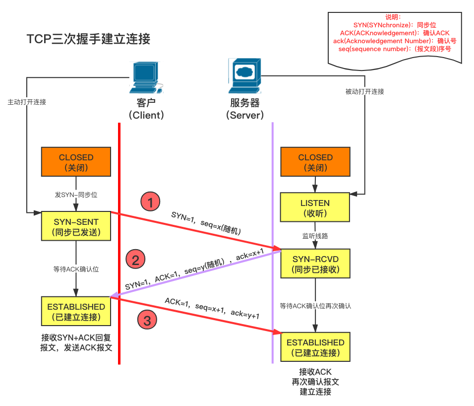
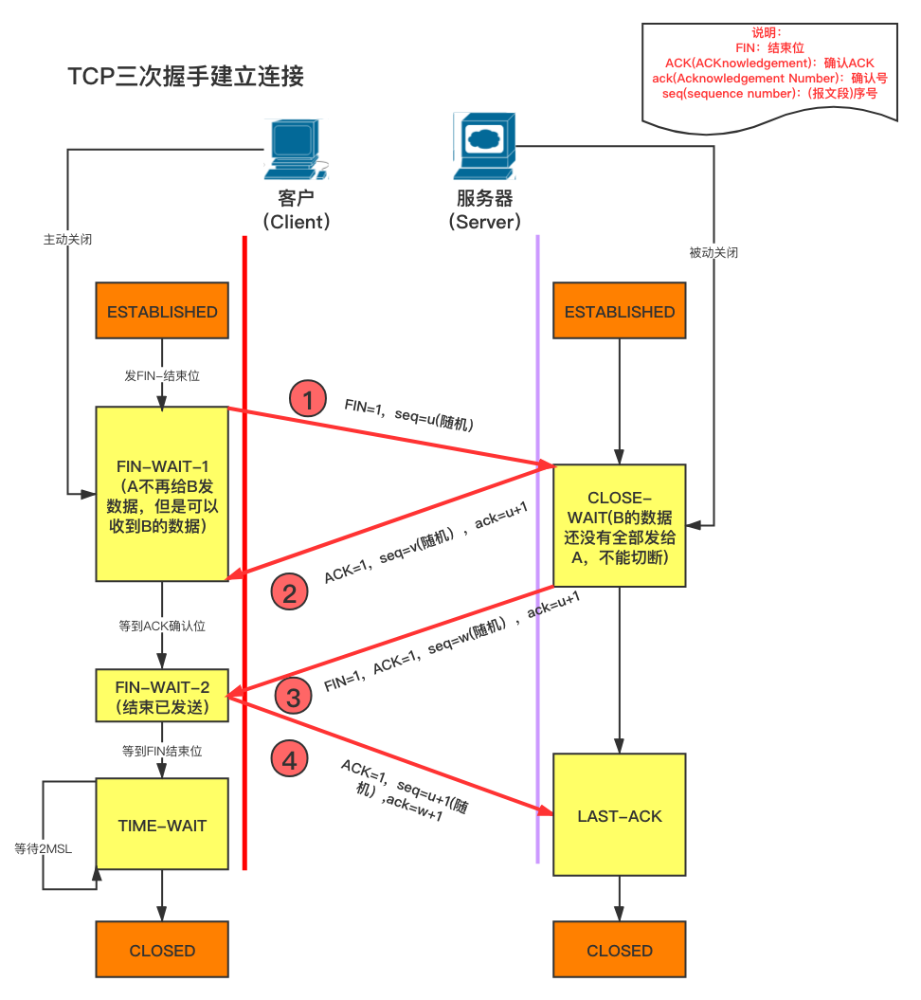

[根据动画来学TCP的三次握手，四次挥手（简单了解）](https://juejin.im/post/5b29d2c4e51d4558b80b1d8c#heading-0)

[TCP的三次握手四次挥手（报文格式）](https://juejin.im/post/5a0444d45188255ea95b66bc)

[输入url之后（为什么三次握手四次挥手，2msl）](https://juejin.im/post/5cc573c85188252e741ccbb6)

## TCP协议

TCP/IP协议栈包括多层，其中TCP报文通常被封装在IP数据包中进行传输。详细的看：网络安全/网络协议。

一个完整的TCP数据包（分段）在网络上传输时，包括以下几个部分：

**IP首部**：

这一部分包含源IP地址、目标IP地址、生存时间（TTL）、传输协议类型等。

**TCP首部（就是底下说的报文段）**：

包含用于确保可靠连接的控制信息，如源端口、目标端口、序列号、确认号、数据偏移、控制标志（SYN、ACK、FIN等）、窗口大小、校验和以及紧急指针（如果URG标志位被设置）。

**TCP数据部分**：

最后的部分是数据本身，这是远端应用层传输的实际数据，其大小可以从0（如在纯确认ACK分段或携带SYN/FIN标志的分段时）到多个字节。分段的数据部分的大小受到最大传输单元（MTU）和最大报文长度（MSS）的限制。

## TCP报文格式

上图字段从上而下介绍下：

（1）源端口：占16位，2字节，表示发送方的端口号。源IP地址和源端口同时使用，能够标识发送方的应用进程，便于报文返回。

（2）目的端口：占16位，2字节，表示接收方的端口号。目的IP和目的端口同时使用，能够用来标识接收方的应用进程。

（3）序号Seq：占32位，用来标识从TCP源端向目的端发送的字节流，发起方发送数据时对此进行标记。

（5）确认号Ack：占32位，只有ACK标志位为1时，确认序号字段才有效，**Ack=Seq+1**。

（6）标志位：共6个，即URG、ACK、PSH、RST、SYN、FIN等，具体含义如下：

（A）URG：紧急指针（urgent pointer）有效。

（B）ACK：确认序号有效。

（C）PSH：接收方应该尽快将这个报文交给应用层。

（D）RST：重置连接。

（E）SYN：发起一个新连接。

（F）FIN：释放一个连接。

#### 需要注意的是：

（A）不要将确认序号Ack与标志位中的ACK搞混了。
（B）确认方Ack=发起方Req+1，两端配对。

## TCP 三次握手

- 第一次握手

  - SYN = 1， 序列号(seq)= x
  - 客户端向服务端发送序列号(seq)置为x的SYN包，向服务器请求建立连接。请求发送后，客户端便进入同步已发送状态。
- 第二次握手

  - SYN = 1，ACK = 1，确认号 = x+1, 序列号(seq) = y
  - 服务端收到SYN包后，如果同意建立连接，则会发送一个ACK/SYN包，发送完成后服务器进入同步已接收状态
- 第三次握手

  - ACK = 1，确认号 = y+1, 序列号(seq) = x+1（TCP序号规则，空的syn包占一个字节序号，详情见tcp和udp的区别，失序重排部分）
  - 客户端收到连接同意的应答后，还要向服务端发送一个确认报文。客户端发完这个报文段后便进入已建立连接状态，服务端收到这个应答后也进入已建立连接状态。

此时连接建立成功。TCP协议会对HTTP的长报文进行分段，将它们分成多个较小的报文段进行传输。每个报文段都有一个序列号，这样即使报文段在传输过程中丢失或者乱序，TCP协议也能够根据序列号重新组装报文段，并且保证它们按照正确的顺序到达接收方。

### QA

**什么是长报文**

“长报文”指的是在HTTP（超文本传输协议）中需要传输的数据量较大的数据包。HTTP是一个应用层协议，它在传输数据时依赖于下层的协议（如TCP，传输控制协议）来实现可靠的数据传输。

当HTTP传输的内容（如网页、图片、视频等）过大，以至于不能在一个TCP段内传输完毕时，这个内容就会被分成多个较小的部分（或段）来传输。这个过程中，TCP的分段功能被用来确保即使数据量很大，数据也能被有效地分成一系列更小的段，然后通过网络发送到目的地。在目的地，TCP层会排序和通过确认机制确认分段，确保可靠到达。

## TCP 四次挥手

- 第一次挥手
  - 若客户端认为数据发送完成，则它需要向服务端发送 `FIN`包，请求释放连接，客户端进入 `fin_wait_1`状态
- 第二次挥手
  - 服务器收到连接释放请求后，会告诉应用层要释放客户端到服务器的连接，但是因为 **TCP 连接是双向的**，所以服务器依然可以给客户端发送数据，服务器给客户端发送 ACK 包，并进入 关闭-等待 状态。
- 第三次挥手
  - 服务器如果此时**还有没发完的数据会继续发送**，完毕后会向客户端发送 `FIN`包，请求释放连接，然后服务器便进入**LAST-ACK**状态。
- 第四次挥手
  - 客户端收到释放请求后，向服务器发送确认应答，此时客户端进入 **TIME-WAIT** 状态。该状态会持续 **2MSL**（最大段生存期，指报文段在网络中生存的时间，超时会被抛弃） 时间，若该时间段内没有服务器的重发请求的话，就进入**CLOSED**状态。当客户端收到确认应答后，也便进入 **CLOSED** 状态。

### 关于time_wait为什么是2个MSL

> MSL:最长报文段寿命

- **保证客户端发送的最后一个ACK报文能够到达服务器**，因为这个ACK报文可能丢失，如果服务器没收到客户端的ACK报文，会觉得客户端没有收到它发送的请求断开报文，于是服务器又会重新发送一次。而客户端就能在这个2MSL时间段内收到这个重传的报文，接着给出回应报文，**并且会重启2MSL计时器**。
- 防止**已经失效的请求报文**出现在本连接中。客户端发送完最后一个确认报文后，在这个2MSL时间中，就可以使**本连接持续的时间内所产生的所有报文段都从网络中消失**。这样新的连接中不会出现旧连接的请求报文。

## 为什么建立连接是三次握手，而关闭连接却是四次挥手呢？

为了在关闭连接之前把未发送的数据发送完。

关闭连接时，当服务端收到客户端的**FIN**报文时，仅仅表示客户端不再发送数据了但是还能接收数据，**服务端方也未必全部数据都发送给对方了，所以服务端可以立即close，也可以发送一些数据给对方后，再发送FIN报文给对方来表示同意现在关闭连接**，因此，己方ACK和FIN一般都会分开发送。
