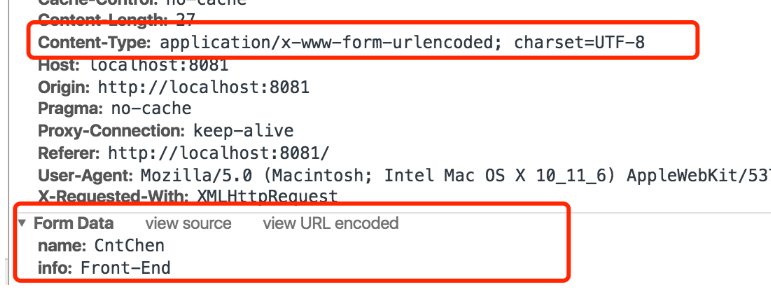
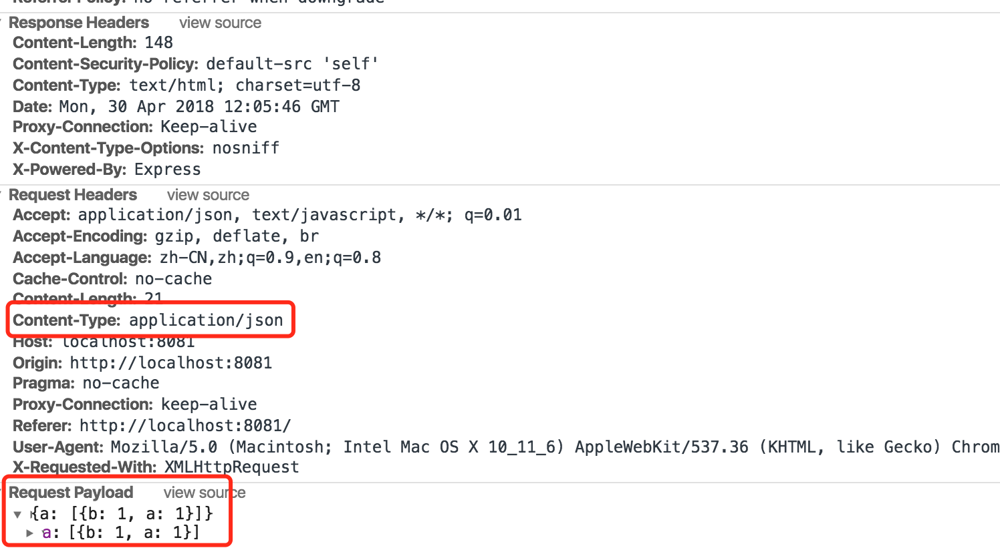

[前端跨域整理](<https://juejin.im/post/5815f4abbf22ec006893b431>)

[由同源策略到前端跨域](<https://juejin.im/post/58f816198d6d81005874fd97>)

[九种跨域方式实现原理（完整版）](<https://juejin.im/post/5c23993de51d457b8c1f4ee1#heading-2>)

[Jquery ajax, Axios, Fetch区别](<https://juejin.im/post/5acde23c5188255cb32e7e76>)

[CORS 简单请求+预检请求（彻底理解跨域）](<https://github.com/amandakelake/blog/issues/62>)

###  同源策略和跨域？

> 如果两个页面的协议，端口和主机都相同，则两个页面具有相同的**源**不满足同源策列就会导致跨域。
>

#### 同源策略的限制

同源资源都是可读写的

不同源：

- `iframe`：访问跨域页面时, 只读，不同的框架之间是可以获取window对象的，但却无法获取相应的属性和方法。

- `Ajax`：跨域请求会直接**被浏览器拦截**(chrome下跨域请求不会发起, 其他浏览器一般是可发送跨域请求, 但响应被浏览器拦截)

##### 还限制了

- `DOM`结点
- `cookie`，`localStorage`，`IndexDB`等存储型内容

🌟但是有三种标签允许跨域加载资源

- ``
- `<link href=XXX>`
- `<script src=XXX>`

#### 理解域名

##### 顶级域名&二级域名&三级域名

**顶级域名**是域名中最高的一级，每个域名都以顶级域名结尾。顶级域名下面是二级域名，它位于顶级域名的左侧，二级域名下面是三级域名。例如，在`zh.wikipedia.org`中，`org`是顶级域名，`wikipedia`是二级域名。，`zh`是三级域名。

##### 子域

**子域**是属于更高一层域的域。比如，`mail.example.com`和`calendar.example.com`是`example.com`的两个子域，而`example.com`则是顶级域`.com`的子域。

**域名带不带`www`的区别**
`www`代表的是主机名，`www.baidu.com`为三级域名，`baidu.com`属于二级域名。

🌟注意：

1. 如果是**协议**和**端口**造成的跨域问题“前台”是无能为力的；
2. 域不会判断相同的`ip`地址对应着两个域或两个域是否在同一个`ip`上。

### AJAX

#### `AJAX`是什么

`AJAX`是一种无需刷新页面就可以从服务器获取到数据的技术,它的核心是`XMLHttpRequest`对象

#### `AJAX`的原理

Ajax相当于在用户和服务器之间加了一个中间层(ajax引擎)，让用户的操作与服务器响应异步化。并不是所有的用户请求都提交给服务器，像—些数据验证(比如判断用户是否输入了数据)和数据处理(比如判断用户输入数据是否是数字)等都交给Ajax引擎自己来做, 只有确定需要从服务器读取新数据时再由Ajax引擎代为向服务器提交请求。把这些交给了Ajax引擎，用户操作起来也就感觉更加流畅了。

#### 创建步骤

```javascript
 	var url = 'http://localhost:8080/';
    function ajax(url){
        var xhr = new XMLHttpRequest();
        //注意onreadystatechange全小写
        xhr.onreadystatechange = function(){
            if(xhr.readyState===4){
                if(xhr.status>=200&&xhr.status<300||xhr.status===304){
                    console.log(xhr.responseText)
                }
            }
        }
        xhr.open('post',url,true);
        //在get请求中不需要设置请求头，content-type实际上就是指定了发送给服务器的数据的形式
        xhr.setRequestHeader('Content-Type','application/x-www-form-urlencoded
')
        //超时处理
        xhr.timeout = 5000;
        xhr.ontimeout = function(){
            alert('超时了')；
            console.log(xhr.readyState);
        }
        xhr.send();
    }
    ajax(url)
```

#### AJAX请求头Content-Type

[Content-Type的理解](<https://www.cnblogs.com/tugenhua0707/p/8975121.html>)

**Content-Type**是指http/https发送信息至服务器时的内容编码类型，默认值为`text/plain;charset=UTF-8`

- `application/x-www-form-urlencoded`：在发送前编码所有字符。原生的`form`表单，如果不设置`enctype`属性，那么就以这种方式提交数据，如下

  ```
  title=test&sub%5B%5D=1&sub%5B%5D=2&sub%5B%5D=3
  //所有数据变成键值对的形式，并且特殊字符需要转义成utf-8编号
  ```
  
  对于`GET`请求，格式化的字符串将直接拼接在`url`后发送到服务端；对于`POST`请求，在`chrome`的`network`面板下，格式化的字符串将放在`http body`的`Form Data`中发送，如下
  
- `multipart/form-data`：不对字符编码。在使用表单上传文件时，必须使用该值。请求体被` --boundary`分割成多部分

- `application/json`：用来告诉服务器消息主题是序列化后的JSON字符串，一般用来传递复杂的数据对象

🌟注意：`ContentType`为 `application/json`时会发两次请求，第一次先发`Method`为`OPTIONS`的请求询问服务器支持哪些请求方法(比如`GET`,`POST`)等。如果这个请求支持跨域的话，才会发送第二个请求，否则的话在控制台会报错，第二个请求不会发送。




#### AJAX返回的状态

| 状态码 | 含义                                         |
| ------ | -------------------------------------------- |
| 0      | 未初始化。未调用open()                       |
| 1      | 启动。已调用open()，未调用send()             |
| 2      | 发送。调用send(),但未收到响应                |
| 3      | 接收。受到部分响应数据                       |
| 4      | 完成。接收全部响应数据，且可以在客户端使用。 |

🌟注意：一个`ajax`请求不是完全异步的，在readyState变为2之前，都是同步的(即readyState为0,1时是同步的)

#### 如何发出一个有序的`AJAX`

回调函数,`Promise.then`,`async`

#### `ajax`和`jquery`, `Fecth`,`Axios`比有什么区别

##### `jquery`

是对原生`XMLHttpRequest`对象的封装,还增添了对`jsonp`的支持,但是`jquery`整个项目太大了,单纯使用`ajax`就要引入整个`jquery`非常的不合理

##### `fecth`

优点:`API`基于`promise`方便异步,支持`node`,比较轻量

缺点：除了**网络故障或者请求被阻止**时会将`promise`状态标记为`reject`，其他情况下`fecth`返回的`promise`状态都为`resolve`(但是会将 resolve 的返回值的 `ok` 属性设置为 `false` )，默认情况下，`fecth`不会从服务器接受或发送`cookie`，必须设置`credenitials`选项，所以需要我们再次封装

> fetch发送post请求的时候，总是发送两次，第一次状态码是204，第二次才成功？
>
> 因为第一次发送Options请求，询问服务器是否支持修改的请求头，如果服务器支持，则在第二次中发送真正的请求。

##### `axios`

也是对原生`XMLHttpRequest`对象的封装,但是是`promise`的实现版本,它有以下功能

- 从` node.js `创建 `http` 请求
- 支持` Promise API`
- 客户端支持防止`CSRF`
- **提供了一些并发请求的接口**（重要，方便了很多的操作）

```javascript
axios.all([getUserAccount(), getUserPermissions()])
  .then(axios.spread(function (acct, perms) {
    // Both requests are now complete
  }));
//并发案例
```

这个支持防止`CSRF`其实挺好玩的，是怎么做到的呢，就是让你的每个请求都带一个从`cookie`中拿到的`key`, 根据浏览器同源策略，假冒的网站是拿不到你`cookie`中得`key`的，这样，后台就可以轻松辨别出这个请求是否是用户在假冒网站上的误导输入，从而采取正确的策略。

🌟注意:`ajax`请求是不能跨域的

### 单向跨域

#### 1.`JSONP`
##### 原理
`ajax`受同源策略的影响，不允许进行跨域请求，而`script`标签的`src`中的链接却可以访问跨域的静态资源，利用这个特性，服务端不再返回`JSON`格式的数据，而是返回一段调用某个函数的`js`代码，这样实现了跨域。

##### 过程

- 客户端利用`script`标签可以跨域请求资源的性质，向网页中动态插入`script`标签，来向服务器请求数据
- 服务器会解析请求的`url`，从里面取出`callback`，然后把数据放入callback中返回给客户端
##### `JSONP`的优缺点
  - 优点：它不像Ajax请求那样受到同源策略的限制；它的兼容性更好，在更加古老的浏览器中都可以运行，不需要`XMLHttpRequest`或`ActiveX`的支持；并且在请求完毕后可以通过调用`callback`的方式回传结果。
  - 缺点：它只支持GET请求，因为`script`标签只能使用`get`；没有超时处理；需要和后端协商
##### 实现一个`JSONP`

- 把传入对象转换为`url`
- 给回调函数名设置随机标识，并且拼接到`url`中
- 动态创建`script`标签并插入到页面
- 挂载回调函数
- 超时处理

```javascript
<script type="text/javascript">
var url = 'http://localhost:8080/';
function jsonp(obj,time,url){
    //基本类型
    url+=url.indexOf('?')===-1?'?':'&';
    for(let item in obj){
        url+=encodeURIComponent(item)+'='+encodeURIComponent(obj[item])+'&';
    }
    var callBackName =('_jsonp'+Math.random()).replace('.','')
    url+='callback='+callBackName;
    var scriptEle = document.createElement('script');
    scriptEle.src = url;
    document.head.appendChild(scriptEle);
    window[callBackName] = function(data){
       	//这里是对数据进行处理
        window.clearTimeout(timer);//清除定时器
        window[callBackName] = null;//把回调函数解除引用
        document.head.removeChild(scriptEle);
    }
    //超时处理
    var timer = window.setTimeout(function(){
        document.head.removeChild(scriptEle);//移除script标签
		window[callBackName] = null;//把回调函数解除引用
    },time)
}
jsonp({name:'dd'},5000,url)
</script>
```

#### 2. `CORS(Cross-Origin Resource Sharing)跨域资源共享`

`CORS`允许服务器声明哪些源站通过浏览器有权限访问哪些资源。

##### 基本使用

```js
server.all('*',function(req,res,next){
    
    //其中`*` 表示通配, 所有的域都能访问此资源,为了跨站发送cookie等验证信息， `Access-Control-Allow-Origin` 字段将不允许设置为`*`, 它需要明确指定与请求网页一致的域名
    res.header("Access-Control-Allow-Origin",'*');
    //只允许B站访问
    res.header("Access-Control-Allow-Origin",<B-DOMAIN>)
               
    //CORS需要指定METHOD访问, 对于GET和POST请求, 至少要指定以下三种methods, 如下:
    res.header("Access-Control-Allow-Methods","PUT,POST,GET,DELETE,OPTIONS");
    
    //如果是POST请求, 且提交的数据类型是json, 那么, CORS需要指定headers.
	res.header("Content-Type", "application/json;charset=utf-8");
    
    //CORS默认是不带cookie的, 设置以下字段将允许浏览器发送cookie
    res.header('Access-Control-Allow-Credentials', true);
   
    next()
})
```

同时，前端需要做如下显式设置才能真正发送`cookie`

```javascript
xhr.withCredentials = true;
```

##### `简单请求`和`预检请求（preflighted requests）`

另外，规范要求，对那些可能对服务器数据产生副作用的 HTTP 请求方法（特别是 GET 以外的 HTTP 请求，或者搭配某些 MIME 类型的 POST 请求），**浏览器必须首先使用 OPTIONS 方法发起一个预检请求（preflight request），从而获知服务端是否允许该跨域请求。**

**服务器确认允许之后，才发起实际的 HTTP 请求**。在预检请求的返回中，服务器端也可以通知客户端，是否需要携带身份凭证（包括 Cookies 和 HTTP 认证相关数据）。


**简单请求就是不会触发CORS预检的请求**，满足以下**所有条件**的才会被视为简单请求，基本上我们日常开发只会关注前面两点

1. 使用`GET、POST、HEAD`其中一种方法

2. 只使用了如下的安全首部字段，不得人为设置其他首部字段

   - `Accept`

   - `Accept-Language`

   - `Content-Language`

   - `Content-Type`仅限以下三种
     - `text/plain`
	   - `multipart/form-data`
       - `application/x-www-form-urlencoded`
    
   - HTML头部header field字段：`DPR、Download、Save-Data、Viewport-Width、WIdth`

3. 请求中的任意`XMLHttpRequestUpload` 对象均没有注册任何事件监听器；XMLHttpRequestUpload 对象可以使用 XMLHttpRequest.upload 属性访问

4. 请求中没有使用 ReadableStream 对象

预检请求要求必须**首先使用 `OPTIONS` 方法发起一个预检请求到服务器，以获知服务器是否允许该实际请求**。"预检请求“的使用，可以避免跨域请求对服务器的用户数据产生未预期的影响

下面的请求会触发预检请求，其实非简单请求之外的就会触发预检，就不用记那么多了

1. 使用了`PUT、DELETE、CONNECT、OPTIONS、TRACE、PATCH`方法
2. 人为设置了非规定内的其他首部字段，参考上面简单请求的安全字段集合，还要特别注意`Content-Type`的类型
3. `XMLHttpRequestUpload` 对象注册了任何事件监听器
4. 请求中使用了`ReadableStream`对象

##### 完整请求流程


##### `CORS`和`JSONP`对比

  - 请求类型：`JSONP`只能实现`GET`请求，而`CORS`支持所有类型的`HTTP`请求。
    
  - 使用`CORS`，开发者可以使用普通的`XMLHttpRequest`发起请求和获得数据，比起`JSONP`有更好的错误处理。
    
  - `JSONP`主要被老的浏览器支持，它们往往不支持`CORS`，而绝大多数现代浏览器都已经支持了`CORS`）。

`CORS`与`JSONP`相比，无疑更为先进、方便和可靠。

#### 3. 通过window.name跨域

> window对象有个name属性，该属性有个特征：即在一个窗口(window)的生命周期内,窗口载入的所有的页面都是共享一个window.name的，每个页面对window.name都有读写的权限，window.name是持久存在一个窗口载入过的所有页面中的，并不会因新页面的载入而进行重置。

比如：我们在任意一个页面输入

```javascript
window.name = "My window's name";
setTimeout(function(){
    window.location.href = "http://damonare.cn/";
},1000)
```

进入damonare.cn页面后我们再检测再检测 window.name :

```javascript
window.name; // My window's name
```

可以看到，如果在一个标签里面跳转网页的话，我们的 window.name 是不会改变的。
基于这个思想，我们可以在某个页面设置好 window.name 的值，然后跳转到另外一个页面。在这个页面中就可以获取到我们刚刚设置的 window.name 了。

> 由于安全原因，浏览器始终会保持 window.name 是string 类型。

同样这个方法也可以应用到和iframe的交互来：
比如：我的页面([damonare.cn/index.html)…](http://damonare.cn/index.html)中内嵌了一个iframe：)

```javascript
<iframe id="iframe" src="http://www.google.com/iframe.html"></iframe>
```

在 iframe.html 中设置好了 window.name 为我们要传递的字符串。
我们在 index.html 中写了下面的代码：

```javascript
var iframe = document.getElementById('iframe');
var data = '';

iframe.onload = function() {
    data = iframe.contentWindow.name;
};
```

Boom!报错！肯定的，因为两个页面不同源嘛，想要解决这个问题可以这样干：

```javascript
var iframe = document.getElementById('iframe');
var data = '';

iframe.onload = function() {
    iframe.onload = function(){
        data = iframe.contentWindow.name;
    }
    iframe.src = 'about:blank';
};
```

**或者将里面的 about:blank 替换成某个同源页面（about:blank，javascript: 和 data: 中的内容，继承了载入他们的页面的源。）**

这种方法与 document.domain 方法相比，放宽了域名后缀要相同的限制，可以从任意页面获取 string 类型的数据。

### 双向跨域

#### 4. 通过document.domain跨域

> `www.damona.cn/a.html`页面中`iframe`的`src`是`damona.cn/b.html`。这个时候，我们只要把`www.damona.cn/a.html` 和 `damona.cn/b.html`这两个页面的document.domain都设成相同的域名就可以了。但要注意的是，<font color='red'>我们只能把document.domain设置成自身或更高一级的父域，且主域必须相同。</font>

- 在页面www.damona.cn/a.html 中设置document.domain:

```javascript
<iframe id = "iframe" src="http://damona.cn/b.html" onload = "test()"></iframe>
<script type="text/javascript">
    document.domain = 'damona.cn';//设置成主域
    function test(){
        alert(document.getElementById('iframe').contentWindow);//contentWindow 可取得子窗口的 window 对象
    }
</script>
```

- 在页面[damona.cn/b.html](http://damonare.cn/b.html) 中也设置document.domain:

```javascript
<script type="text/javascript">
    document.domain = 'damona.cn';//在iframe载入这个页面也设置document.domain，使之与主页面的document.domain相同
</script>
```

**修改document.domain的方法只适用于不同子域的框架间的交互。**

#### 5. 通过location.hash跨域

> 因为父窗口和iframe可以对对方进行URL读写，URL有一部分被称为hash，就是#号及其后面的字符，它一般用于浏览器锚点定位，应该说HTTP请求过程中不会携带hash，所以这部分的修改不会产生HTTP请求，但是会产生浏览器历史记录。此方法的**原理就是改变URL的hash部分来进行双向通信**。每个window通过改变其他 window的location来发送消息（由于两个页面不在同一个域下IE、Chrome不允许修改parent.location.hash的值，所以要借助于父窗口域名下的一个代理iframe），并通过监听自己的URL的变化来接收消息。这个方式的通信会造成一些不必要的浏览器历史记录，而且有些浏览器不支持`onhashchange`事件，需要轮询来获知URL的改变，最后，这样做也存在缺点，诸如数据直接暴露在了`url`中，数据容量和类型都有限等。下面举例说明：

假如父页面是baidu.com/a.html,iframe嵌入的页面为google.com/b.html（此处省略了域名等url属性），要实现此两个页面间的通信可以通过以下方法。

- a.html传送数据到b.html
  - a.html下修改iframe的src为google.com/b.html#paco
  - b.html监听到url发生变化，触发相应操作
- b.html传送数据到a.html，由于两个页面不在同一个域下IE、Chrome不允许修改parent.location.hash的值，所以要借助于父窗口域名下的一个代理iframe
  - b.html下创建一个隐藏的iframe，此iframe的src是baidu.com域下的，并挂上要传送的hash数据，如src="[www.baidu.com/proxy.html#…](http://www.baidu.com/proxy.html#data)"
  - proxy.html监听到url发生变化，修改a.html的url（因为a.html和proxy.html同域，所以proxy.html可修改a.html的url hash）
  - a.html监听到url发生变化，触发相应操作

b.html页面的关键代码如下:

```javascript
try {  
    parent.location.hash = 'data';  
} catch (e) {  
    // ie、chrome的安全机制无法修改parent.location.hash，  
    var ifrproxy = document.createElement('iframe');  
    ifrproxy.style.display = 'none';  
    ifrproxy.src = "http://www.baidu.com/proxy.html#data";  
    document.body.appendChild(ifrproxy);  
}
```

proxy.html页面的关键代码如下 :

```javascript
//因为parent.parent（即baidu.com/a.html）和baidu.com/proxy.html属于同一个域，所以可以改变其location.hash的值  
parent.parent.location.hash = self.location.hash.substring(1);
```

#### 6. 通过`HTML5`的`postMessage`方法跨域

> 高级浏览器Internet Explorer 8+, chrome，Firefox , Opera  和 Safari 都将支持这个功能。这个功能主要包括接受信息的"message"事件和发送消息的"postMessage"方法。比如damonare.cn域的A页面通过iframe嵌入了一个google.com域的B页面，可以通过以下方法实现A和B的通信

A页面通过postMessage方法发送消息：

```javascript
window.onload = function() {  
    var ifr = document.getElementById('ifr');  
    var targetOrigin = "http://www.google.com";  
    ifr.contentWindow.postMessage('hello world!', targetOrigin);  
};
```

`postMessage`的使用方法：

- otherWindow.postMessage(message, targetOrigin);
  - otherWindow:指目标窗口，也就是给哪个window发消息，是 window.frames 属性的成员或者由 window.open 方法创建的窗口
  - `message:   `是要发送的消息，类型为 String、Object (IE8、9 不支持)
  - `targetOrigin:`   是限定消息接收范围，不限制请使用 

B页面通过`message`事件监听并接受消息:

```javascript
var onmessage = function (event) {  
  var data = event.data;//消息  
  var origin = event.origin;//消息来源地址  
  var source = event.source;//源Window对象  
  if(origin=="http://www.baidu.com"){  
console.log(data);//hello world!  
  }  
};  
if (typeof window.addEventListener != 'undefined') {  
  window.addEventListener('message', onmessage, false);  
} else if (typeof window.attachEvent != 'undefined') {  
  //for ie  
  window.attachEvent('onmessage', onmessage);  
}
```

同理，也可以B页面发送消息，然后A页面监听并接受消息。

### 后记

> 其它诸如中间件跨域，服务器代理跨域，Flash URLLoader跨域，动态创建script标签（简化版本的jsonp）不作讨论。