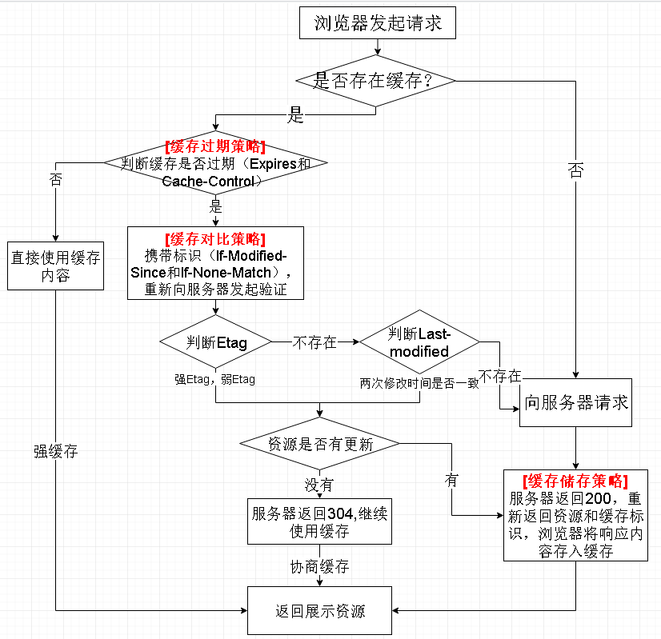

[前端缓存最佳实践](<https://juejin.im/post/5c136bd16fb9a049d37efc47#heading-3>)

## 强缓存和协商缓存

两者的主要区别是**使用本地缓存的时候，是否需要向服务器验证本地缓存是否依旧有效**。顾名思义，协商缓存，就是需要和服务器进行协商，最终确定是否使用本地缓存。

## 两种缓存方案的问题

### 强缓存的问题

我们知道，强缓存主要是通过`http`请求头中的`Cache-Control`和`Expire`两个字段控制。`Expire`是`HTTP1.0`标准下的字段，在这里我们可以忽略。我们重点来讨论的`Cache-Control`这个字段。

一般，我们会设置Cache-Control的值为“public, max-age=xxx”，表示在xxx秒内再次访问该资源，均使用本地的缓存，不再向服务器发起请求。

显而易见，如果在xxx秒内，服务器上面的资源更新了，客户端在没有强制刷新的情况下，看到的内容还是旧的。如果发布新版本的时候，后台接口也同步更新了，有缓存的用户还在使用旧接口，而那个接口已经被后台干掉了。怎么办？

### 协商缓存的问题

协商缓存最大的问题就是每次都要向服务器验证一下缓存的有效性，似乎看起来很省事，但是，每次都去请求服务器，那要缓存还有什么意义。

## 最佳实践（什么时候用强缓存，什么时候用协商缓存）

缓存的意义就在于减少请求，更多地使用本地的资源，给用户更好的体验的同时，也减轻服务器压力。所以，最佳实践，就应该是尽可能命中强缓存，同时，能在更新版本的时候让客户端的缓存失效。

在更新版本之后，如何让用户第一时间使用最新的资源文件呢？机智的前端们想出了一个方法，在更新版本的时候，顺便把静态资源的路径改了，这样，就相当于第一次访问这些资源，就不会存在缓存的问题了。

伟大的webpack可以让我们在打包的时候，在文件的命名上带上hash值。

```javascript
entry:{
    main: path.join(__dirname,'./main.js'),
    vendor: ['react', 'antd']
},
output:{
    path:path.join(__dirname,'./dist'),
    publicPath: '/dist/',
    filname: 'bundle.[chunkhash].js'
}
```

综上所述，我们可以得出一个较为合理的缓存方案：

- HTML：使用协商缓存，每次都能拿到最新的html资源。
- CSS&JS&图片：使用强缓存，文件命名带上hash值，改变资源路径。

## 哈希也有讲究

webpack给我们提供了三种哈希值计算方式，分别是hash、chunkhash和contenthash。那么这三者有什么区别呢？

- hash：跟整个项目的构建相关，构建生成的文件hash值都是一样的，只要项目里有文件更改，整个项目构建的hash值都会更改。（项目的所有文件，文件名都带上一个hash）
- chunkhash：根据不同的入口文件(Entry)进行依赖文件解析、构建对应的chunk，生成对应的hash值。（项目相同入口的文件，文件名都带上一个hash）
- contenthash：由文件内容产生的hash值，内容不同产生的contenthash值也不一样。(项目的每一个文件都根据自己的内容拥有自己的的hash)

显然，我们是不会使用第一种的。改了一个文件，打包之后，其他文件的hash都变了，缓存自然都失效了。这不是我们想要的。

那chunkhash和contenthash的主要应用场景是什么呢？在实际在项目中，我们一般会把项目中的css都抽离出对应的css文件来加以引用。如果我们使用chunkhash，当我们改了css代码之后，会发现css文件hash值改变的同时，js文件的hash值也会改变。这时候，contenthash就派上用场了。

## 后端需要怎么设置

上文主要说的是前端如何进行打包，那后端怎么做呢？ 我们知道，**浏览器是根据响应头的相关字段来决定缓存的方案的**。所以，后端的关键就在于，根据不同的请求返回对应的缓存字段。 以nodejs为例，如果需要浏览器强缓存，我们可以这样设置：

```javascript
res.setHeader('Cache-Control', 'public, max-age=xxx');
```

如果需要协商缓存，则可以这样设置：

```javascript
res.setHeader('Cache-Control', 'public, max-age=0');
res.setHeader('Last-Modified', xxx);
res.setHeader('ETag', xxx);
```

## 总结
在做前端缓存时，我们尽可能设置长时间的强缓存，通过文件名加hash的方式来做版本更新。在代码分包的时候，应该将一些不常变的公共库独立打包出来，使其能够更持久的缓存。



