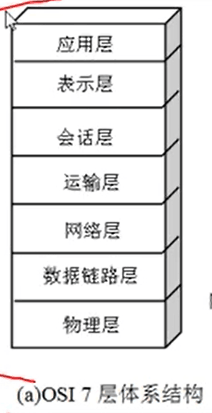
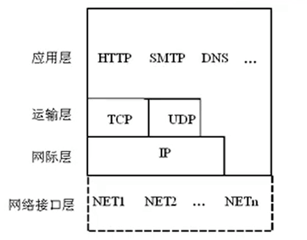
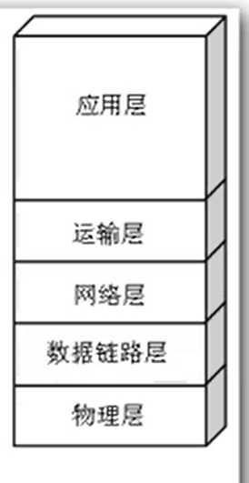

### 网络协议

为进行网络中的数据交换而建立的规则，标准或约定称为网络协议

#### 网络协议三要素

- 语法：数据与控制信息的结构和格式
- 语义：发出何种信息，完成何种动作以及做出何种响应
- 定时：事件实现顺序的详细说明

网络系统的数据通信由协议来支撑

### 分层

优点：

- 简化系统设计
- 模块易于维护
- 系统的更新成本和效率

缺点：

- 信息冗余，降低性能
- 层次的划分难以确定
- 协议首部越来越大

#### 分层要点

- 网络功能模块化，取出不同网络应用之间以及网络应用与网络技术之间的紧密耦合，让层和层之间透明（互相不关联，松耦合）
- 端到端原则，把关键功能作为模块独立

### 网络体系结构

#### osi体系结构

国际化标准组织定义，不考虑成本问题，兼顾各个厂家各个应用的需求。因为太复杂，没有厂家使用，成为理论上的标准。

##### TCP/IP协议

网络事实上的标准

##### 原理体系结构

#### 水平协议和垂直服务

**对等层实体**：两个端之间的相同层

**相邻层实体**：同一个端系统中相邻的层

**协议的通信**：对等层实体的通信

**服务**：相邻层实体的访问，低层为高层提供服务

**协议访问的一方：**服务的消费者

**协议被访问的一方：**服务的提供者

> 协议的调用不建议跨层。协议只能在本端系统中调用（协议是函数，计算机网络的端系统是自治的）。

#### 协议的标准化

- `ISO`：国际标准化组织

- `ITU-T`：国际电信联盟-电信标准部
- `ISOC`：因特网协会
- `IEEE`：电气和电子工程师协会
- `EIA`：电子工业协会
- `ICANN`：因特网名字与号码指派公司

