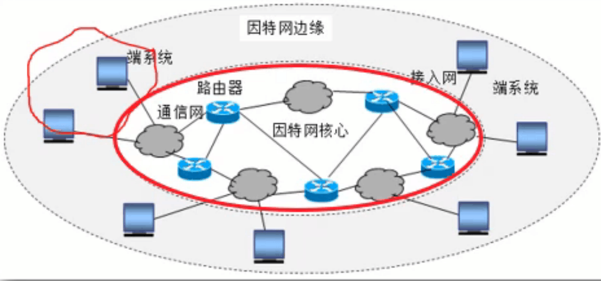
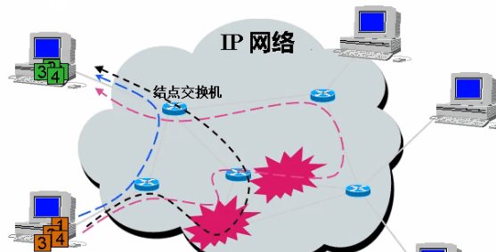

### 计算机网络

由**通信信道**连接的**主机**和**网络设备**的集合，以方便用户共享资源和相互通信

**自主、互连**的**计算机集合**

❤️特征

- 通用性：不对特定应用优化
- 能支持广泛，不断出现的新型应用

### 计算机网络组成

- 拓扑：节点+链路

- `OSI`（开发式系统互联模型）：开放系统+互连环境

  目的：互联环境提供了数据通信的基础支撑，在此之上，通过通信网络把计算机终端连接起来，我们期望连接的计算机不是固定的，可以由不同的厂家进行开发和生产，并在不同的领域使用，因此端节点是一个开发的系统。

- `TCP/IP`：核心网+边缘网

  - 核心网的交换方式
    - 电路交换
    - 分组交换
    - 报文交换
    - 混合交换（前面三种，现有互联网）
  - 边缘网的通信模式
    - `C/S`
    - `P2P`

- 物理：设备+协议+应用

### 构建网络的方式

- **直接连接**的网络：直接通过物理媒体（可能是无线）让网络之间建立连接，在通信距离和通信规模会受限制，又称为局域网。
  - 点到点链路：物理链路与一对结点连接，多于两个结点不建议使用
  - 多路访问链路：多结点共享同一物理链路，存在冲突。

⚠️这种网络没有数据转发设备，如路由器，交换机

- **网络云**：交换网，表示任何类型的网络，把网络云外部结点之间的差异通过统一的网络协议屏蔽（通过协议转换为固定格式，任何接入网络云的网络都可识别），从而实现网络与网络之间的互联，通常采用分组交换技术。主机**间接连通**的第一种方法

- **网络云的网络云**：递归地连接网络云形成更大的网络。称为`互联网internet`，或网络的网络。使用`TCP/IP`的互联网称为**`Internet`因特网。**连接网络云的结点称为**路由器**，主机**间接连通**的第二种方法

### 因特网组成

- 网络边缘：应用系统、主机
- 网络核心：路由器（网络的网络）
- 接入网：连接两者的通信链路

端到端原则：边缘智能，核心简单。

**位于网络边缘的端系统**的强大计算能力，用用网络方式处理大量复杂的控制和应用逻辑

**位于网络核心的路由器**尽可能简单，以简单地转发分组。

❤️概念

端系统（主机）：运行应用程序，例如web，电子邮件

`C/S`：客户端请求，从总是打开的服务器接受服务。如web浏览器/服务器，电子邮件客户/服务器。不适合于大量的同步访问。对硬件的要求很好，为了满足大量的同步访问，又提出了对等模式

对等模式：每个端既做C也做S，最小限度（或不）使用专用服务器，把因特网资源进行分布化，把服务器负担转换为网络负担

### 网络云传递数据的方法

- 电路交换：主要用于**电话网**，在发送方和接收方之间通过多台交换机建立一条连接

  **面向连接**，建立的是物理连接。

  **步骤**：建立连接->通信->释放连接

  特点：通话的两个用户始终占用端到端的固定传输带宽，灵活性和生存性差，线路中任何一点出故障，将导致通信的中断。

- 分组交换：主要用于**计算机网络**

  > 分组：长报文划分为等长的短段，并为每个段加上首部

  - 在发送端把要发送的报文分隔为较短的数据块
  - 每个块增加带有控制信息的首部构成分组（包）
  - 依次把各分组发送到接收端
  - 接收端剥去首部，抽出数据部分，还原成报文。

  > 电路交换的网络的交换机最主要的功能是资源分配，在通信过程中不再领回数据。
  >
  > 分组交换的网络，路由器接受识别数据首部中的地址、控制信息，并根据它们为数据分组选择一条路径进行转发。

  冗余的路由：当部分结点或链路被摧毁时，分组交换仍可保持网络畅通。

  

  原理：使用分组交换，在数据传送前可以不必先建立连接，这样随时可发送数据。这种联网方式称为无连接。

  实现：通信处理机`IMP`的存储转发策略：将收到的分组先放入缓存，再查找转发表（端口=>目的地址），然后缓存中去除分组，把分组传递到适当的端口

  优点：

  - 高效，逐段占用，线路利用率高。
  - 灵活：为每一个分组独立的选择转发路线
  - 迅速：无连接。
  - 可靠：完善的网络协议，分布式多路由的分组交换网络，网络生存性高。

- 报文交换

`Message`应用产生的一条数据消息，例如电报网络。